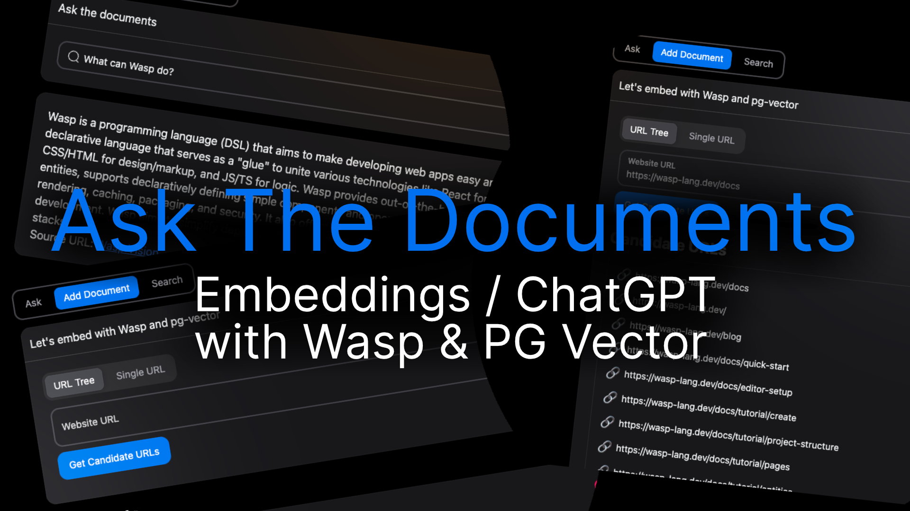

# Ask The Documents (Embeddings / RAG / ChatGPT) with Wasp & PG Vector



Live at https://ask-the-documents-client.fly.dev/

## What does it do?

This is an example Wasp app that supports:

- scraping whole link hierarchies (great for docs)
- scraping a single link
- generating embeddings for page content
- semantic search using PG Vector
- chatting with the documents using OpenAI's ChatGPT

## Running it locally

1. Make sure you have the latest version of Wasp installed.

   ```bash
   curl -sSL https://get.wasp.sh/installer.sh | sh
   ```

2. Start the database with:

   ```bash
   wasp start db --db-image pgvector/pgvector:pg18
   ```

3. Copy `.env.server.example` to `.env.server` and fill out the environment variables.

   ```bash
   OPENAI_API_KEY="<your_openai_key>"
   GOOGLE_CLIENT_ID="<your_google_client_id>"
   GOOGLE_CLIENT_SECRET="<your_google_client_secret>"
   ```

4. Migrate the database with:

   ```bash
   wasp db migrate-dev
   ```

5. Start the server with:

   ```bash
   wasp start
   ```
