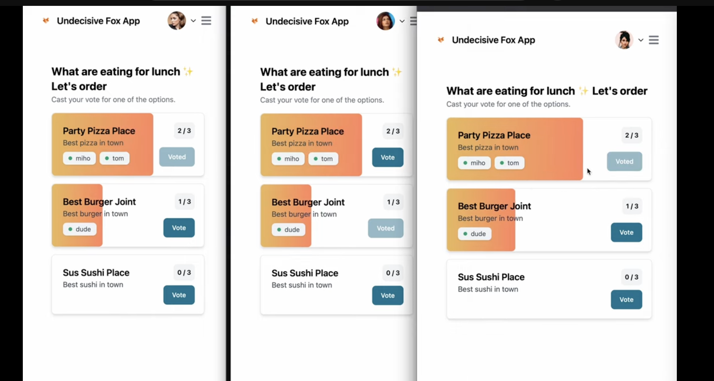

# Using Websockets in Wasp

This is an example real-time, Websockets app built with Wasp in TypeScript to showcase the ease of use and integration of Websockets in Wasp. It's really NEAT!

[](https://www.youtube.com/watch?v=Twy-2P0Co6M)

You can try out a deployed version of the app here: https://websockets-client-production.up.railway.app/

This app also includes Wasp's integrated auth and a voting system (again, neat!).

## Running the app

*If you get stuck at any point, feel free to join our [Discord server](https://discord.gg/rzdnErX) and ask questions there. We are happy to help!*

First, clone the this repo:
```bash
git clone https://github.com/wasp-lang/wasp.git
```

Make sure you've downloaded and installed Wasp
```bash
curl -sSL https://get.wasp-lang.dev/installer.sh | sh
```

Then navigate to the project directory
```bash
cd examples/websockets-realtime-voting
```

```bash
wasp db migrate-dev
```
  
start the app! (this also installs all dependencies)
```bash
wasp start
```

Check out the `src/server/websocket.ts` and `src/client/pages/MainPage.tsx` to see how Websockets are used in Wasp.

## Need Help?

Wasp Docs: https://wasp-lang.dev/docs

Feel free to join our [Discord server](https://discord.gg/rzdnErX) and ask questions there. We are happy to help!