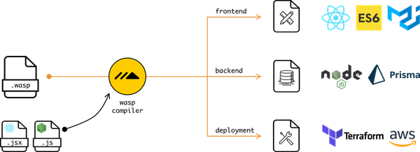
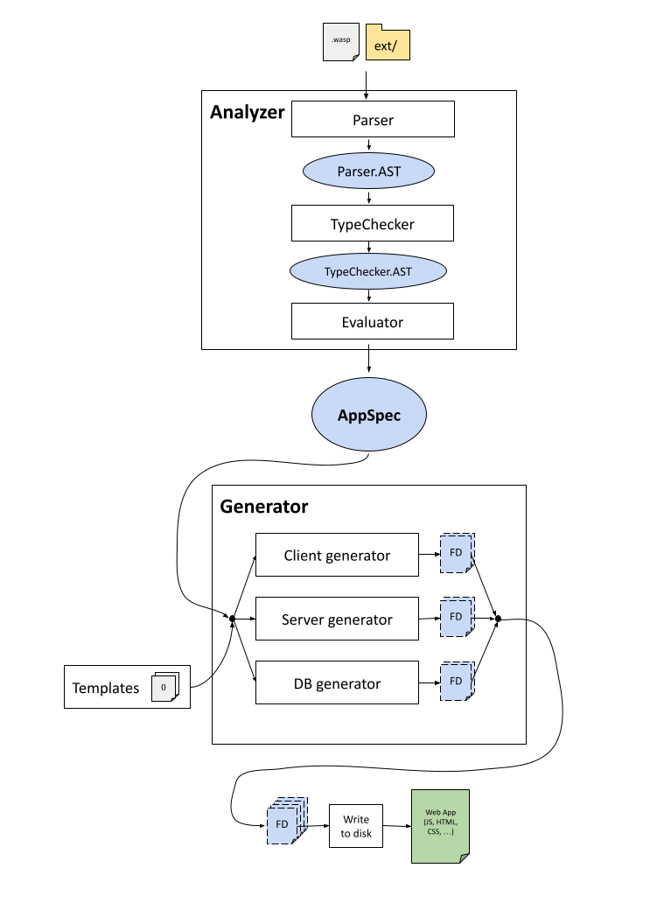

# Waspc

This directory contains source code of the `wasp` compiler (aka `waspc`), and this README is aimed at the contributors to the project.

If you are a Wasp user and not a contributor (yet :)), you might want to look into following resources instead ([**Project page**](https://wasp-lang.dev), [**Docs**](https://wasp-lang.dev/docs)).


## First time contributor checklist
If you would like to make your first contribution, here is a handy checklist we made for you:

- [ ] Read [Quick overview](#quick-overview).
- [ ] Compile the project successfully and get todoApp example running (follow [Basics](#basics)).
- [ ] Join [Discord](https://discord.gg/rzdnErX) and say hi :)!
- [ ] Pick an issue [labeled with "good first issue"](https://github.com/wasp-lang/wasp/issues?q=is%3Aissue+is%3Aopen+label%3A%22good+first+issue%22) and let us know you would like to work on it - ideally immediatelly propose a plan of action and ask questions.
      If you can't find a suitable issue for you, reach out to us on Discord and we can try to find smth for you together.
- [ ] Make a PR and have it accepted! Check [Typical workflow](#typical-development-workflow) for guidance, and consult [Codebase overview](#codebase-overview) for more details on how Wasp compiler works internally.


## Quick overview
Wasp compiler is implemented in Haskell, but you will also see a lot of Javascript and other web technologies because Wasp compiler transpiles Wasp code into them.

You don't have to be expert in Haskell to contribute or understand the code, since we don't use complicated Haskell features much -> most of the code is relatively simple and straight-forward, and we are happy to help with the part that is not.

Main result of building the project is `wasp` executable (also reffered to as CLI), which is both Wasp compiler, CLI and Wasp project runner in one - one tool for everything Wasp-related.

`wasp` executable takes `.wasp` files and `ext/` dir as input and generates a web app from them.



It can then also run that web app for you, deploy it (not yet but that is coming), and manage it in other ways.


## Basics
### Setup
We use [Cabal](https://cabal.readthedocs.io/) to build the project.

The best way to install it is via [ghcup](https://www.haskell.org/ghcup/).

Check [cabal.project](cabal.project) for exact version of GHC that we use to build Wasp.
Then, ensure via `ghcup` that you use that version of GHC and that you are using corresponding versions of `cabal` and `hls`.

### Repo
Fork this repo and clone the fork to your machine (or clone this repo directly if you don't plan to contribute but just want to try it out).

Position yourself in this directory (`waspc/`) and make sure that you are on the `main` branch.

### Build
```
cabal build
```
to build the library and `wasp` executable.

This might take a while (10 mins) if you are doing it for the very first time, since `cabal` will need to download the external dependencies.
If that is the case, relax and feel free to get yourself a cup of coffee! When somebody asks what you are doing, you can finally rightfully say "compiling!" :D.

NOTE: You may need to run `cabal update` before attempting to build if it has been some time since your last update.

### Test
```
cabal test
```
to ensure all the unit and end-to-end tests are passing (this will also build the project if needed).

### Executable
```
cabal run wasp-cli
```
to run the `wasp-cli` executable that you just built!
It should print "Usage" information.

You can pass more arguments by just adding them to the command, e.g.: `cabal run wasp-cli new MyProject`.

### Run example app
Position yourself in `waspc/examples/todoApp/` and run
```
cabal run wasp-cli db migrate-dev
```
to update database schema (this is done only on schema changes).

Then,
```
cabal run wasp-cli start
```
to run web app in development mode.

If you are doing this for the very first time, it might take a minutes or so to download and install npm dependencies.

When done, new tab in your browser should open and you will see a Todo App!
NOTE: Reload page if blank.


## Typical development workflow
1. Create a new feature branch from `main`.
2. If you don't have a good/reliable working HLS (Haskell Language Server) in your IDE, you will want to instead run `./run ghcid` from the root of the project instead: this will run a process that watches the Haskell project and reports any Haskell compiler errors. Leave it running.  
   NOTE: You will need to install `ghcid` globally first. You can do it with `cabal install ghcid`.
3. Do a change in the codebase (most often in `src/` or `cli-lib/` or `data/`) (together with tests if that makes sense: see "Tests").
   Fix any errors shown by HLS/`ghcid`.
   Rinse and repeat.
4. Once close to done, run `cabal test` to confirm that the project's tests are passing (both new and old).
5. If needed, confirm that `examples/todoApp/` is working correctly by running `cabal build` first, to build the wasp executable, and then by running that executable with `cabal run wasp-cli start` from the `examples/todoApp/` dir -> this will run the web app in development mode with the current version of your Wasp code.
   Manually inspect that app behaves ok: In the future we will add automatic integration tests, but for now testing is manual.
6. When all is ready, and if you modified any Haskell dependencies, regenerate the cabal freeze file.
   You can do this by running `cabal freeze` to use the existing frozen dependencies while also capturing new changes you did -> you will likely want to do this if you added a new dependency and don't want to touch frozen versions of other dependencies.
   Or, you can completely recreate freeze file by running `rm cabal.project.freeze && cabal freeze` (or `./run refreeze`) -> you will likely want to do this if you want to get updates for packages, or if just running `cabal freeze` is too restricted by versions currently captured in freeze file.
   If not sure what to do, it is easiest and always ok to just do `./run refreeze`.
7. Squash all the commits into a single commit (or a few in case it makes more sense) and create a PR. 
   Keep an eye on CI tests -> they should all be passing, if not, look into it.
8. If your PR changes how users(Waspers) use Wasp, make sure to also create a PR that will update the documentation, which is in a [separate repo](https://wasp-lang.dev/docs/tutorials/getting-started).
9. Work with reviewer(s) to get the PR approved.
   Keep adding "fix" commits until PR is approved, then again squash them all into one commit.
10. Reviewer will merge the branch into `main`. Yay!

NOTE: What is cabal freeze file, what is its purpose?
   Freeze file (`cabal.project.freeze`) plays the same role as `package.lock.json` in `npm` -> it enables reproducible builds.
   What `cabal freeze` does is, it captures exact versions of all the cabal dependencies (recursively) used at the moment and writes them down into `cabal.project.freeze` file. Then, in future, `cabal` uses those versions for any commands it runs, regardless of what is written in `.cabal` file.
   This ensures consistent builds accross CI and different development machines -> a dependency won't suddenly get updated because the patch was released (potentially causing a bug).
   The way to think about .cabal vs cabal.project.freeze is that dependency version bounds in .cabal specify what range of dependencies are we ok with, while freeze file specifies what (in that range) we know worked last and we tested with.


## Design docs (aka RFCs)
If the feature you are implementing is complex, be it due to its design or technical implementation, we recommend creating a [design doc](https://www.industrialempathy.com/posts/design-docs-at-google/) (aka RFC).
It is a great way to share the idea you have with others while also getting help and feedback.

To create one, make a PR that adds a markdown document under `wasp/docs/design-docs`, and in that markdown document explain the thinking behind and choice made when deciding how to implement a feature.

Others will comment on your design doc, and once it has gone through needed iterations and is approved, you can start with the implementation of the feature (in a separate PR).

## Codebase overview
Wasp is implemented in Haskell.

Codebase is split into library (`src/`) and CLI (which itself has a library `cli-lib/` and thin executable wrapper `cli-exe/`).
CLI is actually `wasp` executable, and it uses the library, where most of the logic is.

Wasp compiler takes .wasp files + everything in the `ext/` dir (JS, HTML, ...) and generates a web app that consists of client, server and database.

Wasp compiler code is split into 2 basic layers: Analyzer (frontend) and Generator (backend).

Wasp file(s) are analyzed by Analyzer, where they are first parsed, then typechecked, and then evaluated into a central IR (Intermediate Representation), which is `AppSpec` (`src/Wasp/AppSpec.hs`).
Check `src/Wasp/Analyzer.hs` for more details.

AppSpec is passed to the Generator, which based on it decides how to generate a web app.
Output of Generator is a list of FileDrafts, where each FileDraft explains how to create a file on the disk.
Therefore, Generator doesn't generate anything itself, instead it provides instructions (FileDrafts) on how to generate the web app.
FileDrafts are using mustache templates a lot (they can be found in `data/Generator/templates`).

Generator is split into three generators, for the three main parts of the web app: WebAppGenerator, ServerGenerator and DbGenerator.

After Generator provides us with FileDrafts, web app is generated by writing the FileDrafts to the disk.



Generated web app consists of client, server and database.

Client is written with React and react-query.
Server is written in NodeJS and uses ExpressJs.
Database is abstracted via Prisma.

We can run Wasp project with `wasp start`.
This will first compile the app, generate JS code in the `.wasp/out/` dir, and then run `npm start` for the client, `npm start` for the server, and also run the database.
On any changes you do to the source code of Wasp, Wasp project gets recompiled, and then changes in the generated code are picked up by the `npm start` of the client/server, therefore updating the web app.


## Important directories (in waspc/)
- src/ -> main source code, library
- cli-lib/ -> rest of the source code, cli, uses library
- cli-exe/ -> thin executable wrapper around cli library code
- test/, e2e-test/, cli-test/ -> tests
- data/Generator/templates/ -> mustache templates for the generated client/server.
- examples/ -> example apps


## Building / development (detailed)
Some useful cabal commands:
- `cabal update` to update your package information.
- `cabal build` to build the project, including `wasp` binary which is both CLI and compiler in one.
- `cabal run wasp-cli <arguments>` to run the `wasp` binary that was previously built.
- `cabal test` to build the whole project + tests and then also run tests.
- `cabal install` -> builds the project and places the binary so it is in PATH (so you can call it directly, from anywhere, with just `wasp`).

For live compilation and error checking of your code we recommend using Haskell Language Server (hls) via your IDE, but if that is not working as it should, then safe fallback is always `ghcid`. You can install `ghcid` globally with `cabal install ghcid` and then just type `ghcid` when in the project -> it will watch for any file changes and report errors.

### Run script
For more convenient running of common build/dev commands, we created `run` script.
It mostly runs cabal commands described above, reducing the number of characters you have to type to run certain commands.
It also allows you to easily run some of the helper tools, for example tools for static analysis of our code.

The idea is that you normally use this for development, and you use `cabal` directly when you need more control.
It is up to you, using `cabal` directly is also perfectly fine and sometimes easier.

You can run `./run help` to learn how to use it.

Examples:
 - `./run ghcid-test` will run ghcid that watches tests, while passing correct arguments to ghcid.
 - `./run test:unit` will run only unit tests (skipping e2e tests, which is useful since they are relatively slow).
 - `./run ormolu:format` will format the Haskell code for you.
 
Tip: to make it easy to run the `run` script from any place in your wasp codebase, you can create a bash alias that points to it:
```
alias wrun="/home/martin/git/wasp-lang/wasp/waspc/run"
```


## Tests
For tests we are using [**Tasty**](https://documentup.com/feuerbach/tasty) testing framework. Tasty let's us combine different types of tests into a single test suite.

In Tasty, there is a main test file that is run when test suite is run. In that file we need to manually compose test tree out of tests that we wrote. We organize tests in test groups, which are then recursively grouped resulting in a test tree.
Cool thing is that we can organize tests this way however we want and also mix different type of tests (hspec, quickcheck, and whatever else we want).

Tests are normally split in files of course, so we need to import those all the way up to the main test file, however we organize our test groups/trees.

In order to avoid need for manual organization and importing of test files described above, we are using [tasty-discover](https://hackage.haskell.org/package/tasty-discover) which does this for us.
It automatically detects files containing tests and organizes them for us into a test tree (and also takes care of importing).
This means we only need to create a file, write tests in it and that is it.
Test functions however do need to be prefixed with special prefix to indicate which type of test are they: spec_ for Hspec, prop_ for QuickCheck and similar.
Check docs for more details.
We can however still organize tests manually if we want in Tasty test trees, and then we just prefix them with test_ and tasty-discover will pick them up from there.

Additionally, currently we limited tasty-discover to auto-detect only files ending with Test.hs (*Test.hs glob).
We might remove that requirement in the future if it proves to have no benefit.

To summarize: If you are writing new tests, just put them in a file that ends with `Test.hs` in `test/` dir and that is it.

For unit testing, we use **Hspec**.

For property testing, we use **Quickcheck**.

We additionally use **doctest** for testing code examples in documentation.

All tests go into `test/` directory.
This is convention for Haskell, opposite to mixing them with source code as in Javascript for example.
Not only that, but Haskell build tools don't have a good support for mixing them with source files, so even if we wanted to do that it is just not worth the hassle.

Tests are run with `cabal test`. They include both unit tests, and end-to-end tests of basic CLI commands.

To run unit tests only, you can do `cabal test waspc-test` (or `./run test:unit`).
To run individual unit test, you can do `cabal test waspc-test --test-options "-p \"Some test description to match\""` (or just `./run test:unit "Some test description to match"`).

To run cli tests only, you can do `cabal test cli-test` (or `./run test:cli`).

To run end-to-end tests only, you can do `cabal test e2e-test` (or `/run test:e2e`).

## Code analysis

To run the code analysis, run:
```
./run code-check
```

This will check if code is correctly formatted, if it satisfies linter, and if it passes static analysis.

These same checks are required to pass the CI, so make sure this is passing before making a PR.
TODO: For now we check only the code formatting during the CI. In the future, once we make sure all the warnings are passing,
  we will also check linter and static analysis during the CI, but that is not happening yet.

### Formatting
For formatting Haskell code we use [Ormolu](https://github.com/tweag/ormolu).

Normally we set it up in our editors to run on file save.

You can also run it manually with
```
./run ormolu:check
```
to see if there is any formatting that needs to be fixed, or with
```
./run ormolu:format
```
to have Ormolu actually format (in-place) all files that need formatting.

NOTE: When you run it for the first time it might take a while (~10 minutes) for all the dependencies to get installed.
  The subsequent runs will be much faster.

### Linting
We use [hlint](https://github.com/ndmitchell/hlint) for linting our Haskell code.

You can use
```
./run hlint
```
to run the hlint on Wasp codebase.

NOTE: When you run it for the first time it might take a while (~10 minutes) for all the dependencies to get installed.
  The subsequent runs will be much faster.

### Static Analysis
We use [stan](https://github.com/kowainik/stan) to statically analyze our codebase.

The easiest way to run it is to use
```
./run stan
```
This will build the codebase, run stan on it (while installing it first, if needed, with the correct version of GHC) and then write results to the CLI and also generate report in the `stan.html`.

NOTE: When you run it for the first time it might take a while (~10 minutes) for all the dependencies to get installed.
  The subsequent runs will be much faster.


## Commit message conventions
We use [Conventional Commits](https://www.conventionalcommits.org/en/v1.0.0-beta.2/) convention when creating commits.

## Deployment / CI
We use Github Actions for CI.

CI runs for any commits on `main` branch, for pull requests, and for any commits tagged with tag that starts with `v`.

During CI, we build and test Wasp code on Linux, MacOS and Windows.

If commit is tagged with tag starting with `v`, github draft release is created from it containing binary packages.

If you put `[skip ci]` in commit message, that commit will be ignored by Github Actions.

We also wrote a `new-release` script which you can use to help you with creating new release: you need to provide it with new version (`./new-release 0.3.0`) and it will update the version in waspc.cabal, commit it, push it, and will also create appropriate tag and push it, therefore triggering CI to create new release on Github.

NOTE: If building of your commit is suddenly taking much longer time, it might be connected with cache on Github Actions.
If it happens just once every so it is probably nothing to worry about. If it happens consistently, we should look into it.

### Typical Release Process
- Update ChangeLog.md with release notes and open an PR for feedback.
- After approval, squash and merge PR for ChangeLog.md into `main`.
- Make sure you are on `main` and up to date locally :D and then run `./new-release 0.x.y.z`.
  - This will automatically create a new commit for updating the version in waspc.cabal, tag it, and push it all.
- Wait for CI to finish & succeed for the new tag.
  - This will automatically create a new draft release.
- Find new draft release here: https://github.com/wasp-lang/wasp/releases and edit it with your release notes.
- Publish the draft release when ready.
- Publish new [docs](/web#deployment).
- Announce new release in Discord.

## Documentation
External documentation, for users of Wasp, is hosted at https://wasp-lang.dev/docs, and its source is available at [web/docs](/web/docs), next to the website and blog. 

Make sure to update it when changes modify how Wasp works.

## Haskell
We are documenting best practices related to Haskell in our [Haskell Handbook](https://github.com/wasp-lang/haskell-handbook).

## Code style guide

### General

#### Comments

##### Grammar
When writing a comment, we prefer starting it with a capital letter.

If it starts with a capital letter, it must end with a punctuation.

If it doesn't start with a capital letter, it shouldn't end with a punctuation.

##### TODO / NOTE

When writing a TODO or NOTE, use all capital letters, like this:

```hs
-- TODO: Wash the car.

-- NOTE: This piece of code is slow.
```

If you wish, you can add your name to TODO / NOTE. This is useful if you think there is a fair chance that reader of that TODO / NOTE might want to consult with its author.
You can do it like this:

```hs
-- TODO(martin): Doesn't work on my machine in some unusual use cases.
```

### JavaScript

#### Functions
For detailed reasoning/discussion on all listed rules, check [Issue #487](https://github.com/wasp-lang/wasp/issues/487).

##### Top-level named functions
When defining top-level named functions, we prefer to use statements:
```javascript
// good
function foo(param) {
  // ...
}

// bad
const foo = (param) => {
  // ...
}

// bad
const foo = function (param) {
  // ...
}
```
##### Inline function expression
When defining inline function expressions, we prefer the arrow syntax:
```javascript
// good
const squares = arr.map(x => x * x)

// bad
const squares = arr.map(function (x) { return x * x })
```
