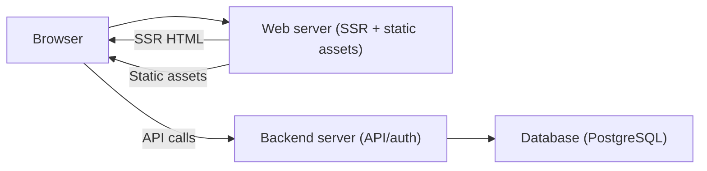

# Server‑Side Rendering (SSR) for selected pages

## Summary
This document describes the first implementation of SSR in Wasp that can be enabled per page via `ssr: true`. The feature generates a small SSR server alongside the Vite build and renders selected routes on the server, while preserving the existing client‑side router and hydration behavior.

## Motivation
- Improve first‑paint and perceived performance for selected routes.
- Support basic SEO use cases where HTML should be present in initial response.
- Keep the initial scope minimal, avoiding a full SSR framework rewrite.

## Goals
- Allow page‑level SSR opt‑in with a simple `ssr: true` flag.
- Keep default behavior unchanged (CSR for all pages).
- Work with existing routing, React Query, and app structure.
- Provide a production‑like SSR preview command for verification.

## Non-goals (for this iteration)
- Full SSR in development mode (no SSR in `wasp start` yet).
- Streaming or partial hydration.
- Automatic data prefetch/dehydration across React Query.
- Auth‑aware SSR (SSR for pages requiring auth). Only public pages are supported.
- SEO head management (no special support for Helmet/etc.).
- React Server Components, server actions/functions, or “full‑stack SSR framework” features.

## Scope note (use cases)
This first iteration is intentionally **lightweight** and best suited for public, marketing/landing pages where an HTML first response is useful. It is not intended to replace a full SSR framework.

## What a full SSR framework would imply (high level)
Adding React Server Components, server actions/functions, and streaming SSR would require:
- A new build pipeline that splits server/client component graphs and produces a Flight manifest.
- A new runtime server capable of streaming RSC payloads and SSR HTML.
- Routing changes to support server component trees and streaming.
- New transport and security model for server actions/functions.
- Deployment and dev‑mode tooling changes (the web client becomes a server runtime).

This is a significant architectural shift and intentionally out of scope for the current POC.

## User‑facing design
### Wasp file

```wasp
page HomePage {
  component: import { HomePage } from "@src/pages/HomePage",
  ssr: true
}
```

- Default is `ssr: false`.
- SSR is allowed only on **public** pages (pages without `authRequired`). This is enforced by validation.

### Runtime usage
SSR is produced in the generated `web-app/` build by a small Node server. The recommended flow:

1. Build the app (`wasp build`).
2. In `.wasp/out/web-app`, run `npm run build` (builds client + SSR bundle).
3. Run `npm run preview` (runs the SSR server).

This yields server‑rendered HTML for SSR‑enabled routes, with hydration on the client.

## Architecture

### Impact on app topology
Previously, the web server was a pure static file server for the SPA. With SSR enabled,
the web server becomes an **active renderer** for selected routes while still serving
static assets. The backend server (API/auth) remains unchanged.

This means the overall architecture stays at **two servers**:
- Backend server: API/auth/actions/queries.
- Web server: static assets + SSR rendering for selected routes.



### Build outputs (web app)
- `src/routes.tsx`: generated route table + SSR flags per route.
- `src/entry-server.tsx`: SSR entry that builds a MemoryRouter and renders to string.
- `server-ssr.mjs`: Node server that serves static assets and SSR HTML.
- `ssr.json`: tiny JSON file used by deploy tooling to detect whether SSR is enabled.

### SSR flow
1. `server-ssr.mjs` receives the request and checks if the route is SSR‑enabled.
2. If SSR:
   - It calls `renderToString` with a MemoryRouter.
   - Injects HTML into `index.html` at `<!--ssr-outlet-->`.
   - Adds `data-wasp-ssr="1"` to the root element.
   - Injects Helmet head tags (title/meta/link/script/style/noscript) into `<!--ssr-head-->`.
3. If not SSR:
   - Serves the plain `index.html` (CSR).
4. If the route does not match any app route:
   - Serves the app shell with a `404` status.

### Client hydration
`src/index.tsx` checks for `data-wasp-ssr="1"` on the root element:
- If present, it calls `hydrateRoot`.
- Otherwise, it calls `createRoot`.

### Deployment implications
- If any page uses SSR, the web client must be deployed as a Node server (not static hosting).
- Wasp Deploy (Fly/Railway) detects SSR via `.wasp/out/web-app/ssr.json` and builds a Node-based client image when needed.
- The SSR web server is a single Node process; we expect container/platform supervision (Fly/Railway/etc.) instead of a separate process manager like PM2.

## Validation & constraints
- SSR is **only supported for public pages**. Pages with `authRequired` are rejected by validation.
- SSR uses `renderToString`, so:
  - No streaming.
  - No server‑only data access beyond what the component does on render.
- `window`/DOM usage in SSR pages must be guarded.
- Server‑side redirects are not supported in this iteration.
- SSR head management supports Helmet head tags only (no html/body attributes yet).

## Implementation details

### Generator changes
- `Page` spec adds `ssr :: Maybe Bool`.
- Router generation includes `routeNameToSsr` mapping and emits `routes.tsx`.
- App templates updated to add SSR outputs and switch to `hydrateRoot` when SSR is used.
- Web app generator writes `ssr.json` for deploy detection.

### SSR server (`server-ssr.mjs`)
- Serves static assets from the Vite build output.
- Uses the same `baseDir` as the client router.
- Validates route SSR eligibility via generated `routeNameToSsr` mapping.

### Data fetching
- React Query is wired for normal client usage.
- SSR does **not** currently prefetch queries or dehydrate state.
- This is intentional to keep scope small; future work can add prefetch/dehydrate.

## Testing
- Snapshot tests updated to include SSR outputs.
- Manual verification via `npm run preview` in generated web app.

## Rollout plan
- Treat as experimental; document limitations clearly.
- Gather feedback on which SSR‑only features should be prioritized next.

## Open questions
- Should SSR be enabled in dev mode (`wasp start`) or stay preview‑only?
- How should auth‑required pages be handled (redirect? 401)?
- Should we add first‑class data prefetch/dehydrate support?
- Should SSR be enabled for all routes under a flag, or keep per‑page only?
- Should the backend server take over SSR to allow a single‑server deployment?

## Alternative: SSR handled by the backend server (single‑server deployment)
It is technically possible to move SSR into the Wasp backend server so that a
single Node process serves API **and** SSR HTML. This would remove the need for
a separate web server in production, but it’s a larger architectural change:

Pros:
- Single deployable service (simpler ops in some environments).
- No separate “client app” deploy target.

Cons:
- Requires the backend server to serve static assets and SSR HTML.
- Requires runtime access to the web build output (`build/` + `build-ssr/`).
- Changes the current deployment model (Fly/Railway currently assume a static client app).
- Needs updates to generator output layout, server start scripts, and docs.

For this POC, SSR is kept in the web server to minimize disruption and avoid
reworking deploy tooling.
