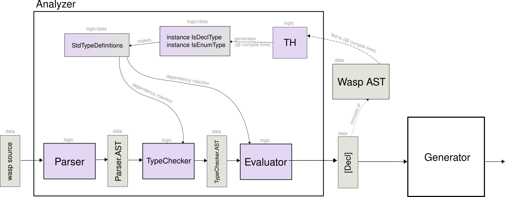

# Analyzer

Please note that in the diagram below, there is one step missing between the `Parser` and the `TypeChecker`: the injection of `Entity` declarations based on the parsed `schema.prisma` file.

Check comments in Analyzer.hs for detailed overview of Analyzer module.
