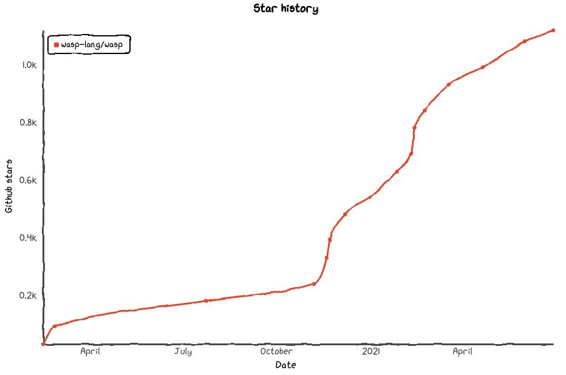
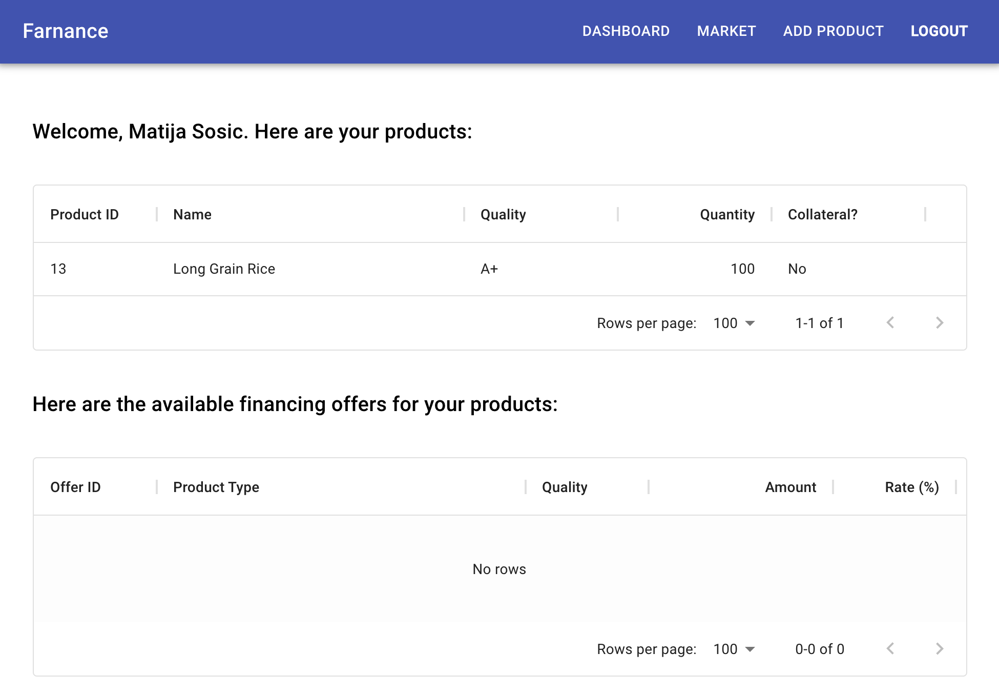

import Link from '@docusaurus/Link';
import useBaseUrl from '@docusaurus/useBaseUrl';

export const Divider = () => (
     → 
)

export const Cta = () => (
    

        <Link className='blog-header-cta--link' to={useBaseUrl('/docs')}>
            We are in Alpha (try it out)!
        </Link>
        <Divider />
        <Link className='blog-header-cta--link' to='https://discord.gg/rzdnErX'>
            Join our community
        </Link>
        <Divider />
        <Link className='blog-header-cta--link'
            to='https://wasp-lang.notion.site/Founding-Engineer-at-Wasp-402274568afa4d7eb7f428f8fa2c0816'>
            Work with us
        </Link>
    

)

*Wasp is a configuration language (DSL) for building full-stack web apps with less code and best practices that works alongside React and Node.js. We are on a mission to streamline web app development while empowering developers to continue using the power of code and their favourite tools.* 

<Cta />

After graduating from Y Combinator's Winter 2021 Batch, we are super excited to announce that Wasp raised $1.5m in our first funding round! The round is led by Lunar Ventures and joined by HV Capital.

The best thing about it is that the majority of our investors are either experienced engineers themselves (e.g. ex-Facebook, Twitter and Airbnb) or have a strong focus on investing in deep technology and developer companies. They share the vision we have with Wasp, understand and care about the problem we are solving.

Besides Lunar and HV Capital, we are thrilled to welcome on board:
- 468 Capital (led by Florian Leibert, founder of Mesosphere and ex-Twitter and Airbnb eng.)
- Charlie Songhurst
- Tokyo Black
- Acequia Capital
- Abstraction Capital
- Ben Tossell, founder of Makerpad (acq. by Zapier)
- Muthukrishnan Ramabadran, Senior Software Engineer at Lyft
- Yun-Fang, ex-Facebook engineer
- Marcel P. Lima from Heller House
- Chris Schagen, former CMO on Contentful
- Rahul Thathoo, Sr. Eng. Manager at Square
- Preetha Parthasarathy
- John Kobs

## Why did we raise funding?

At its core, Wasp is an open-source project and we have full intention for it to stay that way. Open-source is one of the most powerful ways to write software and we want to make sure Wasp is freely accessible to every developer.

Wasp is a technically innovative and challenging project. Even though we are not building a new general programming language from scratch, there still exists an essential complexity of building a language and all the tooling around it. Wasp offers a lot of abstractions that are being introduced for the first time and there is no clear blueprint to follow, and this is why such an undertaking requires full-time attention and dedication. Hence, we plan on expanding the team with some amazing engineers to accelerate us on our journey.

## Where are we today?

Today, Wasp is in Alpha. That means there are many features we still have to add and many that are probably going to change. But it also means you can [try it out, build a full-stack web app](/docs) and see what it is all about. You can also join [our community](https://discord.gg/rzdnErX) and share your feedback and experience with us - we'd be happy to hear from you!

Since we launched our Alpha several months ago, we got some amazing feedback on [Product Hunt](https://www.producthunt.com/posts/wasp-lang-alpha) and [Hacker News](https://news.ycombinator.com/item?id=26091956).

We've also grown a lot and recently passed 1,000 stars on [our Github repo](https://github.com/wasp-lang/wasp) - thank you!

To date, over 250 projects have been created with Wasp in the last couple of months and some were even deployed to production - like [Farnance](https://farnance.netlify.app/) that ended up being a hackathon winner! Check out their source code [here](https://github.com/jlaneve/Farnance).

## The team

Martin and I have been working on Wasp for the last two years and together with our amazing contributors, who made us believe our vision is possible and made it what it is today. Having led development of several complex web apps in the past and continuously switching to the latest stack, we felt the pain and could also clearly see the patterns that we felt were mature and common enough to be worth extracting into a simpler, higher-level language.

  <figure>
    
    <figcaption>Martin and I during our first YC interview. Read <Link to={useBaseUrl('blog/2021/02/23/journey-to-ycombinator')}>here</Link> for more details on our journey to YC!</figcaption>
  </figure>

In case you couldn't tell from the photo and our identical glasses, we are twins (but not fraternal ones, and I'm a couple of minutes older, which makes me CEO :D)!

We are coming from the background of C++, algorithm competitions and applied algorithms in bioinformatics (Martin built [edlib](https://github.com/martinsos/edlib), his first OSS project - a popular sequence alignment library used by top bioinfo companies like PacBio) and did our internships in Google and Palantir. There we first encountered the modern web stack and went on to lead development of web platforms in fintech and bioinformatics space. We also had a startup previously ([TalkBook](https://talkbook.co/home)), where we learned a lot about talking to users and building something that solves a problem they have.

## What comes next?

With the funding secured, we can now fully focus on developing Wasp and the ecosystem around it. We can start planning for more [long-term features](https://github.com/wasp-lang/wasp/issues/109) that we couldn't fully commit to until now, and we can expand our team to move faster and bring more great people on board with new perspectives and enable them to fully employ their knowledge and creativity without any distractions.

Our immediate focus is to bring Wasp to Beta and then 1.0 (see our high-level roadmap [here](https://wasp-lang.dev/#what-can-do)), while also building a strong foundation for our open source community. We believe community is the key to the success for Wasp and we will do everything in our power to make sure everybody feels welcome and has a fun and rewarding experience both building apps and contributing to the project. If you want to shape how millions of engineers develop the web apps of tomorrow, join our community and work with us!

Thank you for reading - we can't wait to see what you will build!

<Cta />
