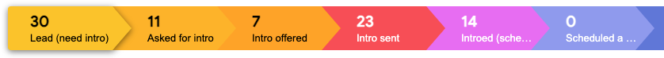

import Link from '@docusaurus/Link';
import useBaseUrl from '@docusaurus/useBaseUrl';
import InBlogCta from './components/InBlogCta';
import WaspIntro from './_wasp-intro.md';

<WaspIntro />
<InBlogCta />

Wasp was part of [Y Combinator](https://www.ycombinator.com/)’s W21 batch, which took place from January of 2021 until the end of March.

At Demo Day, our product had a solid traction (200+ projects created, 1k Github stars, good [ProductHunt](https://www.producthunt.com/posts/wasp-lang-alpha) and [HackerNews](https://news.ycombinator.com/item?id=26091956) feedback) but no monetisation yet, which is typical for open-source projects at this stage. Being based in the EU, we also didn't have a huge network in the Bay Area prior to the fundraise.

:::caution
I will try to refrain from giving "general" advice (as our fundraise is a single data point), and focus on the stats and specific things that worked for us. Keep in mind the same might not work for you - I recommend always taking advice with a pinch of salt to see what makes the most sense in your case.
:::

As we approached our fundraise, we didn't really know what to expect. We had friends from the previous batch that raised a big round very quickly (even before Demo Day) and heard a couple of stories from a few other YC founders who were also quite successful, so we imagined it might go quickly for us too.

As you can see from the title, we had quite a journey with plenty of meetings that provided us a lot of input on how to improve our pitch, and maybe even more importantly, how to reach the right investors.

Here are our stats:
- we spoke to **212 investors** → that led to **250+ meetings**
- **98 days** passed between the first and the last signed SAFE
- **171** investor passed, **24** never responded, **17** invested

And here is how it all looked when laid out on a timeline:

Here are some of the things that worked for us:

## We treated fundraising as a sales process (and stuck to it)

This means we had a typical sales funnel - lead generation, selling (pitching) and following up:
- **Lead generation**: it started with Demo Day of course, from which we got 100+ leads but none of them ended up investing (more on that below). After that we mainly relied on our YC batchmates to identify relevant investors and get the intros.
- **Pitching**: we did a conversational pitch without the deck, but we had a Notion one-pager from which I would drop links during the conversation (to e.g. our traction chart, user testimonials etc.). It also worked well as investors would typically find it interesting and keep scrolling through as we talked, asking follow-up questions.
- **Following-up**: we followed up once per week. I would usually "batch process" it each Wednesday. We used Streak to identify all the leads that I haven't heard from in over 7 days (there is a filter for that) and then manually emailed them.

We started with tracking everything in Google Sheets, but with the volume of leads it soon became hard to navigate them through the funnel. Then we switched to Streak (used their fundraising template, and modified it a bit) and that worked great. The most helpful thing for me was having a CRM that is integrated with gmail, that made the process much more seamless and gave us better overview of the funnel. As soon as I would receive an email I could see in which stage the investor is, and it was also super easy to add new investors straight from gmail - it saved us from the dreaded context switching and kept us focused.

## Our pitch became much better after ~50 meetings
We kept being critical of our pitch and kept a list of questions that we felt needed more work. We called it "creating narratives", e.g. why the right time for our product is now, presenting the team, or how we plan to monetise. We talked to other companies in the same space (devtools, OSS), investigated comparatives (big companies we compared ourselves too), talked to our angels who were domain experts and used all that to build a more convincing story.

I never intended to learn our pitch by heart, but after delivering it for 100s of times just that happened - both me and Martin (my brother and cofounder, who wasn't pitching but was always sitting behind me and provided feedback, especially in the beginning) knew it word by word and I realised how much more polished it sounds and how much more confident I felt compared to when we just started.

## Our goal was to get to 100 no's
After about 50 meetings (and about 20 VCs having passed on us) we started feeling a bit disheartened, as things didn't seem to go so easy as we initially expected. Then I chatted to a friend who also recently finished their fundraise and he gave me a tour of Streak - I saw their numbers and that over 150 investors passed on them! With that I realised our 20 passes were just the beginning and that instead of chasing yeses we should actually chase no's :) - they are more predictable, you'll get plenty of them and they will clearly show your progress.

## We had 100+ leads from Demo Day - none of them invested
This is probably pretty specific for our case, but it's how it went. Connecting with a startup on Demo Day is a very low-cost action for investors. Also, as many investors as there are on Demo Day, there are even more of them who aren't.

When we sorted through the connections we got, about 20% were a really good fit for us, meaning they invest in deep tech / OSS companies, have invested recently, invest in our stage etc.

We still met with pretty much all the interested leads, but we quickly realised that due to our product being deeply technical and the company being pre-revenue, only investors with engineering backgrounds were really interested because they could understand and get excited about what we do. That informed us to generate our leads with much narrower focus.

We looked at other OSS & dev tools companies in our batch, looked at who invested in them and asked for intros. Our batchmates were also in the fundraising mode, they knew how hard it can be and they wanted to help, so everything moved very quickly.

## We learned not to spend time on non-believers
As we learned to focus on the highly qualified leads, we also learned that it is very hard (impossible) to change somebody's mind. Plenty of investors liked u and what we do, but they were skeptical about e.g. market size or monetisation potential and made that clear from the start. Many of them were keen to keep chatting, wanted to meet our angel investors etc., but none of that helped change their mind and it was very distracting for us. I believe it is very hard to change somebody's worldview, especially in the seed stage when there is often no strong factual evidence to do so.

## Passing through the "valley of death"
As you can see on the chart, about two months in we barely passed $300k, and we had a whole month with no progress. At the same time, we felt that our pitch got significantly better and we were reaching investors much better suited for us. 
It was one of the most difficult times, seeing others close their rounds, but we decided to trust in the process and keep going until we have used all the resources we had. It was also the time our lead investor took time to do their own pretty extensive due diligence on Wasp, so although it looks like no progress was made from the outside, a lot of stuff was actually happening behind the scenes.

Suddenly, a few things clicked together from multiple sides and our round was quickly closed, even oversubscribed! It was truly a magical feeling to start closing investors in a single day, even during the first call, when previously it took us weeks to close our first $50k check. The big factor was also that our round was getting filled up and that of course motivated investors to move faster.

## We compared ourselves to big, successful companies
This is one of the best pieces of advice we got from YC partners about fundraising. In the beginning we didn't understand how important this was, but once the meetings started we realised this was one of the best ways to explain the potential of our company to investors. With the innovation in technology that isn't easy to grasp, they needed something to hold on to understand how the business model and distribution could work, and it sounds much more doable if there is a playbook we can follow rather than us reinventing that as well. We kept working on finding a good comparable (we had a few) and explaining in which ways we are similar and why.

## Good luck - you can do it!
I hope you found this helpful and that our story will motivate you to keep going once things get hard! We wish you the best of luck and also feel free to reach out if you'll have any questions.

<InBlogCta />
