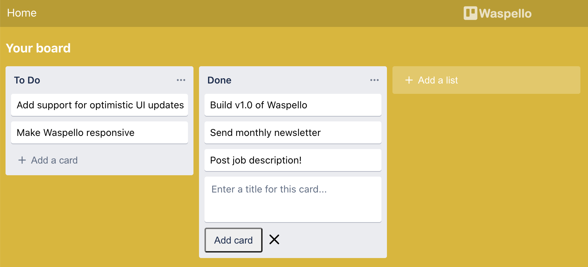
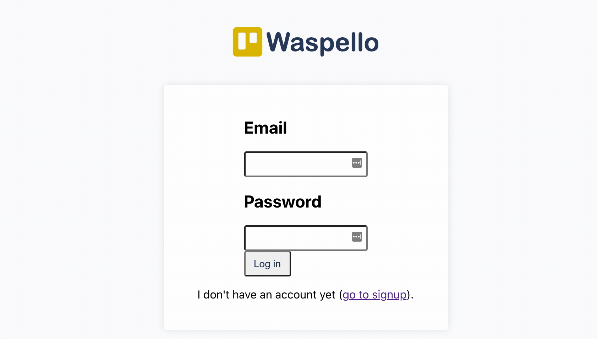
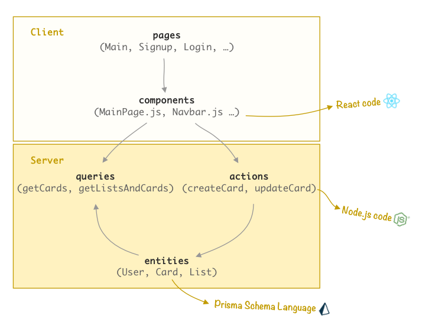

import Link from '@docusaurus/Link';
import useBaseUrl from '@docusaurus/useBaseUrl';
import InBlogCta from './components/InBlogCta';
import WaspIntro from './_wasp-intro.md';
import ImgCap from './components/ImgCap'



<p align="center">
    <Link to={'https://waspello.netlify.app/'}>Try Waspello here!</Link> | <Link to={'https://github.com/wasp-lang/wasp/blob/master/examples/waspello/main.wasp'}>See the code</Link>
</p>

<WaspIntro />
<InBlogCta />

## Why Trello?

While building Wasp, our goal is to use it as much as we can to build our projects and play with it, so we can learn what works and what we should do next. This is why Trello was a great choice of app to build with Wasp - it is one of the most well-known full-stack web apps, it's very simple and intuitive to use  but also covers a good portion of features used by today's modern web apps.

So let's dig in and see and how it went - what works, what doesn't and, what's missing/coming next!

## What works?

### It's alive ⚡🤖 !!
The good news is all the basic functionality is here - Waspello users can signup/log in which brings them to their project board where they can perform CRUD operations on lists and cards - create them, edit them, move them around, etc. Let's see it in action:


<p align="center" class="image-caption">
    Waspello in action!
</p>

As you can see things work, but not everything is perfect (e.g. there is a delay when creating/moving a card) - we'll examine why is that so a bit later.

### Under the hood 🚘 🔧
Here is a simple visual overview of Waspello's code anatomy (which applies to every Wasp app):


<p align="center" class="image-caption">
    Waspello code anatomy
</p>

Let's now dig in a bit deeper and shortly examine each of the concepts Wasp supports (page, query, entity, ...) and learn through code samples how to use it to implement Waspello.

#### Entities

It all starts with a data model definition (called `entity` in Wasp), which is defined via Prisma Schema Language:

```js title="main.wasp | Defining entities via Prisma Schema Language"
// Entities

entity User {=psl
    id          Int     @id @default(autoincrement())
    email       String  @unique
    password    String
    lists       List[]
    cards       Card[]
psl=}

entity List {=psl
    id          Int     @id @default(autoincrement())
    name        String
    pos         Float

    // List has a single author.
    user        User    @relation(fields: [userId], references: [id])
    userId      Int

    cards       Card[]
psl=}

entity Card {=psl
    id          Int     @id @default(autoincrement())
    title       String
    pos         Float

    // Card belongs to a single list.
    list        List    @relation(fields: [listId], references: [id])
    listId      Int

    // Card has a single author.
    author      User    @relation(fields: [authorId], references: [id])
    authorId    Int
psl=}
```

Those three entities are all we need! Wasp uses Prisma to create a database schema underneath and allows the developer to query it through its generated SDK.

#### Queries and Actions (Operations)
After we've defined our data models, the next step is to do something with them! We can read/create/update/delete an entity and that is what `query` and `action` mechanisms are for. Below follows an example from the Waspello code that demonstrates how it works.

The first step is to declare to Wasp there will be a query, point to the actual function containing the query logic, and state from which entities it will be reading information:
```js title="main.wasp | Declaration of a query in Wasp"
query getListsAndCards {
    // Points to the function which contains query logic.
    fn: import { getListsAndCards } from "@ext/queries.js",

    // This query depends on List and Card entities.
    // If any of them changes this query will get re-fetched (cache invalidation).
    entities: [List, Card]
}
```

The main point of this declaration is for Wasp to be aware of the query and thus be able to **do a lot of heavy lifting for us - e.g. it will make the query available to the client without any extra code**, all that developer needs to do is import it in their React component. **Another big thing is cache invalidation / automatic re-fetching of the query once the data changes** (this is why it is important to declare which entities it depends on).

The remaining step is to write the function with the query logic:
```js title="ext/queries.js | Query logic, using Prisma SDK via Node.js"
export const getListsAndCards = async (args, context) => {
  // Only authenticated users can execute this query.
  if (!context.user) { throw new HttpError(403) }

  return context.entities.List.findMany({
    // We want to make sure user can access only their own cards.
    where: { user: { id: context.user.id } },
    include: { cards: true }
  })
}
```
This is just a regular Node.js function, there are no limits on what you can return! All the stuff provided by Wasp (user data, Prisma SDK for a specific entity) comes in a `context` variable.

The code for actions is very similar (we just need to use `action` keyword instead of `query`) so I won't repeat it here. You can check out the code for `updateCard` action [here](https://github.com/wasp-lang/wasp/blob/master/examples/waspello/main.wasp#L103).

#### Pages, routing & components
To display all the nice data we have, we'll use React components. There are no limits to how you can use React components within Wasp, the only one is that each `page` has its root component:
```js title="main.wasp | Declaration of a page & route in Wasp"
route "/" -> page Main
page Main {
    authRequired: true,
    component: import Main from "@ext/MainPage.js"
}
```

All pretty straightforward so far! As you can see here, Wasp also provides [authentication out-of-the-box](/docs/language/basic-elements#authentication--authorization).

Currently, the majority of the client logic of Waspello is contained in `ext/MainPage.js` (we should break it down a little 😅 - [you can help us!](https://github.com/wasp-lang/wasp/issues/334)). Just to give you an idea, here's a quick glimpse into it:

```js title="ext/MainPage.js | Using React component in Wasp"
// "Special" imports provided by Wasp.
import { useQuery } from '@wasp/queries'
import getListsAndCards from '@wasp/queries/getListsAndCards'
import createList from '@wasp/actions/createList'

const MainPage = ({ user }) => {
  // Fetching data via useQuery.
  const { data: listsAndCards, isFetchingListsAndCards, errorListsAndCards }
    = useQuery(getListsAndCards)

  // A lot of data transformations and sub components.
  ...

  // Display lists and cards.
  return (
    ...
  )
}
```
Once you've defined a query or action as described above, you can immediately import it into your client code as shown in the code sample, by using the `@wasp` prefix in the import path. `useQuery` ensures reactivity so once the data changes the query will get re-fetched. You can find more details about it [here](/docs/language/basic-elements#usequery).

This is pretty much it from the stuff that works 😄 ! I kinda rushed a bit through things here - for more details on all Wasp features and to build your first app with Wasp, check out our [docs](/docs/).

## What doesn't work (yet)
The main problem of the current implementation of Waspello is the **lack of support for optimistic UI updates in Wasp**. What this means is that currently, when an entity-related change is made (e.g. a card is moved from one list to another), we have to wait until that change is fully executed on the server until it is visible in the UI, which causes a noticeable delay.  
In many cases that is not an issue, but when UI elements are all visible at once and it is expected from them to be updated immediately, then it is noticeable. This is also one of the main reasons why we chose to work on Waspello - to have a benchmark/sandbox for this feature! Due to this issue, here's how things currently look like:

<ImgCap alt="Waspello - no optimistic UI update" source="img/waspello-no-opt-UI-updates.gif" caption="Without an optimistic UI update, there is a delay"/>

You can notice the delay between the moment the card is dropped on the "Done" list and the moment it becomes a part of that list. The reason is that at the moment of dropping the card on "Done" list, the API request with the change is sent to the server, and only when that change is fully processed on the server and saved to the database, the query `getListsAndCards` returns the correct info and consequently, UI is updated to the correct state.  
That is why upon dropping on "Done", the card first goes back to the original list (because the change is not saved in db yet, so `useQuery(getListsAndCards)` still returns the "old" state), it waits a bit until the API request is processed successfully, and just then the change gets reflected in the UI.

#### The solution
A typical approach for solving this issue is to **make the client a bit more self-confident, in a way that it doesn't wait for the confirmation from the server but rather immediately updates the UI, at the same time or even before the API request is fired**. If it then turns out something went wrong on the server (which typically shouldn't happen), it reverses the change and shows an error message. Thus the name optimistic UI update, since the client assumes in advance that everything will go well to provide a nicer UX.

<p align="center">
  <figure>
    
    <figcaption class="image-caption">The client when performing an optimistic UI update</figcaption>
  </figure>
</p>

This is one of the most complex and error-prone features when developing web apps today and that is why we are super excited to tackle it in Wasp and make the experience as smooth as possible! We are currently in the "figuring out the solution" stage and you can [track/join the discussion on GitHub](https://github.com/wasp-lang/wasp/issues/63)!

## What's missing (next features)
Although it looks super simple at the first glance, Trello is in fact a huge app with lots and lots of cool features hidden under the surface! Here are some of the more obvious ones that are currently not supported in Waspello:
- **Users can have multiple boards**, for different projects (currently we have no notion of a "Board" entity in Waspello at all, so there is implicitly only one)
- **Detailed card view** - when clicked on a card, a "full" view with extra options opens
- **Search** - user can search for a specific list/card
- **Collaboration** - multiple users can participate on the same board

And many more - e.g. support for workspaces (next level of the hierarchy, a collection of boards), card labels, filters, ... . It is very helpful to have such a variety of features since we can use it as a testing ground for Wasp and use it as a guiding star towards Beta/1.0!

## Become a Waspeller!
<p align="center" >
  <figure style={{width: '55%'}}>
    
    <figcaption class="image-caption">Lightweight Waspello propaganda</figcaption>
  </figure>
</p>

 If you want to get involved with OSS and at the same time familiarize yourself with Wasp, this is a great way to get started - feel free to [choose one of the features listed here or add your own](https://github.com/wasp-lang/wasp/issues/337) and help us make Waspello the best demo productivity app out there!

Also, make sure to [join our community on Discord](https://discord.gg/rzdnErX). We’re always there and are looking forward to seeing what you build!

<InBlogCta />
