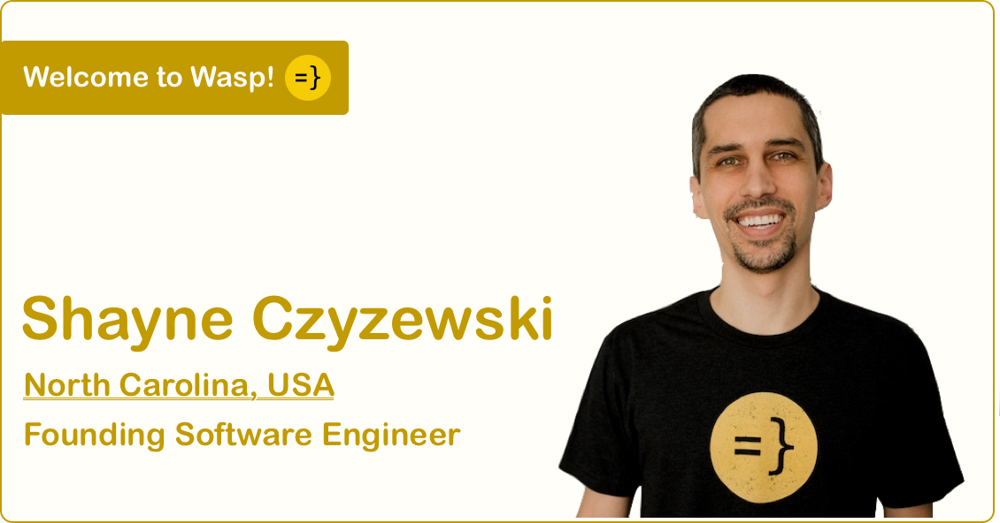

import Link from '@docusaurus/Link';
import useBaseUrl from '@docusaurus/useBaseUrl';
import InBlogCta from './components/InBlogCta';
import WaspIntro from './_wasp-intro.md';

Find Shayne on [Twitter](https://twitter.com/shayneczyzewski) and [GitHub](https://github.com/shayneczyzewski).

<!--truncate-->

<WaspIntro />
<InBlogCta />

**We are super excited to introduce Shayne, the first person to join the Wasp team!** Shayne is a battle-tested veteran engineer, with experiences ranging from leading teams at high-growth startups to working at enterprise giants such as Red Hat and NetApp. Along with that, he is super nice and incredibly pleasant to work with - we are beyond thrilled that he chose Wasp for his next adventure with him and can't wait for you to [meet him in our Discord community](https://discord.gg/rzdnErX)!

#### Why did you join Wasp?

I have always been excited about high-quality dev tooling and web frameworks, and I am also interested in Haskell/compilers. The technology, problem space, and team were just too compelling to pass up. I was also excited to be on the ground floor of a YC startup, where I can have a significant impact and help build a broad, welcoming, open-source community of Wasp developers.

#### What did you do before?

I have been a professional developer for over a decade, mostly in backend web development, with experience from Lockheed Martin, Morgan Stanley, NetApp, and Red Hat. Most recently, I was the head of engineering at an edtech company called LearnPlatform, where we were handling a quarter of a billion incoming events per day with the goal of understanding and improving student access to technology that works best for them.

#### What is your favorite language/framework?

My favorite framework is probably Ruby on Rails, for the elegance of ideas and seamless implementation. I never had an actual favorite programming language, as I enjoy different aspects of Ruby, Elixir, JavaScript, C#, and others. My least favorite has always been Java. My current favorite language is fast becoming Haskell. :)

The most interesting niche programming language I have used professionally was Ada at Lockheed Martin. We used it to build distributed, real-time, full-motion flight simulators for the military (think multi-million dollar, hyperrealistic multiplayer video games).

#### What are you most excited about in Wasp?

As web developers, I think we have gotten accustomed to a certain level of complexity that is not associated with the problem we are solving but the boilerplate of the process. This lack of nuance between accidental and essential complexity has recently led to less than ideal low-code approaches. Wasp, in my view, takes the better approach of a higher-level DSL to abstract some of the typical details using best practices, leaving you to focus on your problem by writing actual code that produces a real web app without any vendor lock-in. That is pretty amazing to me!

#### How did you start coding?

Probably by creating some basic LAMP apps in the late 90s while in high school. Growing up, our parents wanted us to have summer jobs to earn money we could spend during the rest of the year. I quickly found that freelance web development on Elance, and similar sites, was more enjoyable and profitable than the alternatives available to 15-year-olds. From then on, I was hooked.

#### What is your dev setup?

MacBook Air M1 with an external Dell display, Magic Trackpad, and a split mechanical keyboard from UHK (Ultimate Hacking Keyboard).

#### `camelCase` or `snake_case`?

I default to whatever the language or codebase conventions are. Visually, I prefer snake case, though (and definitely spaces over tabs). ;)

#### What's one piece of advice you'd give to an aspiring developer?

One of the biggest differentiators I have found between good and great engineers is that the great ones possess a continuous desire to learn and grow. They view challenges as fun opportunities to expand their knowledge and skills, recognizing that they always have room for improvement. The corollary is that impostor syndrome is real and never goes away, so try not to be too hard on yourself along the way!

*This post was the first of several new hire announcements in the months to come, so stay tuned and reach out if you want to work with Martin, Shayne, and myself!*

<InBlogCta />
