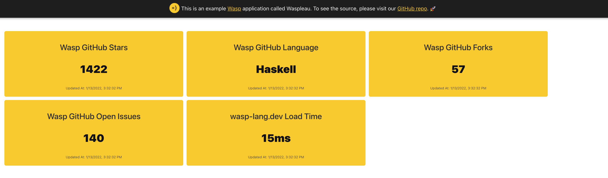

import Link from '@docusaurus/Link';
import useBaseUrl from '@docusaurus/useBaseUrl';
import InBlogCta from './components/InBlogCta';
import WaspIntro from './_wasp-intro.md';
import ImgWithCaption from './components/ImgWithCaption'



<p align="center">
  <Link to={'https://waspleau.netlify.app/'}>See Waspleau here!</Link> | <Link to={'https://github.com/wasp-lang/wasp/blob/main/examples/waspleau'}>See the code</Link>
</p>

We've built a dashboard powered by a job queue using Wasp!

<!--truncate-->

<WaspIntro />
<InBlogCta />


## Hello, Waspleau!

Let’s face it - metrics are all around us. Wouldn’t it be great if there was a quick and easy way to build a nice-looking metrics dashboard from data pulled in by HTTP calls to many different sources, cache the data in-memory, and periodically update it via background jobs? Why yes, yes it would... so we made an example Wasp app called Waspleau that does just that!

Here is what it looks like live: https://waspleau.netlify.app/ There is also a screenshot at the top of this post for those who refrain from clicking on any unknown web links for fear of being **Rickrolled**. Respect.

## “Show me the code”

So, what do we need to get started? First, we need a way to schedule and run jobs; for this, we decided to use [Bull](https://github.com/OptimalBits/bull). Ok, let’s wire it up. This should be easy, right? We can add external NPM dependencies in our Wasp files like so:

```css title="main.wasp"
app waspleau {
  title: "Waspleau",

  dependencies: [
    ("bull", "4.1.1"),
    ("axios", "^0.21.1")
  ]
}
```

But where do we declare our queue and processing callback functions in Wasp? Uh oh...


### `server.setupFn` for queue setup

Thankfully, Waspleau can leverage a powerful and flexible [hook supplied by Wasp](https://wasp-lang.dev/docs/language/basic-elements#setupfn) called `server.setupFn`. This declares a JavaScript function that will be executed on server start. Yahoo! This means we can do things like the following:

```css title="main.wasp"
app waspleau {
  ...

  server: {
    setupFn: import serverSetup from "@server/serverSetup.js"
  }
}
```

```js title="src/server/serverSetup.js"
import Queue from 'bull'

const queue = new Queue('waspleau', process.env.REDIS_URL || 'redis://127.0.0.1:6379',
  { defaultJobOptions: { removeOnComplete: true } }
)

queue.process('*', async (job) => { ... })

export default async () => {
  // To initially populate the queue, we can do:
  await queue.add({ ... }) // first run, one-off job
  await queue.add({ ... }, { repeat: { cron: '*/10 * * * *' } }) // recurring job
}
```

### Abstracting workers and job processing

Awesome, we can now enqueue and process background jobs, but how can we make it easy to create many different kinds of jobs and schedule them to run at different intervals? For Waspleau, we created our own type of worker object convention to help standardize and simplify adding more:

```js title="src/server/workers/template.js"
const workerFunction = async (opts) => {
  return [
    { name: 'Metric 1 name', value: 'foo', updatedAt: ... },
    { name: 'Metric 2 name', value: 'bar', updatedAt: ... },
  ]
}

export const workerTemplate = { name: 'Job Name', fn: workerFunction, schedule: '*/10 * * * *' }
```

With this `workerFunction` setup, we can return one or more metrics per worker type. Waspleau can easily use any module that exports this shape. Here is a real example from the demo that makes HTTP calls to GitHub’s API with Axios:

```js title="src/server/workers/github.js"
import axios from 'axios'

const workerFunction = async (opts) => {
  console.log('github.js workerFunction')

  const now = Date.now()

  try {
    const response = await axios.get('https://api.github.com/repos/wasp-lang/wasp')

    return [
      { name: 'Wasp GitHub Stars', value: response.data.stargazers_count, updatedAt: now },
      { name: 'Wasp GitHub Language', value: response.data.language, updatedAt: now },
      { name: 'Wasp GitHub Forks', value: response.data.forks, updatedAt: now },
      { name: 'Wasp GitHub Open Issues', value: response.data.open_issues, updatedAt: now },
    ]
  } catch (error) {
    console.error(error)
    return []
  }
}

export const githubWorker = { name: 'GitHub API', fn: workerFunction, schedule: '*/10 * * * *' }
```

_Note: Please see the [actual serverSetup.js file](https://github.com/wasp-lang/wasp/blob/main/examples/waspleau/src/server/serverSetup.js) for how we use this abstraction in practice._

### Server → client

We now have jobs running and data updating at regular intervals, nice, but we still need a way to send that data down the wire. Here, we expose the in-memory data from our `server.setupFn` module so our queries can also use it:

```css title="main.wasp"
...

query dashboard {
  fn: import { refreshDashboardData } from "@server/dashboard.js"
}
```

```js title="src/server/dashboard.js"
import { getDashboardData } from './serverSetup.js'

export const refreshDashboardData = async (_args, _context) => {
  return getDashboardData()
}
```

```js title="src/server/serverSetup.js"
...

const dashboardData = {} // This is updated in the queue process callback
export const getDashboardData = () => Object.values(dashboardData).flat()
```

From there, we can request it on the frontend in React components as usual and also set a one-minute client-side refetch interval just for good measure:

```js title="src/client/MainPage.js"
...

const { data: dashboardData, isFetching, error } = useQuery(refreshDashboardData, null, { refetchInterval: 60 * 1000 })

...
```

## Congratulations, let’s dance!

Whew, we did it! If you’d like to deploy your own customized version of this dashboard, please clone [our repo](https://github.com/wasp-lang/wasp) and check out the Waspleau example [README.md](https://github.com/wasp-lang/wasp/blob/main/examples/waspleau/README.md) for tips on getting started. You can also [check out our docs](https://wasp-lang.dev/docs) to dive deeper into anything.


_Still got ya! :D_

## 2022 is going to be exciting 🚀

While this functionality currently exists outside of Wasp, keep an eye on our roadmap as we head toward 1.0. We will be busy adding lots of great features to our Wasp DSL in the coming months that will supercharge your web development experience! Thanks for reading, and please feel free to connect with us in [Discord](https://discord.gg/rzdnErX) about using Wasp on your next project.
