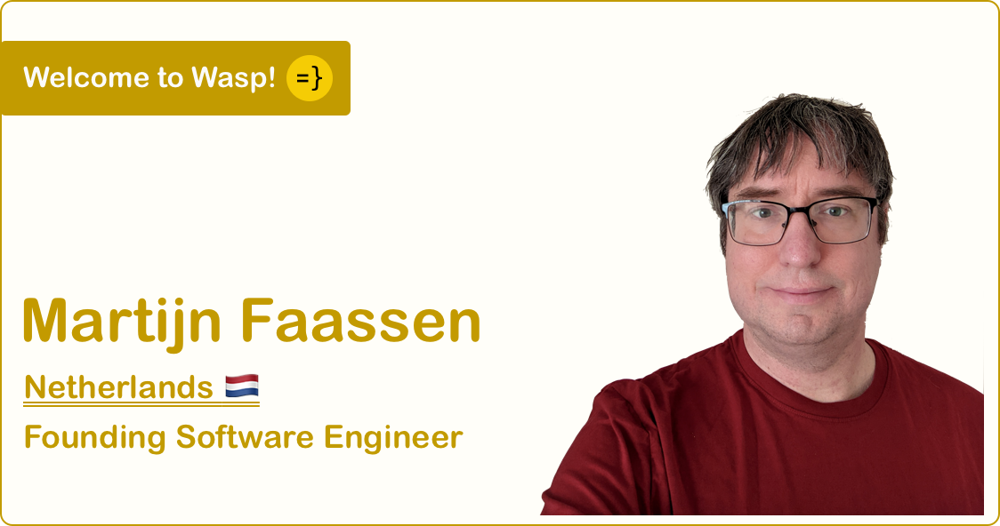

import Link from '@docusaurus/Link';
import useBaseUrl from '@docusaurus/useBaseUrl';
import InBlogCta from './components/InBlogCta';
import WaspIntro from './_wasp-intro.md';

Find Martijn on [Twitter](https://twitter.com/faassen) and [GitHub](https://github.com/faassen).

<WaspIntro />
<InBlogCta />

**Martijn, welcome to the Wasp team!** Martijn is an experienced full-stack engineer and seasoned OSS contributor and author - he is one of the early adopters and evangelists of Python, back in the day when you had to explain to other developers that Python is a cool new language they should try out (sounds familiar, right? ;)). His passion is [building and designing web frameworks](https://blog.startifact.com/posts/framework-patterns-javascript-edition/) and he has authored and contributed to numerous OSS projects such as [lxml](https://github.com/lxml/lxml), [reselect](https://github.com/reduxjs/reselect) and [Morepath](https://github.com/morepath/morepath). We're more than excited about the opportunity to work together!

#### Why did you join Wasp?

I have been using web frameworks since before the term “web framework” had come into common usage. I have also been building them - obscure frameworks that never became very popular, but I did learn a lot. I’ve worked on several server-side web frameworks in Python, a client-side web framework in JavaScript before it was cool, and a number of web form frameworks. I’m drawn to building frameworks. I’ve written a few blog posts about [framework patterns](https://blog.startifact.com/posts/framework-patterns-javascript-edition/).

So when the founders of Wasp contacted me and asked me to join them to build a web framework together, it was easy to say yes. I’m really excited to put a lot of what I’ve learned about web frameworks to use, and to learn a lot more about them along the way.

#### What did you do before?

I’ve been a web developer for almost 25 years now. I was an early adopter of the Python programming language — I remember I had to explain to other programmers what it was. Over the years I’ve worked on many web applications: invoice processing software, a CMS, quite a few in-house applications for a range of organizations, and so on. I started when web development was all on the server side, and I evolved with it as JavaScript and later TypeScript became more important.

#### What is your favorite language/framework?

I’ve worked with Python for decades. The language has been really good to me. But I enjoy learning new programming languages, and I’ve read the manuals for many more. Of course just reading a manual isn't the same as speaking a language! As to the languages that I did learned to speak, I’ve been really enjoying TypeScript the last few years and I have also learned Rust on the side, though I haven’t used it for any customer projects yet. I like languages that stretch my brain, so getting to pick up Haskell for Wasp makes me happy.

#### What are you most excited about in Wasp?

Wasp combines existing systems into something new. I believe the whole can be greater than the sum of its parts, and I get to be part of discovering that new whole. Wasp is an opportunity to think about web frameworks thoroughly, and work on ways to make life better for web developers.

I have had my biggest open source successes not when I built something from scratch, but when I combined and extended existing systems to create something new. I believe Wasp can be huge because it takes this route.

And I get to work with really nice and smart people to do it!

#### How did you start coding?

I started to program back in the 1980s because I wanted to create games. In the early days I could only do that on the one computer in my father’s office, so sometimes I’d go with him there in the evening and write simple BASIC programs. After a while we got a computer at home, and I played a lot with simple graphics programming, still aiming to create games. Then I picked up assembler, as it was faster than BASIC, and finally in the 1990s a whole world of software development opened up to me. I used C++ for a while, and Delphi, until in 1998 I discovered Python. This language was a revelation to me at the time — dynamically typed, bindings for everything even back then. It made me feel really empowered as a developer and I got into web development quickly after that.

#### What is your dev setup?

I’m using VSCode on Fedora Linux. I’ve used Emacs for years, and until recently used Vi to do quick edits, but I switched to VSCode some years ago and recently replaced Vi with Micro as a quick command-line tool. I’ve been using Linux since 1995.

Last summer I experimented with my desktop a lot; I now have 3 monitors, one of which is vertical. I also started to use the i3 tiled window manager, and I’m using a split mechanical keyboard ([Dygma Raise](https://dygma.com/)). I don’t know whether any of this really makes me more productive but it’s fun.

#### `camelCase` or `snake_case`?

Whichever is appropriate for the language. Unless the data is produced with a different convention on the server, then I stick to that on the client as well. I’m a big fan of code autoformatters.

#### What's one piece of advice you'd give to an aspiring developer?

Don’t be afraid to spend time talking and thinking. You don’t have to be typing code all the time. It may feel unproductive but it’s fine.

<InBlogCta />
