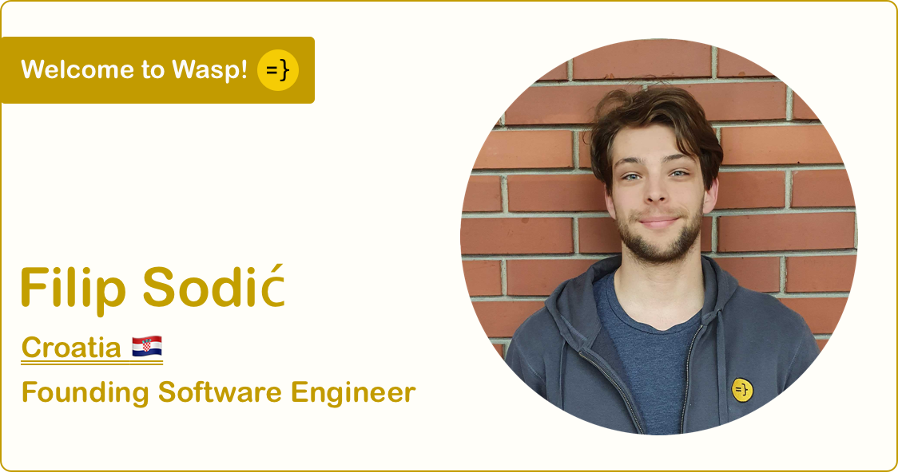

import Link from '@docusaurus/Link';
import useBaseUrl from '@docusaurus/useBaseUrl';
import InBlogCta from './components/InBlogCta';
import WaspIntro from './_wasp-intro.md';

Find Filip on [GitHub](https://github.com/sodic).

<!--truncate-->

<WaspIntro />
<InBlogCta />

**We are immensely excited to welcome Filip, our latest Founding Software
Engineer!** Filip is an experienced engineer and a passionate computer
scientist - his two biggest passions are building compilers/designing
programming languages and web development (what a lucky coincidence, right?
;)). Before joining Wasp, Filip earned his stripes in various domains, ranging
from bioinformatics and the betting industry to route optimisation software.
Welcome to the team, Filip - we can't wait to see what you build!

#### Let’s start with two truths and a lie about yourself.

- I found out about Wasp through a friend/former colleague and still haven’t
  bought him a drink to say thanks.
- I’ve designed and implemented my own Turing-complete functional programming
  language that compiles to JavaScript.
- I wasted nearly 30 hours customizing my setup to maximize productivity and
  probably ended up in a less productive state

#### Which statement was the lie above? Any interesting stories to share?

The last one was a lie. I wish it were only 30 hours :)

I did design [a programming language](https://sodic.github.io/func). It is
Turing-complete but still far from being practical. For one, it can’t print
stuff to the screen (or perform any other side effects).

I never did buy that drink. He’s not letting me forget about it, though.

#### Why did you join Wasp? What did you do before?

I've wanted to work on a project where I'd get a chance to design a language
and build a compiler for quite some time now. While I did develop my own
language on the side (and even graduated with it), I thought getting paid for
doing something similar this early in my career was pretty far-fetched.

Almost all my paid work had something to do with the web, whether on the
client-side or the server-side. I enjoy nearly all parts of web development
(yes, even styling websites with CSS :), but one thing I've always found
annoying was dealing with all the boilerplate. Whenever I start building
something, I spend most of my time implementing the same repetitive stuff
(e.g., authentication, databases, SPA routing, API routes, etc.) and relearning
all the best practices that come with it.

And then, one day, a friend of mine mentioned Wasp - a DSL aiming to eliminate
boilerplate from web apps. The product was a perfect fit based on everything I
know and want to do! Also, I shared a college advisor with the founders (Martin
and Matija) and only heard great things about them.

The whole thing sounded almost too good to be true, so joining them to work on
Wasp was an easy decision.

#### What is your favorite language?

I don’t have many favorite things, especially when it comes to technology.
After going through several cycles of falling in love with a
language/framework/tool before becoming annoyed by its shortcomings and
limitations, I made peace with the fact that everything’s a tradeoff. I’ll
generally choose a language depending on:
- the problem at hand
- its current position in the aforementioned cycle :)

With that said, I'm currently most excited about properly learning Haskell. It
always looked interesting and exotic. I've gotten a few opportunities to play
with the language through university courses and on my own but never really had
an excuse to use it in my day-to-day.

#### What are you most excited about in Wasp?

From a developer’s perspective, I’m definitely most excited about designing the
DSL and working on the compiler.

From a product standpoint, I love the idea of never again having to implement
an authentication system.

#### What’s a feature or project you’re most proud of that you worked on in the past three months?

[Definitely this thing](https://www.youtube.com/watch?v=dQw4w9WgXcQ).

#### How did you start coding?

No exciting story to tell here, I’m afraid.

I enrolled in computer science college and first started programming as a part
of my regular “Introduction to programming” course.

Before then, I didn’t really know what programming was. In fact, I  wanted to
study electrical engineering. Unluckily for most but luckily for me, our
college does not let you choose your major (i.e., electrical engineering or
computing) right away. Instead, they make you go through a shared year of
universal (and some not-so-universal) courses, only allowing you to specialize
at the start of your second year. Thanks to this quirk, I had a chance to
encounter programming, change my mind, and enroll in computer science.

#### Your dev setup?

As far as hardware goes, it’s pretty basic. I use a regular laptop that’s
starting to show signs of age (ASUS N550JX), a cheap Lenovo mouse, and my
laptop’s integrated keyboard.

The software setup is a bit more interesting. I’m usually on Manjaro Linux with
the i3 tiling window manager. I jump between editors depending on what I’m
doing. It’s sometimes Vim, but mainly something more powerful that comes with
Vim emulation (e.g., VS Code or JetBrains IDEs). My preferred shell is zsh
(sorry Frane).

#### `camelCase` or `snake_case`?

NoPreference

#### What is your current favorite gem, library, tool, or anything else that helps you with your work? Why?

That would have to be [ranger](https://github.com/ranger/ranger)!

Ranger is a terminal file manager I use daily, mainly because it makes my work
in the shell much faster. It also gives me a consistent interface for moving
around, previewing files, and interacting with the file system. In other words,
my workflow doesn't have to change much regardless of where I am (Mac, Linux
Desktop, or Linux server).

#### One piece of advice you’d give to budding developers?

It’s easy to get stuck in an endless loop of polishing and fine-tuning your
projects because you think they aren’t ready yet. Good enough sometimes truly
is good enough and things can often be considered done before _you_ consider
them done.

I still occasionally need to give this advice to myself :).

####  Lastly, where can people find or connect with you online?

GitHub: [https://github.com/sodic](https://github.com/sodic)

LinkedIn: [https://www.linkedin.com/in/filipsodic/](https://www.linkedin.com/in/filipsodic/)

