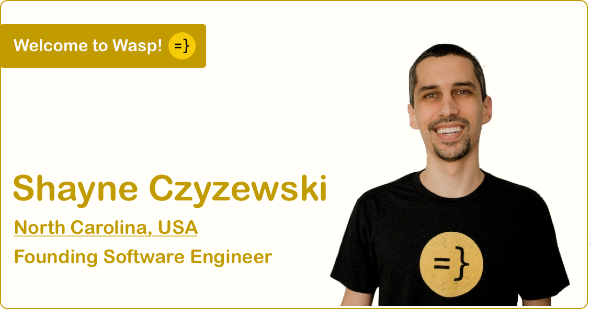

import Link from '@docusaurus/Link';
import useBaseUrl from '@docusaurus/useBaseUrl';
import InBlogCta from './components/InBlogCta';
import WaspIntro from './_wasp-intro.md';

Find Filip on [GitHub](https://github.com/sodic).

<!--truncate-->

<WaspIntro />
<InBlogCta />

#### Let’s start with two truths and a lie about yourself.

- I found out about Wasp through a friend/former colleague. And, to this day, I still haven’t bought him a drink to say thanks.
- I’ve created my own Turing-complete functional programming language that compiles to JavaScript.
- I wasted 40 hours customizing my setup to maximize productivity and probably ended up in a less productive state

#### Which statement was the lie above? Any interesting stories to share?

The last one was a lie. I wish it were only 40 hours :)

I did create my own language, but it’s still far from being practical. For one, it can’t print anything to the screen (or perform any side effects).

I never did buy that drink. He’s not letting me forget about it, though.

#### Why did you join Wasp? What did you do before?

I've wanted a job that would give me a chance to design a language and build a compiler for quite some time now. While I did develop my own language on the side (and even graduated with it), I thought getting paid for doing something similar this early in my career was pretty far-fetched.

Almost all my paid work was somehow related to the web, whether on the client-side or the server-side. I enjoy nearly all parts of web development (yes, even styling websites using CSS :)), but the one thing I've always found annoying was dealing with all the boilerplate. Whenever I want to build something, I spend a lot of time setting up and implementing the same stuff (e.g., authentication, databases, SPA routing, API routes, etc.).

And then, one day, a friend of mine mentioned Wasp - a DSL for eliminating boilerplate from web apps. The product was a perfect fit based on everything I know and want to do! Also, the founders (Matija and Martin) and I shared an advisor in college, and I've heard great things about them.

The whole thing sounded almost too good to be true, so joining the company was an easy decision.

#### What is your favorite language?

I don’t have many favorite things, especially when it comes to technology. After going through several cycles of falling in love with a language/framework/tool before becoming annoyed by its shortcomings and limitations, I made peace with the fact that everything’s a tradeoff. I’ll generally choose a language depending on the problem and where I am in the mentioned cycle :).

With that said, I'm currently most excited about properly learning Haskell. It always looked interesting and exotic. I've learned a little Haskell through school and on my own, but I've never really had an excuse to use it in my day-to-day.

## What are you most excited about in Wasp?

From a developer’s perspective, I’m definitely most excited about designing the DSL and working on the compiler.

From a product standpoint, I love the idea of never again having to implement an authentication system.

#### What’s a feature or project you’re most proud of that you worked on in the past three months?

[Definitely this thing](https://www.youtube.com/watch?v=dQw4w9WgXcQ).

#### How did you start coding?

No exciting story to tell here, I’m afraid.

I enrolled in computer science college and first started programming as a part of my regular “Introduction to programming” course.

Before then, I didn’t really know what programming was and actually wanted to study electrical engineering. Unluckily for most but luckily for me, our college does not let you choose if you wish to major in electrical engineering or computing right away. Instead, they make you go through a year of common (and some not so common) subjects, only allowing you to specialize at the start of your second year. Thanks to this quirk, I had a chance to encounter programming, change my mind, and enroll in computer science.

#### Your dev setup?

As far as hardware goes, it’s pretty basic. I use a regular laptop that’s starting to show signs of age (ASUS N550JX), a cheap Lenovo mouse, and my laptop’s integrated keyboard.

The software setup is a bit more interesting. I’m usually on Manjaro Linux with the I3 tiling window manager. I jump between editors depending on what I’m doing. It’s usually either VS Code, Vim, or one of JetBrains IDEs, but I use Vim emulation no matter where I am. My preferred shell is zsh (sorry Frane).

#### camelCase or snake_case?

NoPreference

#### What is your current favorite gem, library, tool, or anything else that helps you with your work? Why?

That would have to be [ranger](https://github.com/ranger/ranger)!

Ranger is a terminal file manager I use daily, mainly because it makes my work in the shell much faster. It also gives me a consistent interface for moving around, previewing files, and interacting with the file system, regardless of where I am (Mac, Linux Desktop, or Linux server).

#### One piece of advice you’d give to budding developers?

It’s easy to get stuck in an endless loop of polishing and fine-tuning your projects, thinking they aren’t ready yet. Good enough sometimes truly is good enough and things can often be considered done before *you* consider them done.

I still occasionally need to give this advice to myself :)

####  Lastly, where can people find or connect with you online?

Facebook: [https://www.facebook.com/filip.sodic](https://www.facebook.com/filip.sodic)

LinkedIn: [https://www.linkedin.com/in/filipsodic/](https://www.linkedin.com/in/filipsodic/)

Email: filip@wasp-lang.dev
