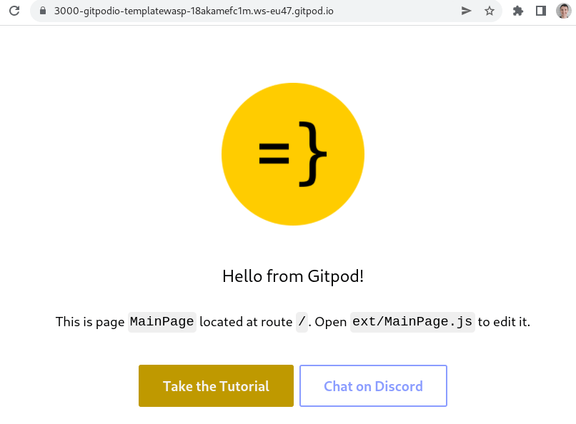
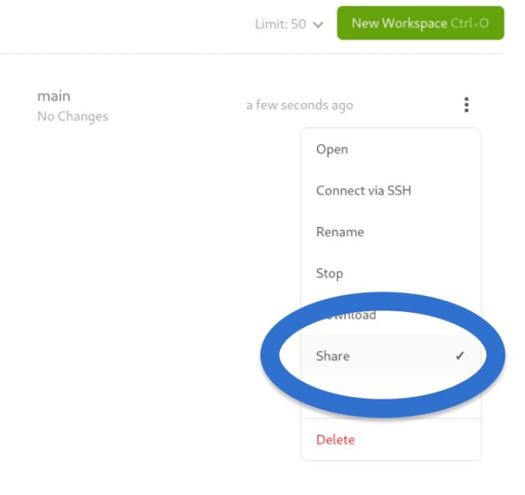
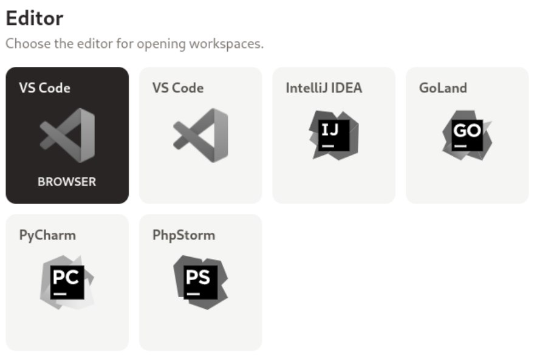

import InBlogCta from './components/InBlogCta';
import WaspIntro from './_wasp-intro.md';

>*"All good thoughts and ideas mean nothing without the proper tools to achieve them."* 
>*Jason Statham*

**TL;DR:** Wasp allows you to build and deploy a full-stack JS web app with a single config file. [Gitpod](https://gitpod.io/) spins up fresh, automated developer environments in the cloud, in seconds. A perfect tandem to win a hackathon and enjoy free pizza even before other teams even started to set up their coding env and realized they need to update their node version. 

<!--truncate-->

<WaspIntro />
<InBlogCta />

## Intro:

Usually, every hackathon starts from similar activities: 
1) **setting up a local dev environment**, especially if all the team members use different operating systems. There are always issues with the SDK/packages/compiler, etc. 
2) **building project backbone** (folder structure, basic services, CRUD APIs, and so on).

Both of them are time-consuming, boring, and cause issues.

Thankfully, those issues can be avoided! Gitpod allows you to spin up a clean, already pre-set dev environment. And Wasp enables you to build a full-stack JS web app with a single config file (alongside your React and Node.js code). But first things first.

## Dev environment setup: 

Gitpod spins up a bespoke dev environment in the cloud for any git branch (once you configured it for your project), on-demand. So you can start coding right away. Build, debug, commit and push your code in seconds, without any local SDK issues. After you’ve finished – you can host your app after a couple of clicks and share the project with your teammate. You can even make changes to the same project simultaneously, leveraging a pair programming approach. 

Since Gitpod is a cloud-based workspace – spinning up a new application takes a couple of clicks. 

1) Fork https://github.com/gitpod-io/template-wasp and give it a meaningful name, e.g. “My Awesome Recipes App” -> this is now a repo for your new web app. 
2) In your newly created repo, check the Readme and click the “Open in Gitpod” button 
3) Login via Github 
4) Allow pop-ups 
5) That’s it! Enjoy your fresh cloud-based dev environment! 

An optional thing might be enabling the “Share” option to make the app accessible from the external internet. 

You can pick up one of the following IDE’s, switch between light/dark themes and you can even install all your favorite extensions. 

So, eventually, the workflow can look like this: someone from the team forks the template repo and shares it with others. Teammates open this repo in Gitpod, creating their own dev branches. 

Voila! 🥳

The whole team is ready to code in a matter of seconds. After the team is done with the development, someone can pull all the changes, share the project, and present it to the judges. 

No need to fix local issues, ensure the Node version is aligned, or configure the deployment pipeline for DigitalOcean. Gitpod does all development preparations. The only thing the team has to do – is to implement the idea ASAP. And here Wasp comes into play!

## Building project backbone:

Ok, we’ve successfully set up a shared dev environment. It’s time to create a production-ready web app with just a few lines of code. Based on your needs – you can declare separate pages, routes, database models, etc. - it’s super easy and intuitive! 

The ideal case would be to: 
1) Check out the language overview: https://wasp-lang.dev/docs/language/overview  
2) Follow a 20-minutes tutorial on how to build a To-Do app with Wasp: https://wasp-lang.dev/docs/tutorials/todo-app  

It may seem a bit inconvenient: why spend time on learning, when you already can start building something meaningful? The short answer is: time-saving. Wasp’s main point is to set you free from building time-consuming boilerplate. So even if you’ll spend half of an hour learning the basics –  you’ll still be able to outrun other hackathon participants. While they will be copy-pasting CRUD API methods – you’ll be building business logic.

And 20 minutes is time well spent to become more productive. Setting up each team member's environment locally likely takes more than 20 minutes if you don't use Gitpod.

## To wrap up: 

We think that Wasp + Gitpod is a powerful toolset for speedrunning any hackathon. No matter how complex or ambitious your project is. If it’s built with Node and React – nothing can stop you from winning. Good luck, have fun, and enjoy that pizza 🍕!
