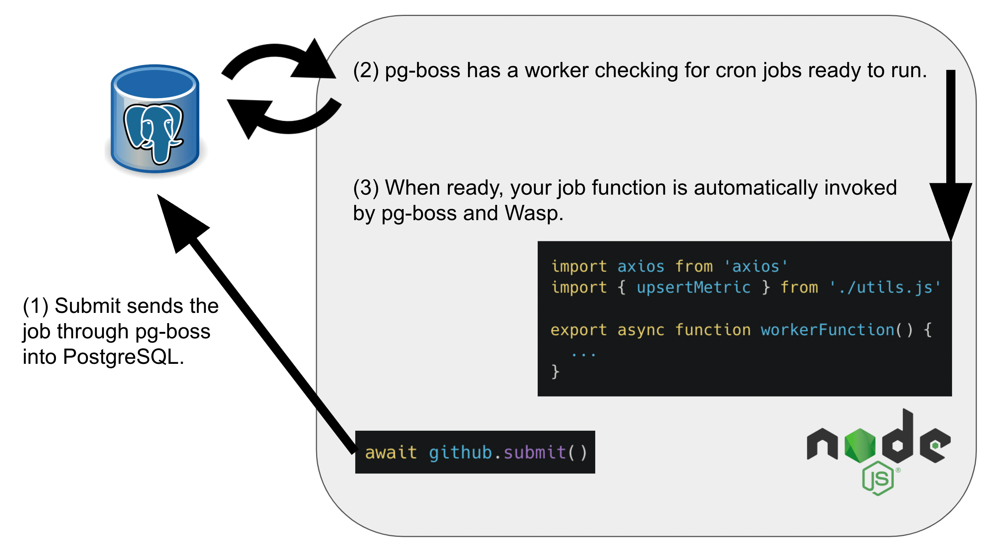

import Link from '@docusaurus/Link';
import useBaseUrl from '@docusaurus/useBaseUrl';
import InBlogCta from './components/InBlogCta';
import WaspIntro from './_wasp-intro.md';
import ImgWithCaption from './components/ImgWithCaption'

<p align="center">
  
</p>

<!--truncate-->

<WaspIntro />
<InBlogCta />

## **Storytime**

<p align="center">
  
</p>

Imagine you are working on the next unicorn SaaS web app and need to send a user an email, manipulate an uploaded image via an external API call, or recalculate some internal metrics every night. (Or, maybe you’re doing some fancy blockchain thing for that frothy investment multiple; :D whatever it is, just envision an operation that may take a significant amount of time and/or fail.) How would you implement this?

<p align="center">
  
</p>

You wouldn’t want the server to delay sending its HTTP response until those are done (unless you are one of those people who love seeing the Mac spinning icon), so you'll need something out-of-band from the normal request-response flow. Even in an event-loop-based system like Node.js, just calling an async function isn't ideal since you will need to handle failures, retries, and throttling, amongst other concerns. And sometimes we need to schedule tasks to run in the future, or repeatedly, so we need a completely different toolset.

The typical solution here is to use a job queue of some kind. They are not impossible to set up, of course, but there is a fair amount of boilerplate involved, some operational expertise/overhead required, and moving from one system to another when you outgrow it is usually a challenge. These are the exact areas where we feel Wasp can provide real value, so we are happy to introduce Wasp Jobs to help out with this!

```js title=src/server/workers/github.js
import axios from 'axios'
import { upsertMetric } from './utils.js'

export async function workerFunction() {
  const response = await axios.get('https://api.github.com/repos/wasp-lang/wasp')

  const metrics = [
    { name: 'Wasp GitHub Stars', value: response.data.stargazers_count },
    { name: 'Wasp GitHub Language', value: response.data.language },
    { name: 'Wasp GitHub Forks', value: response.data.forks },
    { name: 'Wasp GitHub Open Issues', value: response.data.open_issues },
  ]

  await Promise.all(metrics.map(upsertMetric))

  return metrics
}
```

Wasp allows you to write a regular async JavaScript function (like the one above that gathers GitHub metrics and stores them in the DB) and have it run within the context of a job queue system, which we call an executor. You can manually submit work to be done on the server, or specify a cron schedule to have your job automatically invoked. And, best of all, as we add more job executors in the future, you can change where it runs on a single line in your .wasp file.

## Most jobs have a boss. Our first job executor is a... pg-boss. 😅

<p align="center">
  <figure>
    
    <figcaption>Me trying to lay off the job-related puns. Ok, ok, I’ll quit. Ahhh!</figcaption>
  </figure>
</p>

In my prior life as a Ruby on Rails developer, the decision of how to implement jobs was pretty simple. You had Active Job at your disposal, and for backends, you would use something like Sidekiq or Delayed Job. In a similarly paved path, Python developers would have likely looked first to Celery.

In the JavaScript world, [Bull](https://github.com/OptimalBits/bull) is quite popular these days. However, we decided to use [pg-boss](https://github.com/timgit/pg-boss), as it too provides persistence, delayed jobs, and schedules (plus many other features). But critically, pg-boss uses PostgreSQL instead of Redis (like Bull) for storage and coordination, and this was important since we did not want to introduce any new infrastructure dependencies to our existing production stack.

But isn’t a database as a queue an anti-pattern, you may ask? Well, historically I’d probably say yes. However, PostgreSQL 9.5 added SKIP LOCKED, which it specifically mentions can aid in avoiding lock contention with multiple consumer queue-like workloads [[https://www.postgresql.org/docs/9.5/sql-select.html#SQL-FOR-UPDATE-SHARE](https://www.postgresql.org/docs/9.5/sql-select.html#SQL-FOR-UPDATE-SHARE)]. So for the low-volume background job workloads that many apps have, we feel using a database as a queue is a great compromise and starting point for many users from a benefit vs. complexity perspective.

However, we will also continue to expand the number of job execution runtimes we support. Let us know in [Discord](https://discord.gg/rzdnErX) what you’d like to see next!

## Real Example - Updating Waspleau

If you are a regular reader of this blog (thank you, you deserve a raise! 😊), you may recall we created an example app of a metrics dashboard called [Waspleau](https://wasp-lang.dev/blog/2022/01/27/waspleau) that used workers in the background to make periodic HTTP calls for data. In that example, we didn’t yet have access to recurring jobs in Wasp, so we used Bull for scheduled jobs instead. To set up our queue-related logic we had to have this huge `setupFn` wiring it all up; but now, we can remove all that code and simply use jobs instead! Here is what the new DSL looks like:

```js title=main.wasp
// A cron job for fetching GitHub stats
job getGithubStats {
  executor: PgBoss,
  perform: {
    fn: import { workerFunction } from "@server/workers/github.js"
  },
  schedule: {
    cron: "*/10 * * * *"
  }
}

// A cron job to measure how long a webpage takes to load
job calcPageLoadTime {
  executor: PgBoss,
  perform: {
    fn: import { workerFunction } from "@server/workers/loadTime.js"
  },
  schedule: {
    cron: "*/5 * * * *",
    args: {=json {
      "url": "https://wasp-lang.dev",
      "name": "wasp-lang.dev Load Time"
    } json=}
  }
}
```

And here is an example of how you can reference and invoke jobs on the server. *Note: We did not even need to do this step since jobs with a schedule are automatically configured to run at the desired time.*
```js title=src/server/serverSetup.js
/**
* These Jobs are automatically scheduled by Wasp.
* However, let's kick them off on server setup to ensure we have data right away.
*/
import { github } from '@wasp/jobs/getGithubStats.js'
import { loadTime } from '@wasp/jobs/calcPageLoadTime.js'

export default async function () {
  await github.submit()
  await loadTime.submit({
    url: "https://wasp-lang.dev",
    name: "wasp-lang.dev Load Time"
  })
}
```

And voila, it is really that simple. Wasp takes care of setting up pg-boss and hooking up all your job callbacks, leaving you to focus on what matters- your own code. Here is a visual of what is happening behind the scenes:



For those interested, check out the [full diff here](https://github.com/wasp-lang/wasp/commit/1721371fc73f4485ca0046aafea2ee3fc0be41cf#diff-e158328e137176b595ad01641ba68faf82dbb88ccc5be3597009bb576fcd6505) and weep with joy for all those boilerplate lines of code we fired! We were also able to ax Redis from our infrastructure!

## Looks neat! What’s next?

First off, please check out our docs for Jobs: [https://wasp-lang.dev/docs/language/features#jobs](https://wasp-lang.dev/docs/language/features#jobs) There, you will find all the info you need to start using them. Next, if you want to see the code for this example in full, you can find it here: [https://github.com/wasp-lang/wasp/tree/release/examples/waspleau](https://github.com/wasp-lang/wasp/tree/release/examples/waspleau)

In the future, we plan to add more job executors, including support for polyglot workers (imagine running your Python ML function from Wasp!). We are also open to any other ideas on how jobs can become more useful to you (like client-side access to server-side jobs, or client-side jobs using similar abstractions?). Let us know what you think!

<hr />

<small>Special thanks to Tim Jones for his hard work building an amazing OSS library, <a href="https://github.com/timgit/pg-boss" target="_blank">pg-boss</a>, and for reviewing this post. Please consider supporting that project if it solves your needs!</small>
