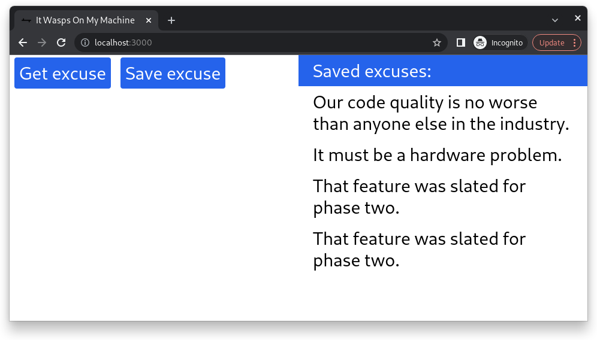
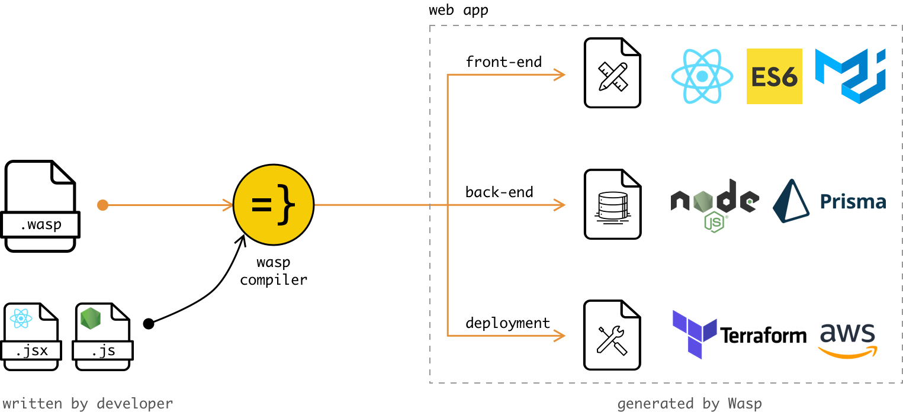

import InBlogCta from './components/InBlogCta';

We’ll build a web app to solve every developer's most common problem – finding an excuse to justify our messy work! And will do it with a single config file that covers the full-stack app architecture plus several dozen lines of code. In the quickest possible way, so we can’t excuse ourselves from building it!


Best excuse of all time! [Taken from here.](https://xkcd.com/303/)


## The requirements were unclear.

We’ll use Michele Gerarduzzi’s [open-source project](https://github.com/michelegera/devexcuses-api). It provides a simple API and a solid number of predefined excuses. A perfect fit for our needs. Let’s define the requirements for the project: 

- The app should be able to pull excuses data from a public API. 
- Save the ones you liked (and your boss doesn't) to the database for future reference.
- Building an app shouldn’t take more than 15 minutes.
- Use modern web dev technologies (NodeJS + React)

As a result – we’ll get a simple and fun pet project. You can find the complete codebase [here](https://github.com/wasp-lang/wasp/tree/main/examples/tutorials/ItWaspsOnMyMachine). 




## There’s an issue with the third party library.

Setting up a backbone for the project is the most frustrating part of building any application. 

We are installing dependencies, tying up the back-end and front-end, setting up a database, managing connection strings, and so on. Avoiding this part will save us a ton of time and effort. So let’s find ourselves an excuse to skip the initial project setup.

Ideally – use a framework that will create a project infrastructure quickly with the best defaults so that we’ll focus on the business logic. A perfect candidate is [Wasp](https://wasp-lang.dev/). It’s an open-source, declarative DSL for building web apps in React and Node.js with no boilerplate

How it works: developer starts from a single config file that specifies the app architecture. Routes, CRUD API, auth, and so on. Then adds React/Node.js code for the specific business logic. Behind the scenes, Wasp compiler will produce the entire source code of the app - back-end, front-end, deployment template, database migrations and everything else you’ve used to have in any other full-stack app. 



So let’s jump right in.


## Maybe something's wrong with the environment.

Wasp intentionally works with the LTS Node.js version since it guarantees stability and active maintenance. As for now, it’s Node 16 and NPM 8. If you need another Node version for some other project – there’s a possibility to [use NVM](https://wasp-lang.dev/docs#1-requirements) to manage multiple Node versions on your computer at the same time.

Installing Wasp on Linux (for Mac/Windows, please [check the docs](https://wasp-lang.dev/docs#2-installation)):
```
curl -sSL https://get.wasp-lang.dev/installer.sh | sh
```

Now let’s create a new web app named ItWaspsOnMyMachine.
```
wasp new ItWaspsOnMyMachine
```

Changing the working directory:
```
cd ItWaspsOnMyMachine
```

Starting the app:
```
wasp start
```

Now your default browser should open up with a simple predefined text message. That’s it! 🥳 We’ve built and run a NodeJS + React application. And for now – the codebase consists of only two files! `main.wasp` is the config file that defines the application’s functionality. And `MainPage.js` is the front-end.


## That worked perfectly when I developed it.


**1) Let’s add some additional configuration to our `main.wasp` file. So it will look like this:**

```js title="main.wasp | Defining Excuse entity, queries and action"

// Main declaration, defines a new web app.
app ItWaspsOnMyMachine {

  // Used as a browser tab title.                                  
  title: "It Wasps On My Machine",

  head: [
    // Adding Tailwind to make our UI prettier
    "<script src='https://cdn.tailwindcss.com'></script>"
  ],

  dependencies: [ 
    // Adding Axios for making HTTP requests                                          
    ("axios", "^0.21.1")
  ]
}

// Render page MainPage on url `/` (default url).
route RootRoute { path: "/", to: MainPage }                 

// ReactJS implementation of our page located in `ext/MainPage.js` as a default export
page MainPage {                                             
  component: import Main from "@ext/MainPage.js"
}

// Prisma database entity
entity Excuse {=psl                                          
    id          Int     @id @default(autoincrement())
    text        String
psl=}

// Query declaration to get a new excuse
query getExcuse {                                           
  fn: import { getExcuse } from "@ext/queries.js",
  entities: [Excuse]
}

// Query declaration to get all excuses
query getAllSavedExcuses {                                  
  fn: import { getAllSavedExcuses } from "@ext/queries.js",
  entities: [Excuse]
}

// Action to save current excuse
action saveExcuse {                                         
  fn: import { saveExcuse } from "@ext/actions.js",
  entities: [Excuse]
}
```

We’ve added Tailwind to make our UI more pretty and Axios for making API requests. 

Also, we’ve declared a database entity called `Excuse`, queries, and action. The `Excuse` entity consists of the entity’s ID and the text. 

`Queries` are here when we need to fetch/read something, while `actions` are here when we need to change/update data. Both query and action declaration consists of two lines – a reference to the file that contains implementation and a data model to operate on. You can find more info [in the docs](https://wasp-lang.dev/docs/tutorials/todo-app/listing-tasks#introducing-operations-queries-and-actions). So let’s proceed with queries/actions. 


**2) Create two files: “actions.js” and “queries.js” in the `ext` folder.**

```js title=".../ext/actions.js | Defining an action"
export const saveExcuse = async (excuse, context) => {
  return context.entities.Excuse.create({
    data: { text: excuse.text }
  })
}
```

```js title=".../ext/queries.js | Defining queries"
import axios from 'axios';

export const getExcuse = async () => {
  return axios
    .get('https://api.devexcus.es/')
    .then(res => {
      return res.data;
    })
    .catch(error => {
      console.error(error);
    });
}

export const getAllSavedExcuses = async (_args, context) => {
  return context.entities.Excuse.findMany()
}
```

Let’s add `saveExcuse()` action to our `actions.js` file. This action will save the text of our excuse to the database. Then let’s create two queries in the `queries.js` file. First, one `getExcuse` will call an external API and fetch a new excuse. The second one, named `getAllSavedExcuses`, will pull all the excuses we’ve saved to our database. 

That’s it! We finished our back-end. 🎉 Now, let’s use those queries/actions on our UI.


**3) Let’s erase everything we had in the `MainPage.js` file and substitute it with our new UI.**

```js title=".../ext/MainPage.js | Updating the UI"
import React, { useState } from 'react'
import { useQuery } from '@wasp/queries'
import getExcuse from '@wasp/queries/getExcuse'
import getAllSavedExcuses from '@wasp/queries/getAllSavedExcuses'
import saveExcuse from '@wasp/actions/saveExcuse'

const MainPage = () => {
  const [currentExcuse, setCurrentExcuse] = useState({ text: "" })
  const { data: excuses } = useQuery(getAllSavedExcuses)

  const handleGetExcuse = async () => {
    try {
      setCurrentExcuse(await getExcuse())
    } catch (err) {
      window.alert('Error while getting the excuse: ' + err.message)
    }
  }

  const handleSaveExcuse = async () => {
    if (currentExcuse.text) {
      try {
        await saveExcuse(currentExcuse)
      } catch (err) {
        window.alert('Error while saving the excuse: ' + err.message)
      }
    }
  }

  return (
    <div className="grid grid-cols-2 text-3xl">
      <div>
          <button onClick={handleGetExcuse} className="mx-2 my-1 p-2 bg-blue-600 hover:bg-blue-400 text-white rounded"> Get excuse </button>
          <button onClick={handleSaveExcuse} className="mx-2 my-1 p-2 bg-blue-600 hover:bg-blue-400 text-white rounded"> Save excuse </button>
        <Excuse excuse={currentExcuse} />
      </div>
      <div>
        <div className="px-6 py-2 bg-blue-600 text-white"> Saved excuses: </div>
        {excuses && <ExcuseList excuses={excuses} />}
      </div>
    </div>
  )
}

const ExcuseList = (props) => { 
  return props.excuses?.length ?  props.excuses.map((excuse, idx) => <Excuse excuse={excuse} key={idx} />) : 'No saved excuses'
}

const Excuse = ({ excuse }) => {
  return (
    <div className="px-6 py-2">
      {excuse.text}
    </div>
  )
}

export default MainPage
```

Our page consists of three components. `MainPage`, `ExcuseList` and `Excuse`. It may seem at first that this file is pretty complex. It’s not, so let’s look a bit closer. 

`Excuse` is just a div with an excuse text, `ExcuseList` checks if there are any excuses. If the list is empty – show a message `No saved excuses`. In other case – excuses will be displayed. 

`MainPage` contains info about the current excuses and the list of already saved excuses. Two buttons click handlers `handleGetExcuse` and `handleSaveExcuse`. Plus, the markup itself with some Tailwind flavor. 


**4) Before starting an app – we need to execute database migration because we changed the DB schema by adding new entities. If you’ve had something running in the terminal – stop it and run:**

```
wasp db migrate-dev
```

You’ll be prompted to enter a name for the migration. Something like `init` will be ok. Now we can start the application!

```
wasp start
```


Now you can click the “Get excuse” button to receive an excuse. And save the ones you like into the DB with the “Save excuse” button. Our final project should look like this:


## It would have taken twice as long to build it properly.

Now we can think of some additional improvements. For example:
 
- 1) Add a unique constraint to Entity’s ID so we won’t be able to save duplicated excuses. 
- 2) Add exceptions and edge cases handling. 
- 3) Make the markup prettier.
- 4) Optimize and polish the code 

So, we’ve been able to build a full-stack application with a database and external API call in a couple of minutes. And now we have a box full of excuses for all our development needs. 


<InBlogCta />