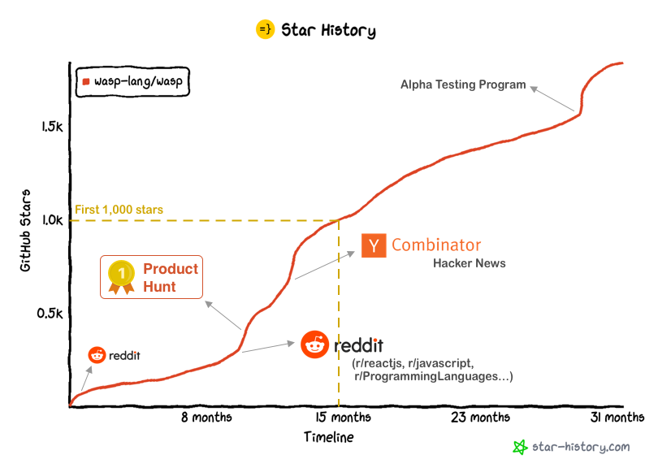

import Link from '@docusaurus/Link';
import useBaseUrl from '@docusaurus/useBaseUrl';
import InBlogCta from './components/InBlogCta';
import WaspIntro from './_wasp-intro.md';
import ImgWithCaption from './components/ImgWithCaption'

Wasp is an open-source configuration language for building full-stack web apps that integrates with React & Node.js. We launched first prototype 2 years ago, currently are at 1.9k stars on GitHub and will be releasing Beta in the coming months.

It was very hard for us to find and be able to learn from early inception stories of successful OSS projects and that's why we want to share what it looked like for Wasp.

<!--truncate-->

## Before the stars: Is this really a problem? (1 year)

My co-founder and twin brother Martin and I got an initial idea for Wasp in 2018, while developing a web platform for running bioinformatics analysis in the cloud for one London-based startup.

It was our third or fourth time creating a full-stack app from scratch with the latest & hottest stack. This time, it was React/Node.js; for our previous projects, we went through PHP/Java/Node.js on the back-end and jQuery/Backbone/Angular on the front-end. Because Martin and I felt we were spending a lot of time relearning how to use the latest stack just to build the same features all over again (auth, CRUD, forms, async jobs, etc.), we asked ourselves: *Why not abstract these common functionalities in a stack-agnostic, higher-level language (like e.g. SQL does for databases) to never reimplement them again?*

Before we jumped into coding, we wanted to make sure this is a problem that actually exists and that we understand it well (enough). In our previous startup we found Customer Development (aka talking to users) extremely helpful, so we decided to do it again for Wasp.

In a month or so we conducted 25 problem interviews, probing around “What is your biggest challenge with web app development?” After we compiled the results, we identified the following four problems as the most significant ones and decided to focus on them in our v1:

- It is hard to **quickly start** a new web app and make sure **the best practices are being followed**.
- There is a lot of duplication/boilerplate in **managing the state** across front-end, back-end, and the database.
- A lot of **common features are re-implemented** for every new app.
- Developers are overwhelmed by the **increasing tool complexity** and don't want to be responsible for managing it.

We also clustered the answers we got by topics, so we could dive deeper and identify the areas that got the most attention:
<ImgWithCaption
    alt="Start and setup of a web app - problems"
    source="img/1000-gh-stars/wasp-cust-dev-start-and-setup.png"
    caption="Interviewee problems regarding starting and setting up a new web app."
/>
The reason why we stopped at 25 was that the answers started repeating themselves. We felt that we identified the initial patterns and were ready to move on.

## 0-180 ⭐️: First Contact (7 months)
After confirming and clarifying the problem with other developers, Martin and I felt we finally deserved to do some coding. (Ok, I admit, we had actually already started, but the interviews made us feel better about it 😀). We created a new repo on GitHub and started setting up the tooling & playing around with the concept.

For the next couple of months, we treated Wasp as a side project/experiment and didn’t do any marketing. However, we were well aware of how crucial external feedback is. So, once we built a very rudimentary code generation functionality, we also created a project page that we could share with others to explain what we’re working on and ask for feedback.

At that point, we came up with the first “real” name for Wasp - **STIC: Specification To Implementation Compiler**, as the big vision for Wasp was to be a stack-agnostic, specification language from which we could generate the actual code in e.g. React & Node.js or even some other stack.

<ImgWithCaption
    alt="STIC - first project page"
    source="img/1000-gh-stars/stic-project-page.png"
    caption="Our first page for Wasp! Not the best at explaining what Wasp does, though."
/>

### Baby steps on Reddit and Hacker News

Our preferred way of distributing STIC project page was through relevant subreddits - r/webdev, r/coding, r/javascript, r/Haskell, r/ProgrammingLanguages, …. 

[This](https://www.reddit.com/r/javascript/comments/f38h1t/askjs_we_are_developing_a_declarative_dsl_for/) was the first Reddit post we’ve ever made about Wasp:

<ImgWithCaption
    alt="First Wasp post on Reddit"
    source="img/1000-gh-stars/wasp-reddit-first-post.png"
    caption="Our first Reddit post! We managed to get some feedback before we got banned."
/>

One important thing we learned is that Reddit doesn’t like self-promotion. Sometimes, even if you’re only asking for feedback, the mods (and bots) will see it as self-promo and ban your post. It depends a lot on the mods, though. Reaching out to them and asking for explanation sometimes helps, but not very often. All subreddits have their own rules and guidelines that describe when or how it is OK to post about your project (e.g., /r/webdev has “Showoff Saturdays”), and we tried to follow them as best as we could.

After Reddit, we also launched on HN. This was our first ever launch there! We scored 20 points and received a few motivating comments:

<ImgWithCaption
    alt="First Wasp post on Reddit"
    source="img/1000-gh-stars/first-hn-launch.png"
/>

### Listening to users
Martin and I also followed up with the people we had previously interviewed about their problems in web dev. We showed them STIC project page and asked for comments. From all the feedback we captured, we identified the following issues:

- **Developers were not familiar with a term “DSL.”** Almost all of us use a DSL on a daily basis (e.g., SQL, HCL (Terraform), HTML), but it’s not a popular term.
- **Developers feared learning a new programming language**. Although our goal was never to replace e.g. Java or Typescript but to make Wasp work alongside it, we discovered that we had failed to communicate it well. Our messaging made developers feel they have to drop all their previous knowledge and start from scratch if they want to use Wasp.
- **Nobody could try Wasp yet + there wasn’t any documentation besides the project page**. Our code was public, but we didn’t have a build/distribution system yet. Only a devoted Haskell developer could build it from the source. This made it hard for developers to buy into the high-level vision, as there was nothing they could hold onto. Web frameworks/languages are very “tactile” — it’s hard to judge one without trying it out.

## 180-300 ⭐️ : Anybody can try Wasp out + Docs = Alpha! (3 months)
After processing this feedback, we realized that the next step for us was to get Wasp into the condition where developers can easily try it out without needing any extra knowledge or facing the trouble of compiling from the source. That meant polishing things a bit, adding a few crucial features, and writing our first documentation, so that users would know how to use it.

To write our docs, we picked [Docusaurus](https://docusaurus.io/) — an OSS writing platform made by Facebook. We saw several other OSS projects using it for their docs + its ability to import React in your markdown was amazing. Docusaurus gave us a lot of initial structure, design and features (e.g., search), saving us from reinventing the wheel.

<ImgWithCaption
    alt="First Wasp docs"
    source="img/1000-gh-stars/first-docs.png"
    caption="Martin made sure to add a huge Alpha warning sign :D"
/>

Our M.O. at the time was to focus pretty much exclusively on one thing, either development or community. Since Wasp team consisted of only Martin and me, it was really hard to do multiple things at once. After the docs were out and Wasp was ready to be easily downloaded, we called this version “Alpha” and switched once again into the “community” mode.

## 300-570 ⭐️ : Big break on Reddit and Product Hunt (2 months)

Once Alpha was out, we [launched again on HackerNews](https://news.ycombinator.com/submitted?id=matijash) and drew a bit of attention (34 upvotes and 3 comments). However, that was little compared to our Reddit launches, where we scored 263 upvotes on [r/javascript](https://www.reddit.com/r/javascript/comments/jvv1yg/together_with_my_brother_ive_been_working_on_wasp/) and 365 upvotes on [r/reactjs](https://www.reddit.com/r/reactjs/comments/jx5fyg/together_with_my_brother_ive_been_working_on_wasp/):

<ImgWithCaption
    alt="Big break on Reddit"
    source="img/1000-gh-stars/reddit-big-break.png"
    caption="They love me! [insert Tobey Maguire as Spiderman]"
/>

Compared to the volume of attention and feedback we’ve been previously receiving, this was a big surprise for us! Here are some of the changes in messaging that we made for the Reddit launches:

- **Put prefix “declarative” in front of the “language”** to convey that it’s not a regular programming language like Python or Javascript but rather something much more lightweight and specialized.
- **Emphasized that Wasp is not a standalone language that will replace your current stack** but rather a “glue” between your React & Node.js code, allowing you to keep using your favourite stack.
- **Focused on the benefits like “less boilerplate,”** which is a well known pain in web development.

:::tip Docs made the difference
 
Once we added the docs, we noticed a peculiar thing: **developers became much less trigger-happy to criticize the project, especially in a non-constructive way**. Our feeling was the majority of developers who were checking Wasp out still didn’t read the docs in detail (or at all), but the sheer existence of them made them feel there is more content they should go through before passing the final judgment.

:::

### Winning #1 Product of The Day on Product Hunt

After HN and Reddit, we continued with the “Alpha launch” mindset and set ourselves to launch Wasp on Product Hunt. It was our first time ever launching on PH, so we didn’t know what to expect. We googled some advice, did maybe a week of preparation (i.e., wrote the copy, asked a few friends to share their experiences with Wasp once we’re live), and that was it.

We launched [Wasp on PH on Dec 6, 2020](https://www.producthunt.com/products/wasp-lang-alpha#wasp-lang-alpha) and it ended up as Product of the day! That gave us a boost in stars and overall traction. Another benefit of PH was that Wasp also ended up in their daily newsletter, which supposedly has over a million subscribers. All this gave us quite a boost and visibility increase.

<ImgWithCaption
    alt="Product Hunt launch"
    source="img/1000-gh-stars/ph-launch.png"
/>

## 570-1000 ⭐️ : Wasp joins YC + “Official” HN launch (2.5 months)

Soon after Product Hunt, Wasp joined Y Combinator for their W21 batch. We had applied two times before and always made it to the interviews, but did not get in. This time, the traction tipped the scales in our favour. (You can read more about our journey to YC [here](https://wasp-lang.dev/blog/2021/02/23/journey-to-ycombinator).)

For the first month of YC, there was a lot of admin and setup work to deal with alongside the regular program. That added a third dimension to our existing two areas of effort. Once we went past that, we could again put more focus on product and community development. 

Our next milestone was to launch Wasp on Hacker News, but this time “officially” as a YC-backed company. **Hacker News provides a lot of [good tips](https://news.ycombinator.com/yli.html) on how to successfully launch and 80% of the advice applies even if your product isn’t backed by YC**. I wish I had known about it before. The gist of the advice is to write in a clear and succinct way and to avoid buzzwords, superlatives, and salesy tone above all. Consider HN readers as your peers and explain what you do in a way you would talk to a friend over a drink. It really works that way.

We went through the several iterations of the text, sweated over how it’s gonna go, and when the day finally came — we launched! It went beyond all our expectations. With 222 points and 79 comments, **our HN launch was one of the most successful launches (#9) out of 300+ companies in the W21 batch.** Many developers and VCs that checked our launch afterwards were surprised how much positive feedback Wasp received, especially given how honest and direct HN audience can be.

**HN launch brought us about 200 stars right away**, and the rest came in the following weeks. As it was February and the YC program was nearing its end, we  needed to shift gears again and focus on fundraising. This put all the other efforts on the back burner. (You can read about our fundraising learnings from 250+ meetings in 98 days [here](https://wasp-lang.dev/blog/2021/11/22/fundraising-learnings).) But the interest of the community remained and even without much activity from our side they kept coming and trying Wasp out.

<ImgWithCaption
    alt="YC HN launch"
    source="img/1000-gh-stars/yc-hn-launch.png"
/>

## Conclusion: understanding users > number of stars

Our primary goal was never to reach X stars, but rather to understand how we can make Wasp more helpful so that developers would want to use it for their projects. As you could read above, even well before we started a repository we made sure to talk to developers and learn about their problems.

We also kept continually improving how we present Wasp - had we not pivoted our message from *“Wasp is a new programming language”* to *“Wasp is a simple config language that works alongside React & Node.js”* we wouldn’t have been where we are today.

On the other hand, stars have become an unofficial “currency” of GitHub and developers and VCs alike consider it when evaluating a project. They shouldn’t be disregarded and you should make it easy for users who like your product to express their support by starring your repo (like I’m doing right [here](https://github.com/wasp-lang/wasp)), but that should always be a second order of concern.

## Good luck!

I hope you found this helpful and that we shed some light on how things can look like in the early stages of an OSS project. Also, keep in mind this was our singular experience and that every story is different, so take everything with a grain of salt and pick only what makes sense for you and your product.

We wish you the best of luck and feel free to reach out if you'll have any questions!
