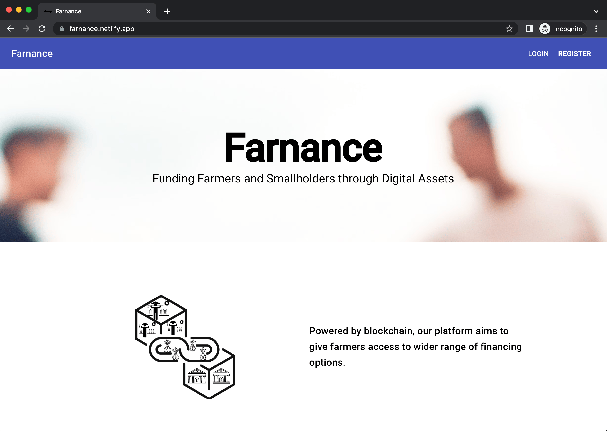

import Link from '@docusaurus/Link';
import useBaseUrl from '@docusaurus/useBaseUrl';

import InBlogCta from './components/InBlogCta';
import WaspIntro from './_wasp-intro.md';
import ImgWithCaption from './components/ImgWithCaption'

[Julian LaNeve](https://jlaneve.github.io/) is an engineer and data scientist who currently works at [Astronomer.io](http://Astronomer.io) as a Product Manager. In his free time, he enjoys playing poker, chess and [winning](https://www.smudailycampus.com/news/smu-graduate-julian-laneve-wins-100k-grand-prize-from-data-science-competition) data science competitions.

His project, [Farnance](https://farnance.netlify.app/), is a SaaS marketplace that allows farmers to transform their production into a digital asset on blockchain. Julian and his team developed Farnance as a part of the London Business School’s annual hackathon [HackLBS 2021](https://hacklbs.devpost.com/), and ended up as winners among more than 250 participants competing for 6 prizes in total!

Read on to learn why Julian chose Wasp to develop and deploy Farnance and what parts he enjoyed the most.

<!--truncate-->

## Finding a perfect React & Node.js hackathon setup

Julian had previous experiences with React and Node.js and loved that he could use JavaScript across the stack, but setting up a new project and making sure it uses all the latest packages (and then also figuring out how to deploy it) was always a pain. Since the hackathon only lasted for two days, he needed a quick way to get started but still have the freedom to use his favourite stack.

## The power of one-line auth and No-API approach

Julian first learned about Wasp when it [launched on HN](https://news.ycombinator.com/item?id=26091956) and decided it would be a perfect tool for his case. The whole app setup, across the full stack, is covered out-of-the-box, simply by typing `wasp new farnance`, and he is ready to start writing own React & Node.js code.

Except on the app setup, the team saved a ton of time by not needing to implement the authentication and a typical CRUD API, since it is covered by Wasp as well. They could also deploy everything for free on Heroku and Netlify in just a few steps, which was a perfect fit for a hackathon.

<ImgWithCaption
    alt="Julian's testimonial on Discord"
    source="img/farnance/julian-discord-testimonial.png"
/>

Farnance is still running and you can [try it out here](https://farnance.netlify.app/)! The source code is also [publicly available](https://github.com/jlaneve/Farnance), although note it is running on older version of Wasp so some things are a bit different.

## Spend more time developing features and less time reinventing the wheel

Julian was amazed by how fast he was able to get Farnance of the ground and share a working web app with the users! He decided to go with Google's material-ui for an UI framework which gave his app an instant professional look, although they didn’t have a dedicated designer on the team.

With all the common web app features (setup, auth, CRUD API) being taken care of by Wasp out-of-the-box they could invest all the time saved in developing and refining their unique features which in the end brought them victory!

> I’ve done plenty of hackathons before where I’ve built small SaaS apps, and there’s just so much time wasted setting up common utilities - stuff like user management, databases, routing, etc. Wasp handled all that for me and let me build out our web app in record time
>
> — Julian LaNeve - Farnance

<ImgWithCaption
    alt="Farnance's dashboard"
    source="img/farnance/farnance-dashboard.png"
    caption="Farnance dashboard in action!"
/>

## Start quickly, but also scale without worries

Since Wasp compiler generates a full-stack React & Node.js app under the hood, there aren’t any technical limitations to scaling Julian’s app as it grows and gets more users in the future. By running `wasp build` inside a project folder, developers gets both frontend files and a Dockerfile for the backend, which can then be deployed as any regular web app to the platform of your choice.

Wasp provides [step-by step instructions](/docs/deploying) on how to do it with Netlify and Heroku for free (since Heroku is canceling their free plan, we'll publish guides for other providers soon), but we plan to add even more examples and more integrated deployment experience in the coming releases!

> Deploying the wasp app was incredibly easy - I didn’t have time to stand up full infrastructure in the 2 day hackathon and don’t have an infra/devops background, but I had something running on Netlify within an hour. Other projects at the hackathon struggled to do this, and putting access in the hands of the judges certainly helped get us 1st place.
>
> — Julian LaNeve - Farnance
