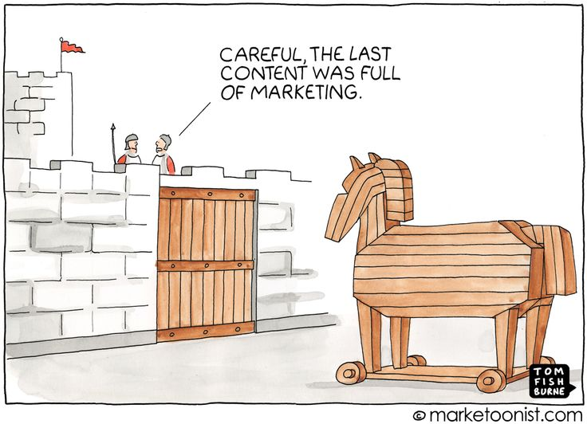

import Link from '@docusaurus/Link';
import useBaseUrl from '@docusaurus/useBaseUrl';

import InBlogCta from './components/InBlogCta';
import WaspIntro from './_wasp-intro.md';
import ImgWithCaption from './components/ImgWithCaption'

2078 lines of code across 24 PRs were changed in [Wasp repo](https://github.com/wasp-lang/wasp) during [HacktoberFest 2022](https://hacktoberfest.com/) - the most prominent online event for promoting and celebrating OSS culture. October has been a blast, to say the least, and the most active month in the repo's history.

This is the story of our journey along with the tips on leveraging Hacktoberfest to get your repo buzzing! 🐝🐝

<!--truncate-->

## How it went: the stats

Let's take a quick look at the charts below (data obtained from [OSS Insight](https://ossinsight.io/analyze/wasp-lang/wasp) platform) 👇

<ImgWithCaption
    alt="PR history"
    source="img/hacktoberfest-wrap-up/pr-history.png"
    caption="24 contributor PRs in Oct, an all-time high!"
/>

<ImgWithCaption
    alt="Lines of code changes"
    source="img/hacktoberfest-wrap-up/code-lines-history.png"
    caption="On the other hand, number of changed LoC isn't that huge"
/>

While the number of PRs is at an all-time high, the number of updated lines of code is fewer than usual. If we take a look at the distribution of PR sizes in the first chart, we can see that "xs" and "s" PRs are in the majority (20 out of 24).

**This brings us to our first conclusion: first-time contributors start with small steps!** The main benefit here is getting potential contributors interested and familiar with the project, rather than expecting them to jump in and
immediately start implementing the next major feature. Efforts like that require investing time to understand and digest codebase architecture, design decisions and the development process.

On the other hand, being able to implement and merge any feature, no matter the size, from beginning to the end, and to get your name on the list of contributors of your favourite project is an amazing feeling! That will make your contributors feel like superheroes and motivate them to keep taking on larger and larger chunks, and maybe eventually even join the core team!

**Thus, the second conclusion would be: don’t underestimate the significance of small PRs!** It's not about reducing your backlog, but rather encouraging developers to get engaged with your project in a friendly way.

:::tip

To make it easier for your new contributors, you can prepare in advance good issues to get started with - e.g. smaller bugs, docs improvements, fun but isolated problems, etc.

We added [`good-first-issue`](https://github.com/wasp-lang/wasp/issues?q=is%3Aissue+is%3Aopen+label%3A%22good+first+issue%22) label to such issues in Wasp repo, and even added extra context such as `no-haskell`, `webdev`, `example`, `docs`.

:::

With your repo being set, the next question is *"How do I get people to pick my project to work on"*? Relying solely
on putting "Hacktoberfest" topic on your GitHub repo won't do the trick, not with thousands of other repos doing the same.

If you want to get noticed, **you need to do marketing. A lot of it. The name of the game here is what you put in is what you get back.** Let's talk about this in more detail.

## A thin line between genuine interactions and annoying self-promotion

First and foremost, you'll need to create [an entry point](https://github.com/wasp-lang/wasp/issues/735) with all the necessary information for the participants. We opted for a GitHub issue where we categorized Hacktoberfest issues by type, complexity, etc, but it can be anything - a dedicated landing page, Medium/Dev.to article, or whatever works for you. Once you have that, you can start promoting it.

<ImgWithCaption
    alt="Hacktoberfest entry point - gh issue"
    source="img/hacktoberfest-wrap-up/hf-gh-entry-point.png"
    caption="Our entry point for Hacktoberfest"
/>

Our marketing strategy consisted of the following:

1. Tweeting regularly - what's new, interesting issues, ...

2. Writing meaningful Reddit posts about your achievements

3. Hanging out in HacktoberFest [Discord server](https://discord.com/invite/hacktoberfest), chatting with others and answering their questions

4. Checking posts with [appropriate](https://dev.to/t/hacktoberfest) [tags](https://medium.com/tag/hacktoberfest2022) on different blogging websites like Medium, Dev.to, Hashnode, etc. and participating in conversations. 

There are plenty of other ways to advertise your project, like joining events or writing articles. Even [meme contests](https://github.com/dailydotdev/memetoberfest). The activities mentioned above worked the best for us. Let’s dive a bit deeper.

Tweets are pretty obvious - as mentioned, you can share updates on how stuff is going. Tag contributors, inform your followers about available issues and mention those who might be a good fit for tackling them.  

Reddit is a much more complex beast. You need to avoid clickbait post titles, comply with subreddit rules on self-promotion and try to give meaningful info to the community simultaneously. Take less than you give, and you’re good. 

<ImgWithCaption
    alt="posting on reddit"
    source="img/hacktoberfest-wrap-up/oss-reddit-post.png"
    caption="How posting on Reddit feels"
/>

The Discord server marketing was pretty straightforward. There’s even a dedicated channel for self-promotion. In case you're not talkative much, dropping a link to your project is OK, and that’s it. On the other hand, the server is an excellent platform for discussing Hacktoberfest-related issues, approaches, and ideas. The more you chat, the higher your chances of drawing attention to your project.

The most engaging but also time consuming activity was commenting on blog posts of other Hacktoberfest participants. **Pretending that you’re interested in the topic only to leave a self-promoting comment will not bring you anywhere - it can only result in your comment being removed**. Make sure to provide value: add more information on the topic of the article, address specific points the author may have missed, or mention how you’ve dealt with the related issue in your project. 

Be consistent and dedicate time to regularly to check new articles and jump into discussions. Share a link to your repo only if it fits into the flow of the conversation.

## Was it worth it?

Before joining HacktoberFest as maintainers, we weren’t sure it would be worth the time investment. Our skepticism was reinforced by the following:

1. [Mentions](https://www.reddit.com/r/developersIndia/comments/xvynx9/hacktoberfest_is_ruining_opensource/) of people submitting trivial PRs just to win the award

2. The fact that we're making a relatively complex project (DSL for developing React + Node.js full-stack web apps with less code) and it might be hard for people to get into it

3. The compiler is written is Haskell, with templates in JavaScript - again, not the very common project setup

Fortunately, none of this turned out to be a problem! We've got 24 valid PRs, both Haskell and non-Haskell, a ton of valuable feedback, and several dozen new users and community members. 

## Wrap up

Don’t expect magic to happen. HacktoberFest is all about smaller changes and getting community introduced to your project. Be ready to promote your repo genuinely and don’t be afraid to take part in the contest. We hope that helps and wish you the best of luck!

Remember, HacktoberFest is all about the celebration of open source. Stick to that principle, and you’ll get the results you could only wish for!

## P.S. - Thanks to our contributors!

Massive shout out to our contributors: [@ussgarci](https://twitter.com/ussgarci), [@h4r1337](https://twitter.com/h4r1337), [@d0m96](https://twitter.com/d0m96), [@EmmanuelCoder](https://twitter.com/EmmanuelCoder), [@gautier_difolco](https://twitter.com/gautier_difolco), [@vaishnav_mk1](https://twitter.com/vaishnav_mk1), [@NeoLight1010](https://twitter.com/NeoLight1010), [@abscubix](https://twitter.com/abscubix), [@JFarayola](https://twitter.com/JFarayola), [@Shahx95](https://twitter.com/Shahx95) and everyone else for making it possible. You rock! 🤘
