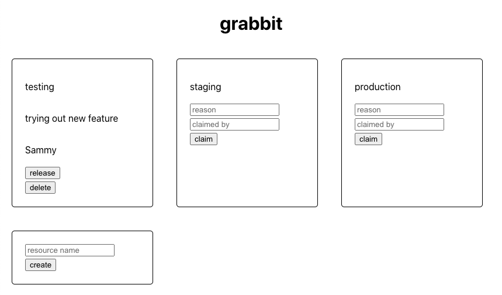

import Link from '@docusaurus/Link';
import useBaseUrl from '@docusaurus/useBaseUrl';

import InBlogCta from './components/InBlogCta';
import WaspIntro from './_wasp-intro.md';
import ImgWithCaption from './components/ImgWithCaption'

[Michael Curry](https://github.com/cursorial) is a senior front-end engineer at [Improbable](https://www.improbable.io/), a metaverse and simulation company based in London. In his free time he enjoys learning about compilers.

In his previous position at StudentBeans, he experienced the problem of multiple engineering teams competing for the same dev environment (e.g. testing, staging, …). Then he discovered Wasp and decided to do something about it!

Read on to learn why Michael chose Wasp to build and deploy an internal tool for managing development environments at StudentBeans.

<!--truncate-->

## The problem: the battle for the dev environment

StudentBeans has a microservices-based architecture with multiple environments - test, staging, production, …. The team practices CI/CD and deploys multiple times a day. With such a rapid development speed, it would relatively often happen that multiple engineering teams attempt to claim the same dev environment at the same time. 

There wasn't an easy way for teams to synchronize on who is using which environment and it would eventually lead to unexpected changes, confusion, and prolonged development times.

## The solution: Grabbit - claim and release dev environments as-you-go

After the incident described above repeated for the n-th time, the team got together for a postmortem. They decided their new development process should look like this:

- merge your changes
- claim the environment you want to deploy to (e.g. testing, staging, …)
- deploy your changes
- test your changes
- release the environment once you are done with it so others are able to claim it

The other requirements were to build the solution in-house to save money and also not to spend more than a few hours on it as they still needed to deliver some important features for the ongoing sprint.

## The power of rapid prototyping with Wasp

Michael learned about Wasp during its [first HackerNews launch](https://news.ycombinator.com/item?id=26091956) and it immediately caught his eye. Being a programming language enthusiast himself, he immediately understood the value of a DSL approach and how it could drastically simplify the development process, while at the same time not preventing him from using his preferred tech stack (React, Node.js) when needed.

Also, although Michael had full-stack experience, his primary strength at the time was on the front-end side. Wasp looked like a great way of not having to deal with the tedious back-end setup and wiring (setting up the database, figuring out API, …) and being able to focus on the UX.

> When I first learned about Wasp on HN I was really excited about its DSL approach. It was amazing how fast I could get things running with Wasp - I had the first version within an hour! The language is also fairly simple and straightforward and plays well with React & Node.js + it removes a ton of boilerplate.
>
> — Michael Curry - Grabbit

## Out-of-the-box deployment

Once Michael was satisfied with the first version of Grabbit, and confirmed with the team it fits their desired process, the only thing left to do was to deploy it! It is well known this step can get really complicated, especially if you're not yet well-versed in the sea of config options that usually come with it.

Wasp CLI comes with a `wasp build` command that does all the heavy lifting for you - it creates a directory with static front-end files that you can easily deploy to e.g. Netlify, and on the other hand, a Docker image for the back-end. Since Heroku is ending its free plan, our recommendation is to deploy to Fly.io, for which the detailed guide is provided. You can find the [detailed deployment instructions here](https://wasp-lang.dev/docs/deploying).

In Michael's case, he deployed Grabbit behind the VPN since it was an internal tool, and this process was made easy by having a ready-to-go Dockerfile.

## From MVP to a full-fledged SaaS without a rewrite

The presented functionality of Grabbit above is quite simple (create a resource → claim it → release it), and it could have easily been implemented in some no-code tool or, if we really wanted to go simple, with a Trello board. So why use Wasp at all?

One reason is that developers know and prefer their tools and trust code over the no-code solutions, especially when requirements are still evolving and it is not evident they won't get "stuck" in some closed system. Michael had similar thinking - as he identified this problem at his own company, he realized others must be facing the same issue as well. That is why his plan was to keep improving Grabbit and eventually offer it as a standalone SaaS.

This is where Wasp comes in - he could develop and deploy an initial version of Grabbit in a matter of hours, but still end up with a platform that he can extend indefinitely through the power of code with his stack of choice, React & Node.js, while also using the npm packages he is using everyday at work.

Once he starts adding more advanced features, such as multi-user support with authentication, email notifications, and integration with CI/CD, no-code tools won't cut it any more. This way he saved himself and the company from throwing an MVP away and starting everything from scratch (having to learn the new technology and figure out how to set it all up) as the product evolves.
