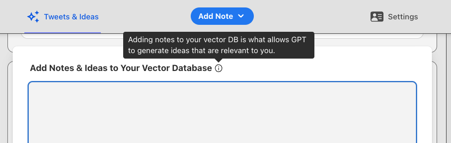

import Link from '@docusaurus/Link';
import useBaseUrl from '@docusaurus/useBaseUrl';

import InBlogCta from './components/InBlogCta';
import WaspIntro from './_wasp-intro.md';
import ImgWithCaption from './components/ImgWithCaption'

## TL;DR

[LangChain](https://js.langchain.com), ChatGPT, and other emerging technology have made it possible to build some really creative tools. 

In this tutorial, we’ll build a full-stack web app that acts as our own personal Twitter Agent, or “intern”, as I like to call it. It keeps track of your notes and ideas, and uses them — along with tweets from trending-setting twitter users — to brainstorm new ideas and write tweet drafts for you! 💥

The app we will be building here is a simplified version of the [Banger Tweet Bot](https://banger-tweet-bot.netlify.app) I built for my own twitter marketing needs. You can take the [app for a spin](https://banger-tweet-bot.netlify.app), and you can also check out the full, final repo here: https://github.com/vincanger/twitter-brainstorming-agent

<!-- truncate -->

## Before We Begin

[Wasp = }](https://wasp-lang.dev) is the only open-source, completely serverful fullstack React/Node framework with a built in compiler that lets you build your app in a day and deploy with a single CLI command.

We’re working hard to help you build performant web apps as easily as possibly — including making these tutorials, which are released weekly!

We would be super grateful if you could help us out by starring our repo on GitHub: [https://www.github.com/wasp-lang/wasp](https://www.github.com/wasp-lang/wasp) 🙏


…e*ven Ron would star [Wasp on GitHub](https://www.github.com/wasp-lang/wasp)* 🤩

## Background

Twitter is a great marketing tool. It’s also a great way to explore ideas and refine your own. But it can be time-consuming and difficult to maintain a tweeting habit.


That’s why I decided to build my own personal twitter agent with [LangChain](https://js.langchain.com) on the basis of these assumptions:

🧠 LLMs (like ChatGPT) aren’t the best writers, but they ARE great at brainstorming new ideas.

📊 Certain twitter users drive the majority of discourse within certain niches, i.e. trend-setters influence what’s being discussed at the moment.

💡 the Agent needs context in order to generate ideas relevant to YOU and your opinions, so it should have access to your notes, ideas, tweets, etc.

So instead of trying to build a fully autonomous agent that does the tweeting for you, I thought it would be better to build an agent that does the BRAINSTORMING for you, based on your favorite trend-setting twitter users as well as your own ideas.

Imagine it like an intern that does the grunt work, while you do the curating!


In order to accomplish this, we need to take advantage of a few hot AI tools:

- Embeddings and Vector Databases
- LLMs (Large Language Models), such as ChatGPT
- LangChain and sequential “chains” of LLM calls

Embeddings and Vector Databases give us a powerful way to perform similarity searches on our own notes and ideas. 

If you’re not familiar with [similarity search](https://www.pinecone.io/learn/what-is-similarity-search/), the simplest way to describe what similarity search is by comparing it to a normal google search. In a normal search, the phrase “a mouse eats cheese” will return results with a combination of **those** **words** **only**. But a vector-based similarity search, on the other hand, would return those words, as well as results with related words such as “dog”, “cat”, “bone”, and “fish”.

You can see why that’s so powerful, because if we have non-exact but related notes, our similarity search will still return them!


For example, if our favorite trend-setting twitter user makes a post about the benefits of typescript, but we only have a note on “our favorite React hooks”, our similarity search would still likely return such a result. And that’s huge!

Once we get those notes, we can pass them to the ChatGPT completion API along with a prompt to generate more ideas. The result from this prompt will then be sent to another prompt with instructions to generate a draft tweet. We save these sweet results to our Postgres relational database.

This “chain” of prompting is essentially where the LangChain package gets its name 🙂


This approach will give us a wealth of new ideas and tweet drafts related to our favorite trend-setting twitter users’ tweets. We can look through these, edit and save our favorite ideas to our “notes” vector store, or maybe send off some tweets.

I’ve personally been using this app for a while now, and not only has it generated some great ideas, but it also helps to inspire new ones (even if some of the ideas it generates are “meh”), which is why I included an “Add Note” feature front and center to the nav bar



Ok. Enough background. Let’s start building your own personal twitter intern! 🤖

BTW, if you get stuck at all while following the tutorial, you can always reference this tutorial’s repo, which has the finished app: [Twitter Intern GitHub Repo](https://github.com/vincanger/twitter-intern)

## Configuration
### Set up your Wasp project

We’re going to make this a full-stack React/NodeJS web app so we need to get that set up first. But don’t worry, it won’t take long AT ALL, because we will be using Wasp as the framework. 

Wasp does all the heavy lifting for us. You’ll see what I mean in a second.

```bash
# First, install Wasp by running this in your terminal:

curl -sSL https://get.wasp-lang.dev/installer.sh | sh

# next, create a new project:

wasp new twitter-agent

# cd into the new directory and start the project:

cd twitter-agent && wasp start
```

Great! When running `wasp start`, Wasp will install all the necessary npm packages, start our server on port 3001, and our React client on port 3000. Head to [localhost:3000](http://localhost:3000) in your browser to check it out.


:::tip Tip ℹ️
you can install the [Wasp vscode extension](https://marketplace.visualstudio.com/items?itemName=wasp-lang.wasp) for the best developer experience.
:::


You’ll notice Wasp sets up your full-stack app with a file structure like so:

```bash
.
├── main.wasp             # The wasp config file.
└── src
    ├── client            # Your React client code (JS/CSS/HTML) goes here.
    ├── server            # Your server code (Node JS) goes here.
    └── shared            # Your shared (runtime independent) code goes here.
```

Let’s start adding some server-side code.

### Server-Side & Database Entities

Start by adding a `.env.server` file in the root directory of your project:

```bash
# https://platform.openai.com/account/api-keys
OPENAI_API_KEY=

# sign up for a free tier account at https://www.pinecone.io/
PINECONE_API_KEY=
# will be a location, e.g 'us-west4-gcp-free'
PINECONE_ENV=   
```

We need a way for us to store all our great ideas. So let’s first head to [Pinecone.io](http://Pinecone.io) and set up a free trial account. 

 


In the Pinecone dashboard, go to API keys and create a new one. Copy and paste your `Environment` and `API Key` into `.env.server`

Do the same for OpenAI, by creating an account and key at [https://platform.openai.com/account/api-keys](https://platform.openai.com/account/api-keys)

Now let’s replace the contents of the `main.wasp` config file, which is like the “skeleton” of your app, with the code below. This will configure most of the fullstack app for you 🤯

```tsx
app twitterAgent {
  wasp: {
    version: "^0.10.6"
  },
  title: "twitter-agent",
	head: [
    "<script async src='https://platform.twitter.com/widgets.js' charset='utf-8'></script>"
  ],
  db: { 
    system: PostgreSQL,
  },
  auth: {
    userEntity: User,
    onAuthFailedRedirectTo: "/login",
    methods: {
      usernameAndPassword: {},
    }
  },
  dependencies: [
    ("openai", "3.2.1"),
    ("rettiwt-api", "1.1.8"),
    ("langchain", "0.0.91"),
    ("@pinecone-database/pinecone", "0.1.6"),
    ("@headlessui/react", "1.7.15"),
    ("react-icons", "4.8.0"),
		("react-twitter-embed", "4.0.4")
  ],
}

// ### Database Models

entity Tweet {=psl
	id              Int           @id @default(autoincrement())
  tweetId         String        
  authorUsername  String
  content         String
  tweetedAt       DateTime      @default(now())
  user            User          @relation(fields: [userId], references: [id])
  userId          Int
  drafts          TweetDraft[]
  ideas           GeneratedIdea[]
psl=}

entity TweetDraft {=psl
  id              Int         @id @default(autoincrement())
  content         String
  notes           String
  originalTweet   Tweet       @relation(fields: [originalTweetId], references: [id])
  originalTweetId Int
  createdAt       DateTime    @default(now())
  user            User        @relation(fields: [userId], references: [id])
  userId          Int
psl=}

entity GeneratedIdea {=psl
  id              Int         @id @default(autoincrement())
  content         String
  createdAt       DateTime    @default(now())
  updatedAt       DateTime    @default(now())
  user            User        @relation(fields: [userId], references: [id])
  userId          Int
  originalTweet   Tweet?      @relation(fields: [originalTweetId], references: [id])
  originalTweetId Int?
  isEmbedded      Boolean     @default(false)
psl=}

entity User {=psl
  id              Int         @id @default(autoincrement())
  username        String      @unique
  password        String
  createdAt       DateTime    @default(now())
  favUsers        String[]
  originalTweets  Tweet[]
  tweetDrafts     TweetDraft[]
  generatedIdeas  GeneratedIdea[]
psl=}

// <<< Client Pages & Routes

route RootRoute { path: "/", to: MainPage }
page MainPage {
  authRequired: true,
  component: import Main from "@client/MainPage"
}

//...
```
:::note 
You might have noticed this `{=psl psl=}` syntax in the entities above. This denotes that anything in between these `psl` brackets is actually a different language, in this case, [Prisma Schema Language](https://www.prisma.io/docs/concepts/components/prisma-schema). Wasp uses Prisma under the hood, so if you've used Prisma before, it should be straightforward.
:::

As you can see, our `main.wasp` config file has our:
- dependencies, 
- authentication method, 
- database type, and 
- database models (”entities”)

With this, our app structure is mostly defined and Wasp will take care of a ton of configuration for us.

### Database Setup

But we still need to get a postgres database running. Usually this can be pretty annoying, but with Wasp, just have [Docker Deskop](https://www.docker.com/products/docker-desktop/) installed and running, then open up **another separate terminal tab/window** and then run:

```bash
wasp start db
```

This will start and connect your app to a Postgres database for you. No need to do anything else! 🤯 Just leave this terminal tab, along with docker desktop, open and running in the background.

In a different terminal tab, run: 

```bash
wasp db migrate-dev
```

and make sure to give your database migration a name.

If you stopped the wasp dev server to run this command, go ahead and start it again with `wasp start`.

At this point, our app will be navigating us to [localhost:3000/login](http://localhost:3000/login) but because we haven’t implemented a login screen/flow yet, we will be seeing a blank screen. Don’t worry, we’ll get to that.

## Embedding Ideas & Notes
### Server Action

First though, in the `main.wasp` config file, let’s define a server action for saving notes and ideas. Go ahead and add the code below to the bottom of the file:

```tsx
// main.wasp

//...
// <<< Client Pages & Routes

route RootRoute { path: "/", to: MainPage }
page MainPage {
  authRequired: true,
  component: import Main from "@client/MainPage"
}

// !!! Actions

action embedIdea {
  fn: import { embedIdea } from "@server/ideas.js",
  entities: [GeneratedIdea]
}
```

With the action declared, let’s create it. Make a new file, `.src/server/ideas.ts` in and add the following code:

```tsx
import type { EmbedIdea } from '@wasp/actions/types';
import type { GeneratedIdea } from '@wasp/entities';
import HttpError from '@wasp/core/HttpError.js';
import { PineconeStore } from 'langchain/vectorstores/pinecone';
import { Document } from 'langchain/document';
import { OpenAIEmbeddings } from 'langchain/embeddings/openai';
import { PineconeClient } from '@pinecone-database/pinecone';

const pinecone = new PineconeClient();
export const initPinecone = async () => {
  await pinecone.init({
    environment: process.env.PINECONE_ENV!,
    apiKey: process.env.PINECONE_API_KEY!,
  });
  return pinecone;
};

export const embeddings = new OpenAIEmbeddings({
  openAIApiKey: process.env.OPENAI_API_KEY,
});

/**
 * Embeds a single idea into the vector store
 */
export const embedIdea: EmbedIdea<{ idea: string }, GeneratedIdea> = async ({ idea }, context) => {
  if (!context.user) {
    throw new HttpError(401, 'User is not authorized');
  }

  console.log('idea: ', idea);

  try {
    let newIdea = await context.entities.GeneratedIdea.create({
        data: {
          content: idea,
          userId: context.user.id,
        },
      });
    

    if (!newIdea) {
      throw new HttpError(404, 'Idea not found');
    }

    const pinecone = await initPinecone();
		
    // we need to create an index to save the vector embeddings to
    // an index is similar to a table in relational database world
    const availableIndexes = await pinecone.listIndexes();
    if (!availableIndexes.includes('embeds-test')) {
      console.log('creating index');
      await pinecone.createIndex({
        createRequest: {
          name: 'embeds-test',
          // open ai uses 1536 dimensions for their embeddings
          dimension: 1536, 
        },
      });
    }

    const pineconeIndex = pinecone.Index('embeds-test');
		
    // the LangChain vectorStore wrapper
    const vectorStore = new PineconeStore(embeddings, {
      pineconeIndex: pineconeIndex,
      namespace: context.user.username,
    });
		
    // create a document with the idea's content to be embedded
    const ideaDoc = new Document({
      metadata: { type: 'note' },
      pageContent: newIdea.content,
    });
		
    // add the document to the vectore store along with its id
    await vectorStore.addDocuments([ideaDoc], [newIdea.id.toString()]);

    newIdea = await context.entities.GeneratedIdea.update({
      where: {
        id: newIdea.id,
      },
      data: {
        isEmbedded: true,
      },
    });
    console.log('idea embedded successfully!', newIdea);
    return newIdea;
  } catch (error: any) {
    throw new Error(error);
  }
};
```

:::info
We’ve defined the action function in our `main.wasp` file as coming from ‘@server/ideas.js’ but we’re creating an `ideas.ts` file. What's up with that?!

Well, Wasp internally uses `esnext` module resolution, which always requires specifying the extension as `.js` (i.e., the extension used in the emitted JS file). This applies to all `@server` imports (and files on the server in general). It does not apply to client files.
:::

Great! Now we have a server action for adding notes and ideas to our vector database. And we didn’t even have to configure a server ourselves (thanks, Wasp 🙂).

Let's take a step back and walk through the code we just wrote though:
1. We create a new Pinecone client and initialize it with our API key and environment.
2. We create a new OpenAIEmbeddings client and initialize it with our OpenAI API key.
3. We create a new index in our Pinecone database to store our vector embeddings.
4. We create a new PineconeStore, which is a LangChain wrapper around our Pinecone client and our OpenAIEmbeddings client.
5. We create a new Document with the idea’s content to be embedded.
6. We add the document to the vector store along with its id.
7. We also update the idea in our Postgres database to mark it as embedded.

Now we want to create the client-side functionality for adding ideas, but you’ll remember we defined an `auth` object in our wasp config file. So we’ll need to add the ability to log in before we do anything on the frontend. 

### Authentication

Let’s add that quickly by adding a new a Route and Page definition to our `main.wasp` file

```tsx
//...

route LoginPageRoute { path: "/login", to: LoginPage }
page LoginPage {
  component: import Login from "@client/LoginPage"
}
```

…and create the file `src/client/LoginPage.tsx` with the following content:

```tsx
import { LoginForm } from '@wasp/auth/forms/Login';
import { SignupForm } from '@wasp/auth/forms/Signup';
import { useState } from 'react';

export default () => {
  const [showSignupForm, setShowSignupForm] = useState(false);

  const handleShowSignupForm = () => {
    setShowSignupForm((x) => !x);
  };

  return (
    <>
      {showSignupForm ? <SignupForm /> : <LoginForm />}
      <div onClick={handleShowSignupForm} className='underline cursor-pointer hover:opacity-80'>
        {showSignupForm ? 'Already Registered? Login!' : 'No Account? Sign up!'}
      </div>
    </>
  );
};
```

:::info
In the `auth` object on the `main.wasp` file, we used the `usernameAndPassword` method which is the simplest form of auth Wasp offers. If you’re interested, [Wasp](https://wasp-lang.dev/docs) does provide abstractions for Google, Github, and Email Verified Authentication, but we will stick with the simplest auth for this tutorial.

:::

With authentication all set up, if we try to go to [localhost:3000](http://localhost:3000) we will be automatically directed to the login/register form.

You’ll see that Wasp creates Login and Signup forms for us because of the `auth` object we defined in the `main.wasp` file. Sweet! 🎉

But even though we’ve added some style classes, we haven’t set up any css styling so it will probably be pretty ugly right about now. 

🤢 Barf.


### Adding Tailwind CSS

Luckily, Wasp comes with tailwind css support, so all we have to do to get that working is add the following files in the root directory of the project:

```bash
.
├── main.wasp            
├── src
│   ├── client            
│   ├── server           
│   └── shared            
├── postcss.config.cjs       # add this file here
├── tailwind.config.cjs      # and this here too
└── .wasproot
```

`postcss.config.cjs`

```jsx
module.exports = {
  plugins: {
    tailwindcss: {},
    autoprefixer: {},
  },
};
```

`tailwind.config.cjs`

```jsx
/** @type {import('tailwindcss').Config} */
module.exports = {
  content: ['./src/**/*.{js,jsx,ts,tsx}'],
  theme: {
    extend: {},
  },
  plugins: [],
};
```

Finally, replace the contents of your `src/client/Main.css` file with these lines:

```css
@tailwind base;
@tailwind components;
@tailwind utilities;
```

Now we’ve got the magic of [tailwind css](https://tailwindcss.com/) on our sides! 🎨 We’ll get to styling later though. Patience, young grasshopper.

### Adding Notes Client-side

From here, let’s create the complimentary client-side components for adding notes to the vector store. Create a new `.src/client/AddNote.tsx` file with the following contents:

```tsx
import { useState } from 'react';
import embedIdea from '@wasp/actions/embedIdea';

export default function AddNote() {
  const [idea, setIdea] = useState('');
  const [isIdeaEmbedding, setIsIdeaEmbedding] = useState(false);

  const handleEmbedIdea = async (e: any) => {
    try {
      setIsIdeaEmbedding(true);
      if (!idea) {
        throw new Error('Idea cannot be empty');
      }
      const embedIdeaResponse = await embedIdea({
        idea,
      });

      console.log('embedIdeaResponse: ', embedIdeaResponse);
    } catch (error: any) {
      alert(error.message);
    } finally {
      setIdea('');
      setIsIdeaEmbedding(false);
    }
  };

  return (
    <div className='flex flex-row gap-2 justify-center items-end w-full'>
      <textarea
        autoFocus
        onChange={(e) => setIdea(e.target.value)}
        value={idea}
        placeholder='LLMs are great for brainstorming!'
        className='w-full p-4 h-22 bg-neutral-100 border rounded-lg w-full'
      />
      <button
        onClick={handleEmbedIdea}
        className='flex flex-row justify-center items-center bg-neutral-100 hover:bg-neutral-200 border border-neutral-300 font-bold px-3 py-1 text-sm text-blue-500 whitespace-nowrap rounded-lg'
      >
        {isIdeaEmbedding ? 'Loading...' : 'Save Note'}
      </button>
    </div>
  );
}
```

Here we’re using the `embedIdea` action we defined earlier to add our idea to the vector store. We’re also using the `useState` hook to keep track of the idea we’re adding, as well as the loading state of the button.

So now we have a way to add our own ideas and notes to our vector store. Pretty sweet!

## Generating New Ideas & Tweet Drafts
### Using LangChain's Sequential Chains

To pull the tweets from our favorite trend-setting twitter users, we’ll be using a package, `Rettiwt`, that pulls the information from the unauthenticated public twitter page. This is perfect for our purposes since we only want to fetch tweets from our selected twitter "trend-setters" and don't need to interact with the official twitter API.

To achieve this, we will perform the following steps:

1. define a function that uses LangChain to initiate a “chain” of API calls to OpenAI’s ChatGPT completions endpoint.
    1. this function takes a tweet that we pulled from one of our favorite twitter users as an argument, searches our vector store for similar notes & ideas, and returns a list of new “brainstormed” based on the example tweet and our notes.
2. define a new action that loops through our favorite users array, pulls their most recent tweets, and sends them to our LangChain function mentioned above

So let’s start again by creating our LangChain function. Make a new `src/server/chain.ts` file:


```tsx
import { ChatOpenAI } from 'langchain/chat_models/openai';
import { LLMChain, SequentialChain } from 'langchain/chains';
import { PromptTemplate } from 'langchain/prompts';
import { PineconeStore } from 'langchain/vectorstores/pinecone';
import { OpenAIEmbeddings } from 'langchain/embeddings/openai';
import { PineconeClient } from '@pinecone-database/pinecone';

const pinecone = new PineconeClient();
export const initPinecone = async () => {
  await pinecone.init({
    environment: process.env.PINECONE_ENV!,
    apiKey: process.env.PINECONE_API_KEY!,
  });
  return pinecone;
};

const embeddings = new OpenAIEmbeddings({
  openAIApiKey: process.env.OPENAI_API_KEY,
});

export const generateIdeas = async (exampleTweet: string, username: string) => {
  try {
    // remove quotes and curly braces as not to confuse langchain template parser
    exampleTweet = exampleTweet.replace(/"/g, '');
    exampleTweet = exampleTweet.replace(/{/g, '');
    exampleTweet = exampleTweet.replace(/}/g, '');

    const pinecone = await initPinecone();

    console.log('list indexes', await pinecone.listIndexes());

    // find the index we created earlier
    const pineconeIndex = pinecone.Index('embeds-test');

    const vectorStore = new PineconeStore(embeddings, {
      pineconeIndex: pineconeIndex,
      namespace: username,
    });

    //
    // sequential tweet chain begin --- >
    //
    /**
     * vector store results for notes similar to the original tweet
     */
    const searchRes = await vectorStore.similaritySearchWithScore(exampleTweet, 2);
    console.log('searchRes: ', searchRes);
    let notes = searchRes
      .filter((res) => res[1] > 0.7) // filter out strings that have less than %70 similarity
      .map((res) => res[0].pageContent)
      .join(' ');

    console.log('\n\n similarity search results of our notes-> ', notes);

		if (!notes || notes.length <= 2) {
      notes = exampleTweet;
    }

    const tweetLlm = new ChatOpenAI({
      openAIApiKey: process.env.OPENAI_API_KEY,
      temperature: 0.8, // 0 - 2 with 0 being more deterministic and 2 being most "loose". Past 1.3 the results tend to be more incoherent.
      modelName: 'gpt-3.5-turbo',
    });

    const tweetTemplate = `You are an expert idea generator. You will be given a user's notes and your goal is to use this information to brainstorm other novel ideas. 

	  Notes: {notes}
	
	  Ideas Brainstorm: 
	  -`;

    const tweetPromptTemplate = new PromptTemplate({
      template: tweetTemplate,
      inputVariables: ['notes'],
    });

    const tweetChain = new LLMChain({
      llm: tweetLlm,
      prompt: tweetPromptTemplate,
      outputKey: 'newTweetIdeas',
    });

    const interestingTweetTemplate = `You are an expert interesting tweet generator. You will be given some tweet ideas and your goal is to choose one, and write a tweet based on it. Structure the tweet in an informal yet serious tone and do NOT include hashtags in the tweet!
 
	  Tweet Ideas: {newTweetIdeas}
	  
	  Interesting Tweet:`;

    const interestingTweetLlm = new ChatOpenAI({
      openAIApiKey: process.env.OPENAI_API_KEY,
      temperature: 1.1,
      modelName: 'gpt-3.5-turbo',
    });

    const interestingTweetPrompt = new PromptTemplate({
      template: interestingTweetTemplate,
      inputVariables: ['newTweetIdeas'],
    });

    const interestingTweetChain = new LLMChain({
      llm: interestingTweetLlm,
      prompt: interestingTweetPrompt,
      outputKey: 'interestingTweet',
    });

    const overallChain = new SequentialChain({
      chains: [tweetChain, interestingTweetChain],
      inputVariables: ['notes'],
      outputVariables: ['newTweetIdeas', 'interestingTweet'],
      verbose: false,
    });

    type ChainDraftResponse = {
      newTweetIdeas: string;
      interestingTweet: string;
      notes: string;
    };

    const res1 = (await overallChain.call({
      notes,
    })) as ChainDraftResponse;

    return {
      ...res1,
      notes,
    };
  } catch (error: any) {
    throw new Error(error);
  }
};
```

Great! Let's run through the above code real quick:
1. Initialize the Pinecone client
2. Find our pinecone index (i.e. table) that we created earlier and initialize a new PineconeStore with LangChain
3. Search our vector store for notes similar to the example tweet, filtering out any results that have less than %70 similarity
4. Create a new ChatGPT completion chain that takes our notes as input and generates new tweet ideas
5. Create a new ChatGPT completion chain that takes the new tweet ideas as input and generates a new tweet draft
6. Create a new SequentialChain and combine the above two chains together so that we can pass it our notes as input and it returns the new tweet ideas and the new tweet draft as output


:::tip VECTOR COSINE SIMILARITY SCORES
A good similarity threshold for cosine similarity search on text strings depends on the specific application and the desired level of strictness in matching. Cosine similarity scores range between 0 and 1, with 0 meaning no similarity and 1 meaning completely identical text strings.
- 0.8-0.9 = strict
- 0.6-0.8 = moderate
- 0.5 = relaxed.

In our case, we went for a moderate similarity threshold of 0.7, which means that we will only return notes that are at least 70% similar to the example tweet.
:::

With this function, we will get our `newTweetIdeas` and our `interestingTweet` draft back as results that we can use within our server-side action.

### Server Action

Now let’s define that action in our `main.wasp` file

```tsx
// actions...

action generateNewIdeas {
  fn: import { generateNewIdeas } from "@server/ideas.js",
  entities: [GeneratedIdea, Tweet, TweetDraft, User]
}
```

…and then create that action within `src/server/ideas.ts`

```tsx

import type { 
	EmbedIdea,
	GenerateNewIdeas // < ---- add this type here -----
 } from '@wasp/actions/types';
// ... other imports ...
import { generateIdeas } from './chain.js'; // < ---- this too -----
import { Rettiwt } from 'rettiwt-api'; // < ---- and this here -----
const twitter = Rettiwt(); // < ---- and this -----

//... other stuff ...

export const generateNewIdeas: GenerateNewIdeas<unknown, void> = async (_args, context) => {
	try {
    // get the logged in user that Wasp passes to the action via the context
    const user = context.user

    if (!user) {
      throw new HttpError(401, 'User is not authorized');
    }

      for (let h = 0; h < user.favUsers.length; h++) {
        const favUser = user.favUsers[h];
        const userDetails = await twitter.users.getUserDetails(favUser);
        const favUserTweets = await twitter.users.getUserTweets(userDetails.id);
        // filter out retweets
        let favUserTweetTexts = favUserTweets.list.filter((tweet) => !tweet.fullText.startsWith('RT'));
        favUserTweetTexts = favUserTweetTexts.filter((tweet) => {
          // filter out tweets that were created more than 24 hours ago
          const createdAt = new Date(tweet.createdAt); // createdAt: 'Wed May 24 03:41:53 +0000 2023'
          const now = new Date();
          const twelveHoursAgo = new Date(now.getTime() - 24 * 60 * 60 * 1000);
          return createdAt > twelveHoursAgo;
        });

        const authorUsername = userDetails.userName

        for (let i = 0; i < favUserTweetTexts.length; i++) {
          const tweet = favUserTweetTexts[i];

					const existingTweet = await context.entities.User.findFirst({
            where: {
              id: user.id,
            },
            select: {
              originalTweets: {
                where: {
                  tweetId: tweet.id,
                },
              },
            },
          });

          /** 
           * If the tweet already exists in the database, skip generating drafts and ideas for it.
           */
          if (existingTweet) {
            console.log('tweet already exists in db, skipping generating drafts...');
            continue;
          }
          
          /**
           * this is where the magic happens
           */
          const draft = await generateIdeas(tweet.fullText, user.username);
          console.log('draft: ', draft);

          const originalTweet = await context.entities.Tweet.create({
            data: {
              tweetId: tweet.id,
              content: tweet.fullText,
              authorUsername: userDetails.userName,
              tweetedAt: new Date(tweet.createdAt),
							userId: user.id
            },
          });

          let newTweetIdeas = draft.newTweetIdeas.split('\n');
          newTweetIdeas = newTweetIdeas
            .filter((idea) => idea.trim().length > 0)
            .map((idea) => {
              // remove all dashes that are not directly followed by a letter
              idea = idea.replace(/-(?![a-zA-Z])/g, '');
              idea = idea.replace(/"/g, '');
              idea = idea.replace(/{/g, '');
              idea = idea.replace(/}/g, '');
              // remove hashtags and the words that follow them
              idea = idea.replace(/#[a-zA-Z0-9]+/g, '');
              idea = idea.replace(/^\s*[\r\n]/gm, ''); // remove new line breaks
              idea = idea.trim();
              // check if last character contains punctuation and if not add a period
              if (idea.length > 1 && !idea[idea.length - 1].match(/[.,\/#!$%\^&\*;:{}=\-_`~()]/g)) {
                idea += '.';
              }
              return idea;
            });
          for (let j = 0; j < newTweetIdeas.length; j++) {
            const newTweetIdea = newTweetIdeas[j];
            const newIdea = await context.entities.GeneratedIdea.create({
              data: {
                content: newTweetIdea,
                originalTweetId: originalTweet.id,
								userId: user.id
              },
            });
            console.log('newIdea saved to DB: ', newIdea);
          }

          const interestingTweetDraft = await context.entities.TweetDraft.create({
            data: {
              content: draft.interestingTweet,
              originalTweetId: originalTweet.id,
              notes: draft.notes,
							userId: user.id
            },
          });

          console.log('interestingTweetDraft saved to DB: ', interestingTweetDraft);

          // create a delay to avoid rate limiting
          await new Promise((resolve) => setTimeout(resolve, 1000));

        }
        await new Promise((resolve) => setTimeout(resolve, 1000));
      }

  } catch (error: any) {
    console.log('error', error);
    throw new HttpError(500, error);
  }
}
```

Ok! Nice work. There’s a lot going on above, so let’s just recap:

- We loop through the array of our favorite users, as defined on our user entity in `main.wasp`,
- Pull that user’s most recent tweets
- Send that tweet to our `generateIdeas` function, which
    - searches our vector store for similar notes
    - asks GPT to generate similar, new ideas
    - sends those ideas in another prompt GPT to create a new, interesting tweet
    - returns the new ideas and interesting tweet
- Create new `GeneratedIdeas` and a `TweetDraft` and saves them to our Postgres DB

Phew! We’re doing it 💪 

## Fetching & Displaying Ideas 
### Defining a Server-side Query

Since we now have our chain of GPT prompts defined via LangChain and our server-side action, let’s go ahead and start implementing some front-end logic to fetch that data and display it to our users… which is basically only us at this point 🫂.

Just as we added a server-side action to `generateNewIdeas` we will now define a query to fetch those ideas.

Add the following query to your `main.wasp` file:

```tsx
query getTweetDraftsWithIdeas {
  fn: import { getTweetDraftsWithIdeas } from "@server/ideas.js",
  entities: [TweetDraft]
}
```

In your `src/server/ideas.ts` file, below your `generateNewIdeas` action, add the query we just defined in our wasp file:

```tsx
//... other imports ...
import type { GetTweetDraftsWithIdeas } from '@wasp/queries/types'; // <--- add this ---

// ... other functions ...

type TweetDraftsWithIdeas = {
  id: number;
  content: string;
  notes: string;
  createdAt: Date;
  originalTweet: {
    id: number;
    content: string;
    tweetId: string;
    tweetedAt: Date;
    ideas: GeneratedIdea[];
    authorUsername: string;
  };
}[];

export const getTweetDraftsWithIdeas: GetTweetDraftsWithIdeas<unknown, TweetDraftsWithIdeas> = async (_args, context) => {
  if (!context.user) {
    throw new HttpError(401, 'User is not authorized');
  }

  const drafts = await context.entities.TweetDraft.findMany({
    orderBy: {
      originalTweet: {
        tweetedAt: 'desc',
      }
    },
    where: {
      userId: context.user.id,
      createdAt: {
        gte: new Date(Date.now() - 2 * 24 * 60 * 60 * 1000), // Get drafts created within the last 2 days
      },
    },
    select: {
      id: true,
      content: true,
      notes: true,
      createdAt: true,
      originalTweet: {
        select: {
          id: true,
          tweetId: true,
          content: true,
          ideas: true,
          tweetedAt: true,
					authorUsername: true,
        },
      },
    },
  });

  return drafts;
};
```

With this function we will be returning the tweet drafts we generate, along with our notes, the original tweet that inspired it, and the newly generated ideas. 

Sweet!

Ok, but what good is a function that fetches the data if we’ve got nowhere to display it!? 

### Displaying Ideas Client-side

Let’s go now to our `src/client/MainPage.tsx` file (make sure it’s got the `.tsx` extension and not `.jsx`) and replace the contents with these below:

```tsx
import waspLogo from './waspLogo.png'
import './Main.css'

const MainPage = () => {
  return (
    <div className='min-h-screen bg-neutral-300/70 text-center'>
      <div className='flex flex-col justify-center items-center mx-auto pt-12'>
        
      </div>
    </div>
  )
}
export default MainPage
```

At this point, you. might need to restart the wasp dev server running in your terminal to get the tailwind configuration to take effect (ctrl + c, then `wasp start` again).

You’ll now be prompted with the login / register screen. Go ahead and click on `register` and you will be automatically logged in and redirected to the main page, which at this point only has this:


Let’s go back to our `MainPage.tsx` file and add the magic!


First, let’s create a buttons component so we don’t have to constantly style a new button. Create a new `src/client/Button.tsx` file:

```tsx
import { ButtonHTMLAttributes } from 'react';

interface ButtonProps extends ButtonHTMLAttributes<HTMLButtonElement> {
  isLoading?: boolean;
}

export default function Button({ isLoading, children, ...otherProps }: ButtonProps) {
  return (
    <button
      {...otherProps}
      className={`flex flex-row justify-center items-center bg-neutral-100 hover:bg-neutral-200 border border-neutral-300 text-blue-500 font-bold px-3 py-1 text-sm rounded-lg ${isLoading ? ' pointer-events-none opacity-70' : 'cursor-pointer'}`}
    >
      {isLoading? 'Loading...' : children}
    </button>
  );
}
```

Now let’s add it to your `AddNote.tsx` component, replacing the original button with this one. The whole file should look like this:

```tsx
import { useState } from 'react';
import embedIdea from '@wasp/actions/embedIdea';
import Button from './Button';

export default function AddNote() {
  const [idea, setIdea] = useState('');
  const [isIdeaEmbedding, setIsIdeaEmbedding] = useState(false);

  const handleEmbedIdea = async (e: any) => {
    try {
      setIsIdeaEmbedding(true);
      if (!idea) {
        throw new Error('Idea cannot be empty');
      }
      const embedIdeaResponse = await embedIdea({
        idea,
      });

      console.log('embedIdeaResponse: ', embedIdeaResponse);
    } catch (error: any) {
      alert(error.message);
    } finally {
      setIdea('');
      setIsIdeaEmbedding(false);
    }
  };

  return (
    <div className='flex flex-row gap-2 justify-center items-end w-full'>
      <textarea
        autoFocus
        onChange={(e) => setIdea(e.target.value)}
        value={idea}
        placeholder='LLMs are great for brainstorming!'
        className='w-full p-4 h-22 bg-neutral-100 border rounded-lg w-full'
      />
      <Button isLoading={isIdeaEmbedding} onClick={handleEmbedIdea}>
        Save Note
      </Button>
    </div>
  );
}
```

Noice. 

Next, we want our page to perform the following actions:

1. create a button that runs our `generateNewIdeas` action when clicked
2. define the query that fetches and caches the tweet drafts and ideas 
3. loop through the results and display them on the page

That’s exactly what the below code will do. Go ahead and replace the `MainPage` with it and take a minute to review what’s going on:

```tsx
import waspLogo from './waspLogo.png';
import './Main.css';
import { useState } from 'react';
import generateNewIdeas from '@wasp/actions/generateNewIdeas';
import { useQuery } from '@wasp/queries';
import getTweetDraftsWithIdeas from '@wasp/queries/getTweetDraftsWithIdeas';
import AddNote from './AddNote';
import Button from './Button';

const MainPage = () => {
  const [isGenerating, setIsGenerating] = useState(false);

  const {
    data: tweetDrafts,
    isLoading: isTweetDraftsLoading,
    error: tweetDraftsError,
  } = useQuery(getTweetDraftsWithIdeas);

  const handleNewIdeas = async (e: any) => {
    try {
      setIsGenerating(true);
      await generateNewIdeas();
    } catch (error: any) {
      alert(error.message);
    } finally {
      setIsGenerating(false);
    }
  };

  if (isTweetDraftsLoading) {
    return 'Loading...';
  }

  if (tweetDraftsError) {
    return 'Error: ' + tweetDraftsError.message;
  }

  return (
    <div className='min-h-screen bg-neutral-300/70 text-center'>
      <div className='flex flex-col gap-6 justify-center items-center mx-auto pt-12'>
        
        <div className='flex flex-col gap-4 justify-center items-center w-2/4'>
          <AddNote />
          <hr className='border border-t-1 border-neutral-100/70 w-full' />
          <div className='flex flex-row justify-center w-1/4'>
            <Button onClick={handleNewIdeas} isLoading={isGenerating}>
              Generate New Ideas
            </Button>
          </div>
          <div className='flex flex-col gap-4 justify-center items-center w-full'>
            {tweetDrafts.map((tweetDraft) => (
              <>
                <h2 className='text-2xl font-bold'>Generated Ideas</h2>
                <div key={tweetDraft.id} className='flex flex-col gap-2 justify-center items-center w-full'>
                  <h2>Tweet Draft</h2>
                  <div className='flex flex-row gap-2 justify-center items-center w-full'>
                    <div className='w-full p-4 h-22 bg-blue-100 border rounded-lg w-full'>{tweetDraft.content}</div>
                  </div>

                  {!!tweetDraft.notes && tweetDraft.notes !== tweetDraft.originalTweet.content && (
                    <>
                      <h2>Your Similar Notes</h2>
                      {tweetDraft.notes}
                    </>
                  )}
                  <div className='flex flex-col gap-2 justify-center items-center w-full'>
                    <h2>Ideas</h2>
                    {tweetDraft.originalTweet.ideas.map((idea) => (
                      <div key={idea.id} className='flex flex-row gap-2 justify-center items-center w-full'>
                        <div className='flex flex-row gap-2 justify-center items-center w-full'>
                          <div className='w-full p-4 h-22 bg-neutral-100 border rounded-lg w-full'>{idea.content}</div>
                        </div>
                      </div>
                    ))}
                  </div>
                </div>
              </>
            ))}
          </div>
        </div>
      </div>
    </div>
  );
};
export default MainPage;
```

This is what you should see on the homepage now! 🎉


But, if you clicked ‘generate new ideas’ and nothing happened, well that’s because we haven’t defined any favorite trend-setting twitter users to scrape tweets from. And there’s no way to do that from the UI at the moment, so let’s open up the database manager and add some manually.

In a new terminal tab, in the root of your project, run:

```bash
wasp db studio
```

Then, in a new browswer tab, at [localhost:5555](http://localhost:5555) you should see your database. 

Go to `user`, and you should be the only user in there. Add the usernames of a couple of your favorite trend-setting twitter users. 


Make sure the accounts have tweeted recently or your function won’t be able to scrape or generate anything! 

:::tip Hey ✋
While you’re at it, if you’re liking this tutorial, give me a [follow @hot_town](https://twitter.com/hot_town) for more future content like this
:::

After adding the twitter usernames, make sure you click `save 1 change`. 

Go back to your client and click the `Generate New Ideas` button again. This might take a while depending on how many tweets it’s generating ideas for, so be patient — and watch the console output in your terminal if you’re curious ;)


Awesome! Now we should be getting back some generated ideas from our twitter “intern” which will help us brainstorm further notes and generate our own BANGER TWEETS.

But it would be cool to also display the tweet these ideas are referencing from the beginning. That way we’d have a bit more context on where the ideas came from.

Let’s do that then! In your `MainPage` file, at the very top, add the following import:

```tsx
import { TwitterTweetEmbed } from 'react-twitter-embed';
```

This allows us to embed tweets with that nice twitter styling.

We already added this dependency to our `main.wasp` file at the beginning of the tutorial, so we can just import and start embedding tweets.

Let’s try it out now in our `MainPage` by adding the following snippet above our `<h2>Tweet Draft</h2>` element:

```tsx
//...

<h2>Original Tweet</h2>
<div className='flex flex-row gap-2 justify-center items-center w-full'>
  <TwitterTweetEmbed tweetId={tweetDraft.originalTweet.tweetId} />
</div>

<h2>Tweet Draft</h2>
//...
```

Great. Now we should be sitting pretty 😻


You might remember from the beginning of the tutorial when we defined the LLM calls, that if your vector store notes don’t turn back a cosine similarity of at least 0.7, your agent will generate its own ideas entirely without using your notes as a guide. 

And since we have NO notes in our vector store at the moment, that’s exactly what it is doing. Which is fine, because we can let it brainstorm for us, and we can select our favorite notes and edit and add them as we see fit.

So you can go ahead and start adding notes whenever you feel like it 📝.

But, we’ve added our favorite twitter users to the database manually. It would be preferable to do it via an account settings page, right? Let’s make one then.

### Creating an Account Settings Page

First, add the route and page to your `main.wasp` config file, under the other routes:

```tsx
//...

route AccountRoute { path: "/account", to: AccountPage }
page AccountPage {
  authRequired: true,
  component: import Account from "@client/AccountPage"
}
```

Next, let’s create a new page, `src/client/AccountPage.tsx`:

```tsx
import Button from './Button';
import { ChangeEvent, useEffect, useState } from 'react';
import logout from '@wasp/auth/logout';
import type { User } from '@wasp/entities';

const AccountPage = ({ user }: { user: User }) => {
  return (
		<div className='flex flex-col justify-center items-center mt-12 w-full'>
      <div className='flex flex-col items-center justify-center gap-4 border border-neutral-700 bg-neutral-100/40 rounded-xl p-1 sm:p-4 w-full'>
        <div className='flex flex-row justify-end w-full px-4 pt-2'>
          <Button onClick={logout}>Logout</Button>
        </div>
        {JSON.stringify(user, null, 2)}
      </div>
    </div>
  );
};

export default AccountPage;
```

When you navigate to [localhost:3000/account](localhost:3000/account), you’ll notice two things, one of them being a logout button. You can see in our `SettingsPage` above that we imported a Wasp-provided `logout` function. We get this “for free” since we defined our `auth` strategy in the `main.wasp` file — a big time-saver!


Because we also defined the `AccountPage` route with the `authRequired: true` property, Wasp will automatically pass the logged in user as a prop argument to our page. We can use the user object to display and update our `favUsers`, just as we can see in the image above.

To do that, let’s define a new `updateAccount` action in our `main.wasp` file:

```tsx
action updateAccount {
  fn: import { updateAccount } from "@server/account.js",
  entities: [User]
}
```

Next, let’s create the `updateAccount` action in a new file, `src/server/account.ts`:

```tsx
import type { UpdateAccount } from "@wasp/actions/types";
import HttpError from "@wasp/core/HttpError.js";

export const updateAccount: UpdateAccount<{ favUsers: string[] }, void> = async ({ favUsers }, context) => {
  if (!context.user) {
    throw new HttpError(401, "User is not authorized");
  }

  try {
    await context.entities.User.update({
      where: { id: context.user.id },
      data: { favUsers },
    });
    
  } catch (error: any) {
    throw new HttpError(500, error.message);
  }
}
```

Right. Now it’s time to put it all together in our `Account` page. We’re going to create a form for adding new twitter users to scrape tweets from, so at the bottom of your  `src/client/AccountPage.tsx`, below your other code, add the following component:

```tsx
function InputFields({ user }: { user: User }) {
  const [isLoading, setIsLoading] = useState(false);
  const [fields, setFields] = useState(['']);

  useEffect(() => {
    if (user?.favUsers.length > 0) {
      setFields(user.favUsers);
    }
  }, [user?.favUsers]);

  const handleAdd = () => {
    setFields([...fields, '']);
  };

  const handleRemove = () => {
    const newFields = [...fields];
    newFields.splice(fields.length - 1, 1);
    setFields(newFields);
  };

  const handleChange = (e: ChangeEvent<HTMLInputElement>, index: number) => {
    const newFields = [...fields];
    newFields[index] = e.target.value;
    setFields(newFields);
  };

  const handleSubmit = async () => {
    //...
  };

  return (
    <div className='w-full p-4'>
      <div className='flex flex-row justify-start items-start'>
        <h2 className='ml-1 font-bold'>Trend-Setting Twitter Accounts</h2>
      </div>
      {fields.map((field, index) => (
        <div key={index} className='my-2'>
          <input
            type='text'
            placeholder='Twitter Username'
            className='w-full bg-white border border-gray-300 rounded-lg py-2 px-4 text-gray-700 focus:border-blue-400 focus:outline-none'
            value={field}
            onChange={(e) => handleChange(e, index)}
          />
        </div>
      ))}
      <div className='my-2 flex flex-row justify-end gap-1'>
        {fields.length > 1 && <Button onClick={handleRemove}>-</Button>}
        {fields.length < 10 && (
          <Button onClick={handleAdd} className='bg-blue-500 text-white px-4 py-2 rounded'>
            +
          </Button>
        )}
      </div>
      <Button onClick={handleSubmit} isLoading={isLoading}>
        <span>Save</span>
      </Button>
    </div>
  );
}
```

This component takes care of adding the logged in user’s `favUsers` array to state, and displaying that in information in a set of input components.

The only thing missing from it is to add our `updateAccount` action we just defined earlier. So at the top of the file, let’s import it and add the logic to our `InputFields` submit handler

```tsx
import updateAccount from '@wasp/actions/updateAccount'; // <--- add this import

//...

const handleSubmit = async () => { // < --- add this function
    try {
      setIsLoading(true);
      await updateAccount({ favUsers: fields });
    } catch (err: any) {
      alert(err.message);
    } finally {
      setIsLoading(false);
    }
  };
```

Also, in your `AccountPage` make sure to replace the line `{JSON.stringify(user, null, 2)}` with the newly created component `<InputFields user={user} />`. 

Here is what the entire `AccountPage.tsx` file should now look like in case you get stuck:

```tsx
import Button from './Button';
import { ChangeEvent, useEffect, useState } from 'react';
import logout from '@wasp/auth/logout';
import type { User } from '@wasp/entities';
import updateAccount from '@wasp/actions/updateAccount'

const AccountPage = ({ user }: { user: User }) => {
  return (
    <div className='flex flex-col justify-center items-center mt-12 w-full'>
      <div className='flex flex-col items-center justify-center gap-4 border border-neutral-700 bg-neutral-100/40 rounded-xl p-1 sm:p-4 w-full'>
        <div className='flex flex-row justify-end w-full px-4 pt-2'>
          <Button onClick={logout}>Logout</Button>
        </div>
        <InputFields user={user} />
      </div>
    </div>
  );
};

export default AccountPage;

function InputFields({ user }: { user: User }) {
  const [isLoading, setIsLoading] = useState(false);
  const [fields, setFields] = useState(['']);

  useEffect(() => {
    if (user?.favUsers.length > 0) {
      setFields(user.favUsers);
    }
  }, [user?.favUsers]);

  const handleAdd = () => {
    setFields([...fields, '']);
  };

  const handleRemove = () => {
    const newFields = [...fields];
    newFields.splice(fields.length - 1, 1);
    setFields(newFields);
  };

  const handleChange = (e: ChangeEvent<HTMLInputElement>, index: number) => {
    const newFields = [...fields];
    newFields[index] = e.target.value;
    setFields(newFields);
  };

  const handleSubmit = async () => {
    try {
      setIsLoading(true);
      await updateAccount({ favUsers: fields });
    } catch (err: any) {
      alert(err.message);
    } finally {
      setIsLoading(false);
    }
  };

  return (
    <div className='w-full p-4'>
      <div className='flex flex-row justify-start items-start'>
        <h2 className='ml-1 font-bold'>Trend-Setting Twitter Accounts</h2>
      </div>
      {fields.map((field, index) => (
        <div key={index} className='my-2'>
          <input
            type='text'
            placeholder='Twitter Username'
            className='w-full bg-white border border-gray-300 rounded-lg py-2 px-4 text-gray-700 focus:border-blue-400 focus:outline-none'
            value={field}
            onChange={(e) => handleChange(e, index)}
          />
        </div>
      ))}
      <div className='my-2 flex flex-row justify-end gap-1'>
        {fields.length > 1 && <Button onClick={handleRemove}>-</Button>}
        {fields.length < 10 && (
          <Button onClick={handleAdd} className='bg-blue-500 text-white px-4 py-2 rounded'>
            +
          </Button>
        )}
      </div>
      <Button onClick={handleSubmit} isLoading={isLoading}>
        <span>Save</span>
      </Button>
    </div>
  );
}
```

And here’s what your `AccountPage` should look like when navigating to [localhost:3000/account](http://localhost:3000/account) (note: the styling may be a bit ugly, but we’ll take care of that later):


Fantastic. So we’ve got the majority of the app logic finished — our own personal twitter “intern” to help us all become thought leaders and thread bois 🤣.

### Adding a Cron Job

But wouldn’t it be cool if we could automate the `Generate New Ideas` process? Each time you click the button, it takes quite a while for tweets to be scraped, and ideas to be generated, especially if we are generating ideas for a lot of new tweets.

So it would be nicer if we had a cron job (recurring task), that ran automatically in the background at a set interval.

With Wasp, that’s also super easy to set up. To do so, let’s go to our `main.wasp` file and add our job at the very bottom:

```tsx
//...

job newIdeasJob {
  executor: PgBoss,
  perform: {
    fn: import generateNewIdeasWorker from "@server/worker/generateNewIdeasWorker.js"
  },
  entities: [User, GeneratedIdea, Tweet, TweetDraft],
  schedule: {
    // run cron job every 30 minutes
    cron: "*/30 * * * *",
    executorOptions: {
      pgBoss: {=json { "retryLimit": 2 } json=},
    }
  }
}
```

Let’s run through the code above:

- Jobs use [pg-boss](https://github.com/timgit/pg-boss), a postgres extension, to queue and run tasks under the hood.
- with `perform` we’re telling the job what function we want it to call: `generateNewIdeasWorker`
- just like actions and queries, we have to tell the job which entities we want to give it access to. In this case, we will need access to all of our entities.
- the schedule allows us to pass some options to pg-boss so that we can make it a recurring task. In this case, I set it to run every 30 minutes, but you can set it to any interval you’d like (tip: change the comment and let github co-pilot write the cron for you). We also tell pg-boss to retry a failed job two times.

Perfect. So now, our app will automatically scrape our favorite users’ tweets and generate new ideas for us every 30 minutes. This way, if we revisit the app after a few days, all the content will already be there and we won’t have to wait a long time for it to generate it for us. We also make sure we never miss out on generating ideas for older tweets.

But for that to happen, we have to define the function our job will call. To do this, create a new directory `worker` within the `server` folder, and within it a new file: `src/server/worker/generateNewIdeasWorker`

```tsx
import { generateNewIdeas } from '../ideas.js';

export default async function generateNewIdeasWorker(_args: unknown, context: any) {
  try {
    console.log('Running recurring task: generateNewIdeasWorker')
    const allUsers = await context.entities.User.findMany({});

    for (const user of allUsers) {
      context.user = user;
      console.log('Generating new ideas for user: ', user.username);
      await generateNewIdeas(undefined as never, context);
      console.log('Done generating new ideas for user: ', user.username)
    }

  } catch (error: any) {
    console.log('Recurring task error: ', error);
  }
}
```

In this file, all we’re doing is looping through all the users in our database, and passing them via the context object to our `generateNewIdeas` action. The nice thing about jobs is that Wasp automatically passes the `context` object to these functions, which we can then pass along to our action.

So now, at the interval that you set (e.g. 30 minutes), you should notice the logs being printed to the console whenever your job starts automatically running.

```bash
[Server]  Generating new ideas for user:  vinny
```

Alright, things are looking pretty good now, but let’s not forget to add a page to view all the notes we added and embedded to our vector store!

### Adding a Notes Page

Go ahead and add the following route to your `main.wasp` file:

```tsx
route NotesPage { path: "/notes", to: NotesPage }
page NotesPage {
  authRequired: true,
  component: import Notes from "@client/NotesPage"
}
```

Create the complementary page, `src/client/NotesPage.tsx` and add the following boilerplate just to get started (we’ll add the rest later):

```tsx
const NotesPage = () => {

  return (
    <>Notes</>
  );
};

export default NotesPage;
```

It would be nice if we had a simple Nav Bar to navigate back and forth between our two pages. It would also be cool if we had our `<AddNote />` input component on all pages, that way it’s easy for us to add an idea whenever inspiration strikes.

Rather than copying the NavBar and AddNote code to both pages, let’s create a wrapper, or “root”, component for our entire app so that all of our pages have the same Nav Bar and layout. 

To do that, in our `main.wasp` file, let’s define our root component by adding a `client` property to our `app` configuration at the very top of the file. This is how the entire `app` object should look like now:

```tsx lines={6-8}
app twitterAgent {
  wasp: {
    version: "^0.10.6"
  },
  title: "twitter-agent",
  client: { 
    rootComponent: import App from "@client/App",
  },
  db: { 
    system: PostgreSQL,
  },
  auth: {
    userEntity: User,
    onAuthFailedRedirectTo: "/login",
    methods: {
      usernameAndPassword: {},
    }
  },
  dependencies: [
    ("openai", "3.2.1"),
    ("rettiwt-api", "1.1.8"),
    ("langchain", "0.0.91"),
    ("@pinecone-database/pinecone", "0.1.6"),
    ("@headlessui/react", "1.7.15"),
    ("react-icons", "4.8.0"),
    ("react-twitter-embed", "4.0.4")
  ],
}

// entities, operations, routes, and other stuff...
```

Next, create a new file `src/client/App.tsx` with the following content:

```tsx
import './Main.css';
import AddNote from './AddNote';
import { ReactNode } from 'react';
import useAuth from '@wasp/auth/useAuth';

const App = ({ children }: { children: ReactNode }) => {

  const { data: user } = useAuth();

  return (
    <div className='min-h-screen bg-neutral-300/70 text-center'>
      <div className='flex flex-col gap-6 justify-center items-center mx-auto pt-12'>
        <div className='flex flex-row justify-between items-center w-1/2 mb-6 text-neutral-600 px-2'>
          <div className='flex justify-start w-1/3'>
            <a href='/' className='hover:underline cursor-pointer'>
              🤖 Generated Ideas
            </a>
          </div>
          <div className='flex justify-center w-1/3'>
            <a href='/notes' className='hover:underline cursor-pointer'>
              📝 My Notes
            </a>
          </div>
          <div className='flex justify-end w-1/3'>
            <a href='/account' className='hover:underline cursor-pointer'>
              👤 Account
            </a>
          </div>
        </div>

        <div className='flex flex-col gap-4 justify-center items-center w-2/4'>
          {!!user && <AddNote />}
          <hr className='border border-t-1 border-neutral-100/70 w-full' />
          {children}
        </div>
      </div>
    </div>
  );
};

export default App;
```

With this defined, Wasp will know to pass all other routes as `children` through our `App` component. That way, we will always show the Nav Bar and `AddNote` component on the top of every page.

We also take advantage of Wasp’s handy `useAuth` hook to check if a user is logged in, and if so we show the `AddNote` component.

Now, we can delete the duplicate code on our `MainPage`. This is what it should look like now:

```tsx
import { useState } from 'react';
import generateNewIdeas from '@wasp/actions/generateNewIdeas';
import { useQuery } from '@wasp/queries';
import getTweetDraftsWithIdeas from '@wasp/queries/getTweetDraftsWithIdeas';
import Button from './Button';
import { TwitterTweetEmbed } from 'react-twitter-embed';

const MainPage = () => {
  const [isGenerating, setIsGenerating] = useState(false);

  const {
    data: tweetDrafts,
    isLoading: isTweetDraftsLoading,
    error: tweetDraftsError,
  } = useQuery(getTweetDraftsWithIdeas);

  const handleNewIdeas = async (e: any) => {
    try {
      setIsGenerating(true);
      await generateNewIdeas();
    } catch (error: any) {
      alert(error.message);
    } finally {
      setIsGenerating(false);
    }
  };

  if (isTweetDraftsLoading) {
    return 'Loading...';
  }

  if (tweetDraftsError) {
    return 'Error: ' + tweetDraftsError.message;
  }

  return (
    <>
      <div className='flex flex-row justify-center w-full'>
        <Button onClick={handleNewIdeas} isLoading={isGenerating}>
          Generate New Ideas
        </Button>
      </div>
      <div className='flex flex-col gap-4 justify-center items-center w-full'>
        {tweetDrafts.map((tweetDraft) => (
          <>
            <h2 className='text-2xl font-bold'>Generated Ideas</h2>
            <div key={tweetDraft.id} className='flex flex-col gap-2 justify-center items-center w-full'>
              <h2>Original Tweet</h2>
              <div className='flex flex-row gap-2 justify-center items-center w-full'>
                <TwitterTweetEmbed tweetId={tweetDraft.originalTweet.tweetId} />
              </div>
              <h2>Tweet Draft</h2>
              <div className='flex flex-row gap-2 justify-center items-center w-full'>
                <div className='w-full p-4 h-22 bg-blue-100 border rounded-lg w-full'>{tweetDraft.content}</div>
              </div>

              {!!tweetDraft.notes && tweetDraft.notes !== tweetDraft.originalTweet.content && (
                <>
                  <h2>Your Similar Notes</h2>
                  {tweetDraft.notes}
                </>
              )}
              <div className='flex flex-col gap-2 justify-center items-center w-full'>
                <h2>Ideas</h2>
                {tweetDraft.originalTweet.ideas.map((idea) => (
                  <div key={idea.id} className='flex flex-row gap-2 justify-center items-center w-full'>
                    <div className='flex flex-row gap-2 justify-center items-center w-full'>
                      <div className='w-full p-4 h-22 bg-neutral-100 border rounded-lg w-full'>{idea.content}</div>
                    </div>
                  </div>
                ))}
              </div>
            </div>
          </>
        ))}
      </div>
    </>
  );
};
export default MainPage;
```

Next, we need to create a query that allows us to fetch all of our added notes and ideas that have been embedded in our vector store.

For that, we need to define a new `query` in our `main.wasp` file:

```tsx
query getEmbeddedNotes {
  fn: import { getEmbeddedNotes } from "@server/ideas.js",
  entities: [GeneratedIdea]
}
```

We then need to create that `query` at the bottom of our `src/actions/ideas.ts` file:

```tsx
// first import the type at the top of the file
import type { GetEmbeddedNotes, GetTweetDraftsWithIdeas } from '@wasp/queries/types';

//...

export const getEmbeddedNotes: GetEmbeddedNotes<never, GeneratedIdea[]> = async (_args, context) => {
  if (!context.user) {
    throw new HttpError(401, 'User is not authorized');
  }

  const notes = await context.entities.GeneratedIdea.findMany({
    where: {
      userId: context.user.id,
      isEmbedded: true,
    },
		orderBy: {
      createdAt: 'desc',
    },
  });

  return notes;
}
```

Now let’s go back to our `src/client/NotesPage.tsx` and add our query. Our new file will look like this:

```tsx
import { useQuery } from '@wasp/queries';
import getEmbeddedNotes from '@wasp/queries/getEmbeddedNotes';

const NotesPage = () => {
  const { data: notes, isLoading, error } = useQuery(getEmbeddedNotes);

  if (isLoading) <div>Loading...</div>;
  if (error) <div>Error: {error.message}</div>;

  return (
    <>
      <h2 className='text-2xl font-bold'>My Notes</h2>
      {notes && notes.length > 0 ? (
        notes.map((note) => (
          <div key={note.id} className='flex flex-col gap-2 justify-center items-center w-full'>
            <div className='flex flex-row gap-2 justify-center items-center w-full'>
              <div className='w-full p-4 h-22 bg-blue-100 border rounded-lg w-full'>{note.content}</div>
            </div>
          </div>
        ))
      ) : notes && notes.length === 0 && (
        <div className='flex flex-col gap-2 justify-center items-center w-full'>
          <div className='w-full p-4 h-22 bg-blue-100 border rounded-lg w-full'>No notes yet</div>
        </div>
      )}
    </>
  );
};

export default NotesPage;
```

Cool! Now we should be fetching all our embedded notes and ideas, signified by the `isEmbedded` tag in our postgres database. Your Notes page should now look something like this:


## You Did it! Your own Twitter Intern 🤖
:::info Help me help you
🌟 **If you haven’t yet, please** [star us on GitHub](https://www.github.com/wasp-lang/wasp), especially if you found this useful! If you do, it helps support us in creating more content like this. And if you don’t… well, we will deal with it, I guess.


:::

And that’s it! You’ve now got yourself a semi-autonomous twitter brainstorming agent to help inspire new ideas and keep you actively contributing 🚀

There’s way more you can do with these tools, but this is a great start.

Remember, if you want to see a more advanced version of this app which utilizes the official Twitter API to send tweets, gives you the ability to edit and add generated notes on the fly, has manual similarity search for all your notes, and more, then you can check out the [💥 Banger Tweet Bot 🤖](https://github.com/vincanger/banger-tweet-bot). 

And, once again, here's the repo for the finished app we built in this tutorial: [Personal Twitter Intern](https://github.com/vincanger/twitter-intern)

