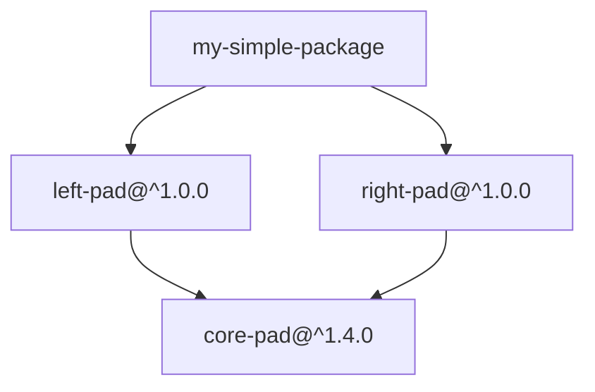
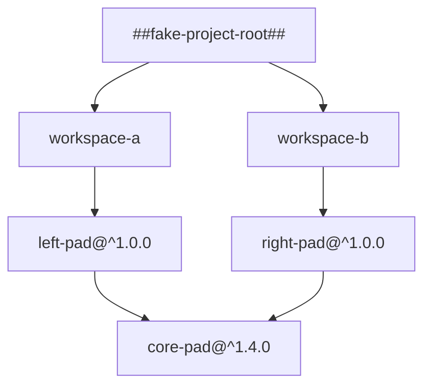

import TabItem from "@theme/TabItem";
import Tabs from "@theme/Tabs";

There comes a time in the life of every project when technical leadership starts thinking: "Oh damn, should we turn this into a monorepo?". This question has been buzzing more and more in the past few years, and thankfully, the answer now does not involve as many custom tools as it once did. The JS ecosystem especially has been hard at work creating versatile infrastructure for big monorepos, and most bleeding-edge open source projects have migrated to one big repo for their whole source code inventory.

{/* truncate */}

One of the key technologies powering today's JS monorepos is **the workspace**. Workspaces are an interesting feature set in JavaScript package managers that let you organize code in encapsulated libraries while keeping most of the advantages of working with a single package. And while workspaces are a fundamental building block of today's monorepos, they can also shine in smaller projects.

In this post, I'll walk you through what a workspace is and how they work under the hood. We'll touch on how JS package managers function and how Node.js finds installed dependencies. But don't worry! The scariest thing you'll see here is a couple of simplified extracts from a yarn lockfile. If that's the level of scary you can handle, you're good to go 💪.

To be clear, this is a technical explanation of a feature we're using internally in Wasp. **If you're only interested in making Wasp apps, you won't miss anything by skipping this post!** But if you're curious about how things work under the hood, or want to use workspaces in your own projects, read on!

:::tip Hey, what's Wasp?

If you arrived here and don't know anything about Wasp, don't worry! You don't need to know about us to learn from this post. But just in case, here's our quick pitch:

Wasp is the quickest way to create a full-stack app, a web framework that seamlessly sews frontend and backend together, and still is extremely easy to understand. Just a single file pointing to your React pages and your backend functions, no boilerplate. Advanced stuff is built-in, like database, authentication, email sending, asynchronous jobs, and more. When you're done we generate an app that you can self-host, or run in any provider that takes a Docker image (with one-command deploy!).

**Get started with Wasp in minutes by following our [Quick Start guide](/docs/quick-start).**

:::

## What are workspaces, anyway? {#definition}

In general terms, workspaces are a feature in npm, Yarn, pnpm, and others that provide **a way to organize multiple JavaScript packages in a single project, each acting as its own encapsulated unit, but able to depend on one another easily.**

Their two main behaviors are: dependencies in common are shared (for example, if two packages depend on `react`, they both work with the same installed version), and packages can import each other by name (so a `pkg-a` can just `import("pkg-b")` without extra ceremony).

Seems simple enough, right? Well, it can be; but the building blocks are quite interesting, and require a bit of a dive into how package managers and Node.js work. The workspaces feature also comes after a long evolution of tooling and JS development practices, so let's start with a bit of history. (You can [skip to the next section](#features) if you're only interested in the technical aspects.)

## How workspaces came to be

It seems the second half of the 2010s was when the professionalization of JS development started to trickle down to the average developer. Specifically, the rise of Babel and Webpack gave us a modern development experience, one that more closely resembled what other languages had enjoyed for years. We finally had a proper module system, and the ability to target newer language versions, while still supporting older runtimes.

**This started in 2015,** when the 6to5 project realized they didn't want to work only on ES6 code, but also on everything that came after it. They renamed themselves to Babel and started working on [modularizing the codebase](https://babeljs.io/blog/2015/10/29/6.0.0#modularization), knowing they'd need well-separated concerns to keep up with the ever-evolving language.

Babel maintainers wanted to distribute the new version as a collection of plugins you could pick and choose, letting you upgrade the parts you cared about and leave the rest untouched. To do that, they split all their code into different packages [in a monorepo](https://github.com/babel/babel/blob/main/doc/design/monorepo.md). That decision kickstarted the development of what would eventually be called workspaces.

Their internal tooling was soon released as [Lerna](https://github.com/lerna/lerna/blob/v1.0.0/README.md). Lerna's main job was to allow packages in a monorepo to seamlessly `require()` one another as if they were already published, instead of having to edit, publish, and reinstall each package independently.

**A few years later, in 2017,** [Yarn](https://classic.yarnpkg.com/blog/2016/10/11/introducing-yarn/) came along. Yarn was created to solve some problematic behaviors of npm at the time, and dramatically improved performance and reliability. Alongside killer features like reproducibility through lockfiles and heavy caching, Yarn also introduced [workspaces as a first-class citizen](https://classic.yarnpkg.com/blog/2017/08/02/introducing-workspaces/). This was no surprise, as Yarn was created by some of the same people who had worked on Babel and Lerna. They had explored the concept in depth, and understood its potential.

Yarn exploded in popularity, and in time other package managers followed suit, adding support for Yarn's best features. pnpm added workspaces support soon after, in 2018; but we had to wait until 2021 for native workspaces support in npm.

Nowadays, after a long evoution, workspaces are supported in any of the mainstream package managers, and widely used in both open and closed source projects.

## Workspace features {#features}

Which features a workspaces project has is a bit of a trick question. Why? Because the exact definition of what a workspace is (and how they interact with one another) depends on the package manager you're using.

[The definition I gave above](#definition) is more of an observation of what the main package managers have in common than a prescriptive specification. Indeed, **there isn't a "workspaces spec"**, so each package manager has its own take on it, with different configuration formats, commands, and even different ways to declare dependencies.

However, there's a core of functionality that you can expect across different package managers. First, you declare a root folder that contains multiple sub-packages. Each of these packages is called a _workspace_, and the whole set of workspaces is a _project_[^yarn-glossary]. From then on, three main features become available:

[^yarn-glossary]: Yarn has a great [glossary](https://yarnpkg.com/advanced/lexicon) that you can check out if you want to get specific definitions for a package-manager-related term, and pointers to which feature they're a part of.

- **Each workspace is its own full package, _as if it were an independent project_.** Each workspace has its own `package.json`, where it declares dependencies, configuration, and scripts without worrying about the insides of other packages.

- **The dependencies of the whole project are resolved together, _as if they were a single package_.** For example, if two workspaces depend on the same package, it will only be installed once and shared between all the dependents (assuming the version ranges are compatible, of course).

- **Workspaces can depend on each other by name, _as if they were regular dependencies_.** Thus, in a project with many workspaces, my `pkg-a` can just import my `pkg-b`, and everything works as expected.

**Workspaces let us mix and match the advantages of both having a single big package, or many small ones**. You get the encapsulation and separation of concerns of small packages while still being able to share dependencies and code easily.

The first feature doesn't require much explanation, as it's just the natural way of working with multiple packages. Let's look into the other two, why they're useful, and how they're implemented:

:::note

As mentioned, the exact implementation details of workspaces depend on the package manager you're using. In this post, **we'll use npm's implementation as a reference**, since it's the most widely used package manager. But the general concepts apply across the board.

:::

### The dependencies of the whole project are resolved together

#### The problem

Imagine having a project with many independent packages. Let's say, maybe... [157(!)](https://github.com/babel/babel/tree/main/packages) You'd have to run `npm install` in each and every workspace folder, plus the ongoing maintenance nightmare of keeping all those dependency versions in sync. Actually, it would be worse than that: if each package had its own `node_modules`, you'd end up with infinitely many copies of the same dependencies installed in different places.

:::info Why is having multiple copies of the same dependency a problem?

This is not only an annoyance and a waste of disk space, but it can also lead to hard-to-debug runtime errors. For example, in JavaScript, the same class, defined in two different places, is considered different, even if their code is identical[^react-aside].

```js title="foo/my-class.js"
export class MyClass {}
```

```js title="bar/my-class.js"
export class MyClass {}
```

```js title="main.js"
import * as foo from "./foo/my-class";
import * as bar from "./bar/my-class";

new foo.MyClass() instanceof foo.MyClass; // true
// highlight-next-line
new foo.MyClass() instanceof bar.MyClass; // false!
```

:::

[^react-aside]: If you've ever wondered why React requires you to have a single version of React in your app, even if two libraries depend on it, this is the reason. If you had two copies of React, components created with one copy wouldn't be recognized as valid React components by the other copy.

For common dependencies between workspaces to work properly, they need to be identified as shared in the first place and installed only once in a single place. This way, when two different pieces of code import the same dependency, they still get the same object and can interoperate correctly.

#### The solution

This is where the package manager's dependency resolution algorithm comes into play. Most package managers already deduplicate and share dependencies for a single project, so they just need to do the same while considering all the workspaces as part of the same project.

Thus, package managers take a shortcut: when resolving dependencies, they simply **consider all the workspaces as if they were dependencies of a single big package**. This way, the existing dependency resolution algorithm can be reused without changes.

And you can see this in action in the lockfile of any workspaces project. Here's a simplified example lockfile for a regular package, no workspaces:

<Tabs>

<TabItem value="Graph" label="Graph">



</TabItem>

<TabItem value="Lockfile" label="Lockfile">

```yaml
"my-simple-package":
  version: local
  resolve: file:./
  dependencies:
    left-pad: ^1.0.0
    right-pad: ^1.0.0

"left-pad@^1.0.0":
  version: 1.1.0
  resolved: https://registry.npmjs.com/left-pad/-/left-pad-1.1.0.tgz
  dependencies:
    core-pad: ^1.1.0

"right-pad@^1.0.0":
  version: 1.4.0
  resolved: https://registry.npmjs.com/right-pad/-/right-pad-1.4.0.tgz
  dependencies:
    core-pad: ^1.4.0

"core-pad@^1.1.0,^1.4.0":
  version: 1.4.5
  resolved: https://registry.npmjs.com/core-pad/-/core-pad-1.4.5.tgz
```

</TabItem>

</Tabs>

As you can see, my package depends on both `left-pad` and `right-pad`. Both of those, in turn, depend on `core-pad`, but with different version ranges. The package manager was able to find a single version of `core-pad` that satisfied both dependents and installed it only once.

Here's how this would look like in a workspaces project:

<Tabs>

<TabItem value="Graph" label="Graph">



</TabItem>

<TabItem value="Lockfile" label="Lockfile">

```yaml
"##fake-project-root##":
  version: fake
  resolve: file:./
  dependencies:
    workspace-a: "local"
    workspace-b: "local"

"workspace-a@local":
  version: local
  resolve: file:./packages/workspace-a
  dependencies:
    left-pad: ^1.0.0

"workspace-b@local":
  version: local
  resolve: file:./packages/workspace-b
  dependencies:
    right-pad: ^1.0.0

"left-pad@^1.0.0":
  version: 1.1.0
  resolved: https://registry.npmjs.com/left-pad/-/left-pad-1.1.0.tgz
  dependencies:
    core-pad: ^1.1.0

"right-pad@^1.0.0":
  version: 1.4.0
  resolved: https://registry.npmjs.com/right-pad/-/right-pad-1.4.0.tgz
  dependencies:
    core-pad: ^1.4.0

"core-pad@^1.1.0,^1.4.0":
  version: 1.4.5
  resolved: https://registry.npmjs.com/core-pad/-/core-pad-1.4.5.tgz
```

</TabItem>

</Tabs>

By pretending that all workspaces are dependencies of a single big package, the package manager reuses its existing dependency resolution algorithm without changes. It finds a single version of `core-pad` that satisfies both dependents and installs it only once. This way, any workspace that imports a shared dependency gets the same object, and everything works as expected.

### Workspaces can depend on each other by name

#### The problem

Let's imagine two regular, different packages that you might have on your computer. If you wanted to have one of them depend on the other, you'd have two different options:

- You could **publish the depended-on package** to the registry, and then install it as a regular dependency in the other package. This is quite straightforward, but if you're trying to do rapid tweaks and tests, the publish-install cycle can be quite tedious and break the flow completely.

- You could use a **local file dependency**. In this case, you'd edit the imports of the dependent package to point to the local path of the other package. This works, but it's quite brittle: if you move the packages around or share the code with someone else, the paths will break and you'll have to fix them manually. If the other package has its own dependencies, you'll have to install them manually as well. Finally, you need to remember to switch those imports back and forth every time you're ready to publish the package.

None of these options are great for development. What we'd like is to just say "my package depends on `pkg-b`", and have the package manager figure out that `pkg-b` is actually just in the folder next to me, and link it automatically.

Well... yes, that's exactly what workspaces let us do!

#### The solution

You'd think this would be easy to implement, right? After all, the package manager already knows where all the workspaces are located, so when it finds a dependency name that matches one of them, it could just point to that folder, done! Unfortunately, it's not that simple, because of one key fact: **the dependency resolution of the package manager (e.g., npm or Yarn) is separate from the import resolution of the runtime (e.g., Node.js or Bun)**.

If you've ever looked into your `node_modules` and found dependencies inside dependencies instead of a flat structure, this is why. The package manager has no influence on how Node.js finds imports[^integrated-package-manager], so all it can do is lay them out on disk in a way that Node.js will understand.

[^integrated-package-manager]: Some newer runtimes have the package manager integrated directly into execution, so they can control both installation and resolution, and simply point to the right folder. For example, Deno doesn't even install dependencies in your project folder. Instead, it keeps a single global copy in an internal cache that it can programmatically reference.

:::info How does Node.js find packages?

While the devil is in the details, the high-level idea is easy to convey:

- If the import is a relative or absolute path (i.e. starts with `./`, `../` or `/`), it just follows that path.
- Otherwise, Node.js will look for the name of that import in the closest `node_modules` folder, starting from the current file's folder, and going up the folder tree until it finds it, or reaches the filesystem root.

  For example, if you have a **`~/projects/app/src/`**`utils.js` that imports `left-pad`, Node.js will look for that package in these folders, in order:
  1. **`~/projects/app/src/`**`node_modules/left-pad`
  2. **`~/projects/app/`**`node_modules/left-pad`
  3. **`~/projects/`**`node_modules/left-pad`
  4. **`~/`**`node_modules/left-pad`

Package managers take this into account when installing dependencies, and arrange the `node_modules` folder accordingly. For example, if two packages depend on the same version of a dependency, it will be installed in a common parent folder's `node_modules`, so that both packages can find it.

:::

Right out of the gate, we know we don't want to generate multiple copies of the same workspace in different `node_modules`, because we'd have the same problems we discussed before. The tool we can use to have "pointers" to the same folder in multiple places is [the symlink](https://en.wikipedia.org/wiki/Symbolic_link). To quickly refresh: it's just a special type of file that points to another file or folder, so when you access the symlink you're redirected to the target.

So now, this just becomes a problem of how to arrange the symlinks in the `node_modules` folders for Node.js. And if you spend a bit of time thinking about it, the solution becomes clear: **we'll create a symlink to each workspace in the top-level `node_modules` folder**. This way, no matter where we are in the project, Node.js will always find the workspace in the first `node_modules` folder it looks at:

- `package-root/`
  - `node_modules/`
    - `sub-a` → `../sub-a/`
    - `sub-b` → `../sub-b/`
    - `sub-c` → `../sub-c/`
  - `sub-a/`
    - `package.json`
    - ...
  - `sub-b/`
    - `package.json`
    - ...
  - `sub-c/`
    - `package.json`
    - ...

Let's see how this works in practice:

```js title="package-root/sub-a/index.js"
import { foo } from "sub-b";
console.log(foo());
```

```js title="package-root/sub-b/index.js"
export function foo() {
  return "Hello from sub-b!";
}
```

How does Node.js resolve the import in `sub-a/index.js`?

- `package-root/sub-a/node_modules/sub-b` → doesn't exist
- `package-root/node_modules/sub-b` → symlink to `package-root/sub-b/`, follow it
- `package-root/sub-b` → found it!

And that's it! Once you see it, it's straightforward. By placing symlinks to all workspaces in the top-level `node_modules`, we ensure that any workspace can import any other workspace by name, and Node.js will always find it correctly.

## When (not) to use workspaces

Now that you know what workspaces _do_, it's worth mentioning that they are not a silver bullet for all the projects in your `~/dev` folder. They are a powerful and simple tool, but they're also a very scoped feature, so they have a clearly defined sweet spot.

In general, workspaces are best suited for projects that:

- Consist of multiple packages
- Will be developed in tandem
- Share many dependencies
- Call each other frequently

That's why workspaces are mostly used in monorepos! Almost by definition, they satisfy all of these criteria. Wasp uses them outside of the monorepo context because the packages we generate are tightly coupled and evolve together, so we get a lot of value from using workspaces.

However, there are some scenarios where I'd discourage using workspaces:

- If you don't have a good reason to split your code into multiple packages, don't do it just to use workspaces. They solve many problems, but it's better if you don't have those problems in the first place!
- If your packages are mostly independent and don't share many dependencies, workspaces won't give you much value. For example, I wouldn't use workspaces to link all the random libraries in my `~/dev` folder.
- If you have cyclic dependencies, extract the common parts into a new package. Without a clear story of which packages depend on which[^recommend-yarn], workspaces let any package depend on any other carelessly, and that can lead to a tangled web of dependencies (even cyclic ones!).
- If your project is split among multiple repositories, using workspaces will make them no longer self-contained, and they'll need to be checked out together to work. Unless you're very sure of your use case, I'd nudge you to either unlink the repos altogether or merge them into a single monorepo.

[^recommend-yarn]: Yarn has some great features that force you to be exhaustive about how your workspaces are structured. By default, you have to [explicitly declare which other workspaces you depend on](https://yarnpkg.com/features/workspaces#cross-references). They also have a [workspace constraints feature](https://yarnpkg.com/features/constraints) that lets you enforce rules on which packages can depend on which others. This one has a steep learning curve, but it's worth it if you're working on a very big monorepo.

## Why does Wasp care about workspaces?

As part of our push for Wasp 1.0, we're working on a project internally called [Wasp Citizen](https://github.com/wasp-lang/wasp/issues/3119). Our generated apps are written to a `.wasp/` folder inside the user's project and need to share dependencies between different packages. We realized that workspaces solve many of our headaches, and the next release of Wasp (out soon!) will enable workspaces in your projects.

But don't fret! **Your Wasp app will still be a single-package project, and you don't need to learn anything new**, everything will work as before. Internally, the generated code will use workspaces to make development more robust and avoid dependency mismatch errors. That translates to a better experience for you, fewer weird bugs for us, and quicker installs for everyone.

## Go off!

Workspaces are a powerful tool that can help you organize your code better, avoid dependency errors, and speed up your development workflow. I hope this post has given you a good understanding of how they work under the hood and when to use them. If you find yourself in a situation where workspaces could help you, give them a try! The next version of Wasp uses them under the hood, and we're excited about the benefits they bring to our users.

Until next time, happy coding!

---

{/* The triple dash here is nice to separate the main content from the footnotes that will be inserted under it. Docusaurus doesn't do this automatically. */}
