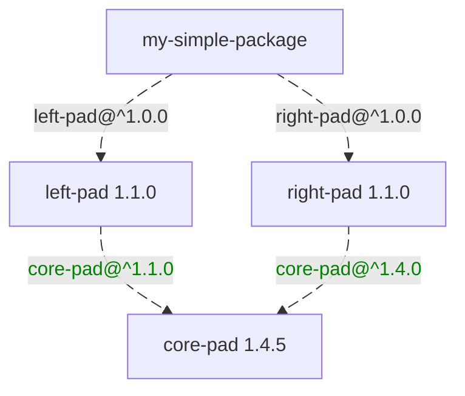
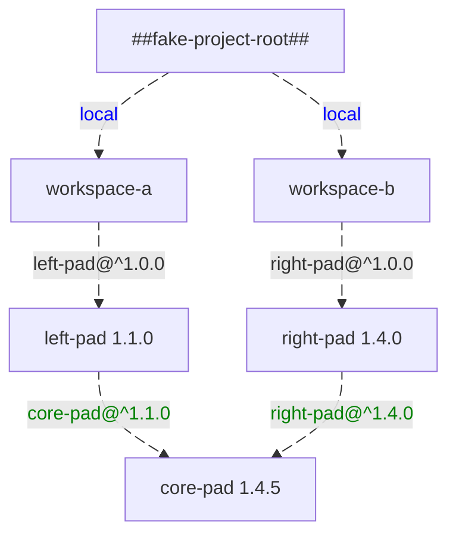

import TabItem from "@theme/TabItem";
import Tabs from "@theme/Tabs";

Imagine that you are working on a full-stack web app, and want to separate your code into a backend and a frontend part. And you also want to share common utilities (like helpers, data validation, or common assets) between those two parts. How can you structure your project? How can you separate everything cleanly but still allow different parts to call shared code easily?

{/* truncate */}

Well, first off, [you should be using Wasp](/), which will happily help you bypass this problem. But, if you were to DIY it, you'd probably end up splitting into multiple packages. But the moment a JS project grows beyond a single package, things get painful fast. Multiple `package.json` files, multiple `npm install`s, dependency versions drifting out of sync, and runtime errors when two packages end up with different copies of the same library. Is this the brave new world of monorepos? 'Cause it sure is not saving me any headache.

Wait, don't start asking your agent to generate a thousand shell scripts to deal with this. Thankfully, our projects don't need to be held up by bash and good wishes anymore, and we don't need as many custom tools as we once did. The JS ecosystem especially has been hard at work creating versatile infrastructure for big monorepos, and most bleeding-edge open source projects have migrated to one big repo for their whole source code inventory.

**Workspaces** are the feature in npm, Yarn, and pnpm that enable this. They let you develop on multiple packages in a single project: dependencies are shared, packages can import each other by name, and everything stays in sync. They're a fundamental building block of today's JS monorepos

This post digs into how workspaces actually work under the hood: how package managers resolve shared dependencies, and how Node.js finds them at runtime. The scariest thing you'll see is a couple of simplified lockfile extracts. If that's the fear level you can handle, you're good to go 💪.

This is a technical explanation of a feature we use internally in Wasp projects. If you're only interested in making Wasp apps, you won't miss anything by skipping this post. But if you're curious about the internals, or want to explore workspaces for use in your own projects, read on.

:::tip Hey, what's Wasp?

If you arrived here and don't know anything about Wasp, don't worry! You don't need to know anything about it to learn from this post.

But, if you're curious, Wasp is the quickest way to create full-stack app in TypeScript; with database, auth, email, and async jobs already included in the deal. To learn more, check out our [website](/) and join our [Discord](https://discord.gg/rzdnErX).

:::

## Enter workspaces {#definition}

Workspaces are a feature in npm, Yarn, pnpm, and others that let you organize multiple JavaScript packages in a single project. And while each package acts as its own encapsulated unit, they can still depend on one another with no extra ceremony.


<div style={{ float: "right", maxWidth: "50%" }}>


</div>

Two main behaviors make this work: shared dependencies (if two packages depend on `react`, they both use the same installed version) and cross-package imports (a `pkg-a` can just import `pkg-b` by name).

The building blocks are interesting and require a dive into how package managers and Node.js work. The feature also comes after a long evolution of tooling and JS development practices, so let's start with some history.

## A brief history

It seems like the second half of the 2010s was when the professionalization of JS development started to trickle down to the average developer. The rise of [Babel](https://babeljs.io/) and [Webpack](https://webpack.js.org/) gave us a modern development experience, one that more closely resembled what other languages had enjoyed for years. We finally had a proper module system, and the ability to target newer language versions, while still supporting older runtimes.


Our history of workspaces starts in 2015, when the 6to5 project [realized](https://babeljs.io/blog/2015/02/15/not-born-to-die) they didn't want to work only on ES6 code, but also on everything that came after it. They renamed themselves to Babel and started working on [modularizing the codebase](https://babeljs.io/blog/2015/10/29/6.0.0#modularization), knowing they'd need well-separated concerns to keep up with the ever-evolving language.

Babel maintainers wanted to distribute the new version as a collection of plugins you could pick and choose, but couldn't afford to manage each one independently. So when they split all their code into different packages, they did so in the shape of [a monorepo](https://github.com/babel/babel/blob/main/doc/design/monorepo.md). That decision kickstarted the development of what would eventually be called workspaces.

Their internal tooling was soon released as [Lerna](https://github.com/lerna/lerna/blob/v1.0.0/README.md). Lerna's main job was to allow packages in a monorepo to seamlessly `require()` one another as if they were already published, instead of having to edit, publish, and reinstall each one independently.

A few months later in 2017, [Yarn](https://classic.yarnpkg.com/blog/2016/10/11/introducing-yarn/) came along. Yarn was created to solve some problematic behaviors of npm at the time, and dramatically improved performance and reliability. Alongside features like reproducible lockfiles and heavy caching, Yarn also introduced [workspaces as a first-class citizen](https://classic.yarnpkg.com/blog/2017/08/02/introducing-workspaces/). This was no surprise, as Yarn was created by some of the same people who had worked on Babel and Lerna.

Soon, Yarn exploded in popularity, and in time, other package managers followed suit. pnpm added workspaces support in 2018, and npm followed in 2020. Nowadays, after a long evolution, workspaces are supported in all the mainstream package managers and widely used in both open and closed source projects.

## Problems and solutions

The exact definition of what a workspace is depends on the package manager you're using. [The definition I gave above](#definition) is more of an observation of what the main package managers have in common than a prescriptive specification. There isn't a common "workspaces spec". Each package manager has its own take, with different configuration formats, commands, and even different ways to declare dependencies.

That said, there's a core of functionality you can expect across package managers: you declare a root folder that contains multiple sub-packages. Each sub-package is called a _workspace_, and the whole set is a _project_[^yarn-glossary]. From there, three features usually become available:

[^yarn-glossary]: Yarn has a great [glossary](https://yarnpkg.com/advanced/lexicon) that you can check out if you want to get specific definitions for a package-manager-related term, and pointers to which feature they're a part of.

- **Each workspace is its own full package**, as if it were an independent project. Each workspace has its own `package.json`, where it declares dependencies, configuration, and scripts without worrying about the insides of other packages.

- **All dependencies are resolved together** across the project, as if it were a single package. If two workspaces depend on the same package, it gets installed once and shared (assuming compatible version ranges).

- **Workspaces can depend on each other by name**, as if they were regular dependencies. In a project with many workspaces, `pkg-a` can import `pkg-b` and everything works.

Workspaces give us the best of both worlds: the encapsulation of small packages with the convenience of shared dependencies.

The first feature is just the natural way of working with multiple packages, so it doesn't require much explanation. Let's look at the other two: why they're useful and how they're implemented. The exact implementation details depend on the package manager, so we'll use npm as a reference here, since it's the most widely used. The general concepts apply across the board.

### The dependencies of the whole project are resolved together

#### The problem

Imagine testing a project with many interconnected packages ...say, [157 of them](https://github.com/babel/babel/tree/main/packages). You'd have to find out which packages depend on which others, run `npm install` in each folder, and deal with the ongoing headache of keeping dependency versions in sync. Worse: if each package had its own `node_modules`, you'd end up with tons of copies of the same dependencies installed in different places.

Multiple copies aren't just a waste of disk space, they can cause bugs. In JavaScript, the same class defined in two different files is considered _different_, even if the code is identical[^react-aside]:

```js title="foo/my-class.js"
export class MyClass {}
```

```js title="bar/my-class.js"
export class MyClass {}
```

```js title="main.js"
import * as foo from "./foo/my-class";
import * as bar from "./bar/my-class";

new foo.MyClass() instanceof foo.MyClass; // true
// highlight-next-line
new foo.MyClass() instanceof bar.MyClass; // false!
```

[^react-aside]: This is one of the reasons React requires a single copy in your app. React relies on a single instance to track internal state (hooks, context, and reconciler). If you had two copies, components created with one wouldn't be recognized by the other, leading to cryptic errors.

For shared dependencies to work correctly, they need to be installed once, in a single place. That way, when different pieces of code import the same dependency, they get the same object.

#### The solution

Most package managers already deduplicate dependencies for a single project. So to get this behaviour for free with workspaces, they cheat a bit: they treat all workspaces as dependencies of a single -fake- root package. The existing resolution algorithm gets reused without changes.

You can see this in any workspaces lockfile. Here's a simplified example for a regular package with no workspaces:

<Tabs>

<TabItem value="Graph" label="Graph">



</TabItem>

<TabItem value="Lockfile" label="Lockfile">

```yaml
"my-simple-package":
  dependencies:
    left-pad: ^1.0.0
    right-pad: ^1.0.0

"left-pad@^1.0.0":
  resolved: 1.1.0
  dependencies:
    core-pad: ^1.1.0

"right-pad@^1.0.0":
  resolved: 1.4.0
  dependencies:
    core-pad: ^1.4.0

"core-pad@^1.1.0,^1.4.0":
  resolved: 1.4.5
```

</TabItem>

</Tabs>

The package depends on both `left-pad` and `right-pad`, which both depend on `core-pad` with different version ranges. The package manager found a single version of `core-pad` that satisfies both and installed it once.

Here's the same scenario in a workspaces project:

<Tabs>

<TabItem value="Graph" label="Graph">



</TabItem>

<TabItem value="Lockfile" label="Lockfile">

```yaml
"##fake-project-root##":
  dependencies:
    workspace-a: local
    workspace-b: local

"workspace-a@local":
  dependencies:
    left-pad: ^1.0.0

"workspace-b@local":
  dependencies:
    right-pad: ^1.0.0

"left-pad@^1.0.0":
  resolved: 1.1.0
  dependencies:
    core-pad: ^1.1.0

"right-pad@^1.0.0":
  resolved: 1.4.0
  dependencies:
    core-pad: ^1.4.0

"core-pad@^1.1.0,^1.4.0":
  resolved: 1.4.5
```

</TabItem>

</Tabs>

By pretending all workspaces are dependencies of a single root package, the package manager reuses its existing algorithm. It finds one version of `core-pad` that works for both, installs it once, and any workspace that imports it gets the same object.

### Workspaces can depend on each other by name

#### The problem

If you have two separate packages and want one to depend on the other, you have two options:

- **Publish the dependency** to the registry, then install it in the other package. Straightforward, but if you're iterating quickly, the publish-install cycle kills your flow.

- **Use a local file dependency.** Edit the imports to point to the local path. This works, but it's brittle: if you move packages around or share the code with someone else, paths break. If the dependency has its own dependencies, you have to install them manually. And you need to remember to switch paths back before publishing.

Neither is great. What you actually want is to say "my package depends on `pkg-b`" and have the package manager figure out that `pkg-b` is just in the folder next to you. That's exactly what workspaces do!

#### The solution

This seems straightforward to implement. The package manager knows where all workspaces are, so it could point to the right folder when it finds a matching dependency name. But there's a catch: the dependency resolution of the package manager (npm, Yarn) is separate from the import resolution of the runtime (Node.js).

If you've ever looked into your `node_modules` and found dependencies nested inside other dependencies instead of a flat structure, this is why. The package manager has no influence on how Node.js finds imports[^integrated-package-manager], all it can do is lay them out on disk in a way that Node.js will understand.

[^integrated-package-manager]: Some newer runtimes have the package manager integrated directly into execution, so they can control both installation and resolution, and simply point to the right folder. For example, Deno doesn't even install dependencies in your project folder. Instead, it keeps a single global copy in an internal cache that it can programmatically reference.

##### How Node.js finds packages

The high-level idea is simple:

- If the import is a relative or absolute path (`./`, `../`, or `/`), Node.js follows that path directly.
- Otherwise, it looks for the import name in the nearest `node_modules` folder, starting from the current file's directory, walking up the folder tree until it finds a match or reaches the filesystem root.

For example, if we want to import e.g. `left-pad`, Node.js checks these folders in order:

- From <code><b>~/projects/app/src/</b>utils.js</code>
1. <code><b>~/projects/app/src/</b>node_modules/left-pad</code>
2. <code><b>~/projects/app/</b>node_modules/left-pad</code>
3. <code><b>~/projects/</b>node_modules/left-pad</code>
4. <code><b>~/</b>node_modules/left-pad</code>

##### Symlinks tie it all together

We know we don't want multiple copies of the same workspace in different `node_modules` folders, because that would bring back all the problems we discussed. Instead, we can use [symlinks](https://en.wikipedia.org/wiki/Symbolic_link). As a refresher: they are special files that just "redirect" to another file or folder when accessed.

So now, this just becomes a problem of how to arrange the symlinks in the `node_modules` folders for Node.js. And the solution: we'll create a symlink to each workspace in the top-level `node_modules` folder. Since Node.js walks up the directory tree looking for that folder, every workspace will eventually find the root one:

- `package-root/`
  - `node_modules/`
    - `sub-a` _(symlink to `sub-a`)_
    - `sub-b` _(symlink to `sub-b`)_
    - `sub-c` _(symlink to `sub-c`)_
  - `sub-a/`
    - `package.json`
    - ...
  - `sub-b/`
    - `package.json`
    - ...
  - `sub-c/`
    - `package.json`
    - ...

Here's an example:

```js title="package-root/sub-a/index.js"
import { foo } from "sub-b";
console.log(foo());
```

```js title="package-root/sub-b/index.js"
export function foo() {
  return "Hello from sub-b!";
}
```

How does Node.js resolve the import in `sub-a/index.js`?

- `package-root/sub-a/node_modules/sub-b`\
  &rarr; doesn't exist
- `package-root/node_modules/sub-b`\
  &rarr; symlink to `package-root/sub-b/`, follow it
- `package-root/sub-b`\
  &rarr; found it!

By placing symlinks in the top-level `node_modules`, any workspace can import any other workspace by name, and Node.js finds it correctly.

## When (not) to use workspaces

While workspaces are pretty useful, they are not a silver bullet. That is, you shouldn't go link every project in your `~/dev` folder just yet. Instead, they should be treated as a scoped feature, with a clear sweet spot.

In general, workspaces work best for projects that:

- Consist of multiple packages
- Will be developed in tandem
- Share many dependencies
- Call each other frequently

That's why workspaces are mostly used in monorepos: almost by definition, they satisfy all of these criteria. Wasp uses them outside the monorepo context, but that's because we generate packages for each part of your app, that are tightly coupled and evolve together.

On the other hand, I'd discourage using workspaces when:

- You don't have a good reason to split a single codebase or repo into multiple packages. Workspaces solve problems, but it's better if you don't have those problems in the first place.
- Your packages are mostly independent and don't share many dependencies. I wouldn't use workspaces to link all the random libraries in my `~/dev` folder. It could lead to random interference between dependencies, or implicit relationships.
- You have cyclic dependencies. Without a clear story of which packages depend on which[^recommend-yarn], workspaces can allow any package depend on any other carelessly, and that can lead to a tangled web of dependencies.
- Your project is split across multiple repositories. Workspaces would make them no longer self-contained. Unless you're very sure of your use case, either unlink the repos altogether or merge them into a single monorepo.

[^recommend-yarn]: Yarn has some great features that force you to be exhaustive about how your workspaces are structured. By default, you have to [explicitly declare which other workspaces you depend on](https://yarnpkg.com/features/workspaces#cross-references). They also have a [workspace constraints feature](https://yarnpkg.com/features/constraints) that lets you enforce rules on which packages can depend on which others. This one has a steep learning curve, but it's worth it if you're working on a very big monorepo.

## Why does Wasp care about workspaces?

When you run the Wasp compiler, it generates app code into a `.wasp/` folder inside your project. And part of that generated code is three different packages: one for the SDK we generate from your Wasp spec, and a frontend and backend package that contain the final codebase for your deployed apps.

Those three packages are tightly coupled, with frequent imports across packages, and also to your own code. They also share many dependencies, and we want to avoid any chance of mismatches or duplication between them.

As part of our push for Wasp 1.0, we wanted to make this situation easier to work with, and we realized workspaces were a perfect fit for our problems. We worked on a project internally called [Wasp Citizen](https://github.com/wasp-lang/wasp/issues/3119), so we could capitalize on workspaces to ease our dependency mismatch issues.

Since Wasp v0.19, this is at work in every Wasp project. Your app still works as a single-package project and you don't need to learn anything new; but internally, the generated packages are structured as workspaces. This translates to a better experience for you, fewer weird bugs for us, and quicker installs for everyone.

And with this knowledge, if you want, now you can add your own workspaces to your Wasp project too, and have them play nicely with the generated ones!

## Go off!

Workspaces are a powerful tool that help you organize your code, avoid dependency errors, and speed up your development workflow. I hope this post has given you a good understanding of how they work under the hood and when to use them. If you find yourself in a situation where workspaces could help you, give them a try!

Until next time, happy coding!

---

{/* The triple dash here is nice to separate the main content from the footnotes that will be inserted under it. Docusaurus doesn't do this automatically. */}
