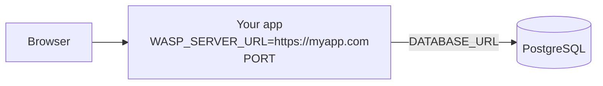
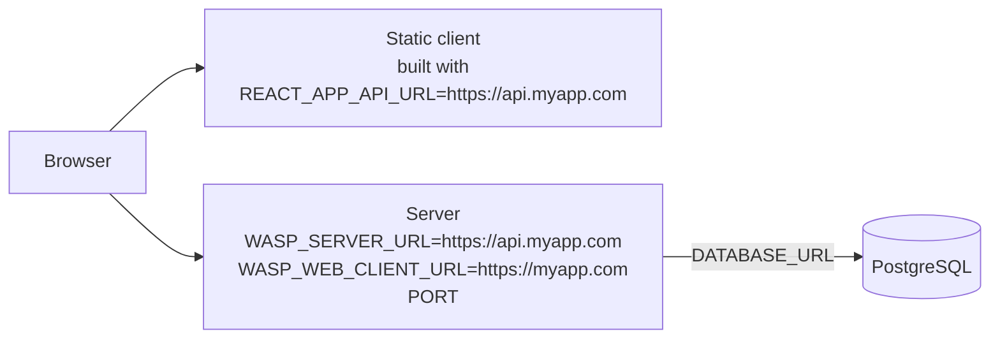

We talked about environment variables in the [project setup section](../project/env-vars.md). If you haven't read it, make sure to check it out first. In this section, we'll talk about environment variables in the context of deploying the app.

While developing our app on our machine, we had the option of using `.env.client` and `.env.server` files which made it easy to define and manage env vars.

However, when we are deploying our app, **`.env.client` and `.env.server` files will be ignored, and we need to provide env vars differently.**


## Which env vars your app needs {#which-env-vars-your-app-needs}

Which URL variables you have to set, and what they point at, depends on your [deployment mode](./intro.md#deployment-modes).

<Tabs groupId="deployment-mode">
<TabItem value="single" label="Single deployment">

The server serves the client, so there is a single URL to configure: `WASP_SERVER_URL`, your app's public origin.



| Env var               | Where you set it     | Value                                                                       |
| --------------------- | -------------------- | --------------------------------------------------------------------------- |
| `DATABASE_URL`        | Server               | The connection URL of your PostgreSQL database.                              |
| `WASP_SERVER_URL`     | Server               | Your app's public URL, e.g. `https://myapp.com`.                             |
| `PORT`                | Server               | The port your app listens on. Most hosts set this for you.                   |
| `JWT_SECRET`          | Server               | A random string of at least 32 characters. Only needed if you use auth.      |
| `WASP_WEB_CLIENT_URL` | Server               | Optional. Defaults to `WASP_SERVER_URL`, which is what you want here.        |
| `REACT_APP_API_URL`   | `wasp build`         | Not needed. The client talks to its own origin.                              |

</TabItem>
<TabItem value="split" label="Split deployment">

The client and the server live on different origins, so each one needs to know where the other is: the client is built with `REACT_APP_API_URL`, and the server gets `WASP_WEB_CLIENT_URL`.



| Env var               | Where you set it     | Value                                                                        |
| --------------------- | -------------------- | ---------------------------------------------------------------------------- |
| `DATABASE_URL`        | Server               | The connection URL of your PostgreSQL database.                               |
| `WASP_SERVER_URL`     | Server               | The server's public URL, e.g. `https://api.myapp.com`.                        |
| `WASP_WEB_CLIENT_URL` | Server               | The client's public URL, e.g. `https://myapp.com`. Used for CORS, e-mail links and OAuth redirects. |
| `PORT`                | Server               | The port the server listens on. Most hosts set this for you.                  |
| `JWT_SECRET`          | Server               | A random string of at least 32 characters. Only needed if you use auth.       |
| `REACT_APP_API_URL`   | `npx vite build`     | The server's origin, baked into the client at build time.                     |

</TabItem>
</Tabs>

On top of these, set any env vars your own code and your auth or e-mail providers need.

## Client Env Vars {#client-env-vars}

During the build process, client env vars are injected into the client Javascript code, making them public and readable by anyone. Therefore, you should **never store secrets in them** (such as secret API keys).

When building for production, the `.env.client` file will be ignored, since it is meant to be used only during development. Instead, you provide the production client env vars in the environment of the command that builds the client:

<Tabs groupId="deployment-mode">
<TabItem value="single" label="Single deployment">

`wasp build` builds the client, so put the client env vars in front of it:

```shell
REACT_APP_SOME_VAR_NAME=somevalue REACT_APP_SOME_OTHER_VAR_NAME=someothervalue wasp build
```

The same goes for `wasp deploy`, which runs `wasp build` for you.

Wasp itself needs no client env vars: the client talks to its own origin, so you don't set `REACT_APP_API_URL`.

</TabItem>
<TabItem value="split" label="Split deployment">

`wasp build` doesn't build the client, you do it yourself with `npx vite build`, so put the client env vars in front of that:

```shell
REACT_APP_API_URL=https://api.myapp.com REACT_APP_SOME_VAR_NAME=somevalue npx vite build
```

`REACT_APP_API_URL` is required here: it's how the built client knows where your server is.

</TabItem>
</Tabs>

Make sure to check the [client env vars](../project/env-vars.md#client-general-configuration) your app requires and set them when building for production, the build will fail if any required env vars are missing.

Also, notice **that you can't and shouldn't provide client env vars to the client code by setting them on the hosting provider** (unlike providing server env vars to the server, in that case this is how you should do it). Your client code will ignore those, as at that point client code is just static files.

:::info How it works
What happens behind the scenes is that Wasp will replace all occurrences of `import.meta.env.REACT_APP_SOME_VAR_NAME` in your client code with the env var value you provided. This is done during the build process, so the value is injected into the static files produced from the client code.

Read more about it in Vite's [docs](https://vitejs.dev/guide/env-and-mode.html#production-replacement).
:::

## Server Env Vars {#server-env-vars}

When building your Wasp app for production `.env.server` will be ignored, since it is meant to be used only during development.

You can provide production env vars to your server code in production by defining them and making them available on the server where your server code is running.

::::caution Set the required env vars

Make sure to go through [all the required server env vars](../project/env-vars.md#server-general-configuration) like `DATABASE_URL`, `WASP_SERVER_URL`, `PORT`, `JWT_SECRET` etc. and set them up in your production environment.

Even though you don't set these variables in development, they are **required in production** and must be explicitly set. If any of them are missing, your server will fail to start.

**If you are using the [Wasp CLI](./deployment-methods/wasp-deploy/overview.md)** deployment method, Wasp will set the general configuration env vars for you, but you will need to set the rest of the env vars yourself (like the ones for OAuth auth methods or any other custom env vars you might have defined).
::::

Setting server env variables up will highly depend on where you are deploying your server, but in general it comes down to defining the env vars via mechanisms that your hosting provider provides.

For example, if you deploy to [Fly](https://fly.io), you can define them using the `fly` CLI tool:

```shell
fly secrets set SOME_VAR_NAME=somevalue
```

We talk about specific providers in the [Cloud Providers section](./deployment-methods/cloud-providers.md) or the [self-hosted deployment section](./deployment-methods/self-hosted.md).
