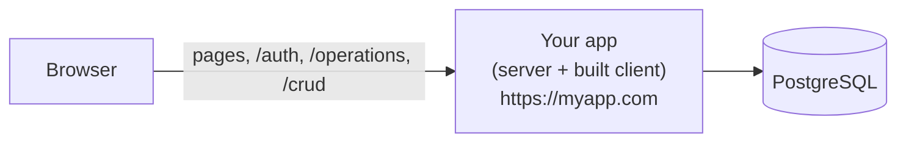
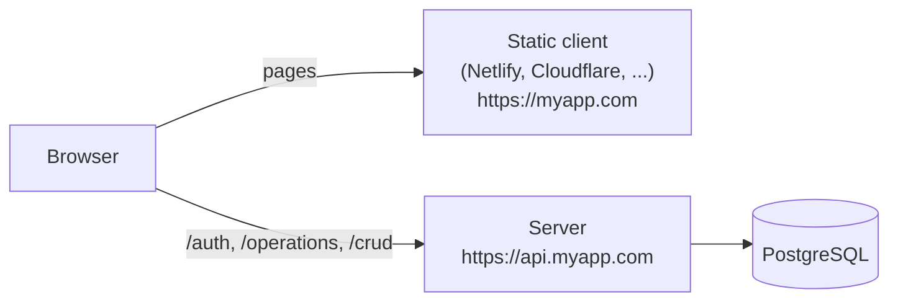

After developing your app locally on your machine, the next step is to deploy it to the web so that others can access it.

In this section, we'll walk you through the steps to deploy your Wasp app.

## What a Wasp app is made of {#what-a-wasp-app-is-made-of}

Before we start, let's understand what Wasp generates when it builds your app.

What we call a "Wasp app" consists of three different parts:

- **Client**
  - A single-page application (SPA), built using [React](https://react.dev/). It's what the user sees and interacts with.
  - It is compiled into static files: HTML, CSS and JavaScript.

- **Server**
  - The backend of your app, built using [Express](https://expressjs.com/) on Node.js.
  - It handles requests from the client, interacts with the database, and returns responses.
  - Wasp's own routes live here: `/auth`, `/operations`, `/crud` and `/health`.

- **Database**
  - Wasp uses [PostgreSQL](https://www.postgresql.org/) as its production database.
  - You can host the database on your own server or use a cloud service.

The database is always its own service. How the client and the server are deployed is up to you, and that choice is what we call the **deployment mode**.

## Deployment modes {#deployment-modes}

Wasp has two deployment modes: **single deployment**, the default, and **split deployment**.

### Single deployment: one app on one origin {#single-deployment-mode}

The server serves the built client, so the whole app is one deployable unit behind one URL. Your pages and Wasp's routes live side by side on the same origin.



`wasp build` builds the client and the server, and the generated Dockerfile packages them into one image. You deploy that image and a database, and you are done.

Because the browser only ever talks to one origin, requests from your client are same-origin: no CORS setup, no second URL to keep in sync, and one place to point your domain at.

### Split deployment: client and server hosted separately {#split-deployment-mode}

The client is a static site on a host or CDN of your choice, and the server runs on a Node.js host. Each has its own URL, and the browser talks to both.



`wasp build` builds only the server. You build the client yourself with `REACT_APP_API_URL` pointing at the server's origin, upload the static files, and tell the server about the client's URL with `WASP_WEB_CLIENT_URL` so that CORS, e-mail links and OAuth redirects work.

This is how every Wasp app was deployed before 0.26. It costs you an extra deployable and some cross-origin configuration, and in exchange you get to host your pages on a static host or CDN.

### Comparing the two modes {#comparing-the-two-modes}

|                          | Single deployment                                | Split deployment                                                        |
| ------------------------ | --------------------------------------------------- | ------------------------------------------------------------ |
| What you deploy          | One app and a database                               | A static client, a server and a database                      |
| `wasp build` produces    | Server and client, packaged into one Docker image    | Server only                                                   |
| Building the client      | Part of `wasp build`                                 | You run `npx vite build` yourself                             |
| Origins                  | One (`https://myapp.com`)                            | Two (`https://myapp.com` and `https://api.myapp.com`)         |
| Required server env vars | `DATABASE_URL`, `WASP_SERVER_URL`, `PORT`, `JWT_SECRET` | The same, plus `WASP_WEB_CLIENT_URL`                       |
| Required client env vars | None                                                 | `REACT_APP_API_URL`                                           |
| CORS                     | Not involved, requests are same-origin               | The server must allow the client's origin                     |
| OAuth redirect URI       | `https://myapp.com/auth/<provider>/callback`         | `https://api.myapp.com/auth/<provider>/callback`              |
| `wasp deploy` creates    | One app plus a database                              | A client app, a server app and a database                     |
| Static hosts and CDNs    | Not applicable, the server serves the client         | Supported (Netlify, Cloudflare Pages, ...)                    |

Both modes are fully supported, and every deployment guide in this section covers both. Future work such as server-side rendering and cookie-based sessions builds on a shared origin, so single deployment mode is where Wasp is heading.

### How to choose {#how-to-choose}

**Use single deployment mode** unless you have a reason not to. It's the default, it's one thing to deploy and configure, and it's the setup the rest of these docs assume.

**Use split mode** when you specifically want the client somewhere the server isn't: on a static host or CDN with its own caching and edge network, on a separate domain from your API, or when your server is only an API that several clients talk to.

### Setting the deployment mode {#setting-the-deployment-mode}

Single deployment mode is the default, so there is nothing to set. To use split mode, set it in your Wasp file:

```ts title="main.wasp.ts"
export default app({
  // ...
  // highlight-next-line
  deployment: { mode: "split" },
});
```

Read more about the field in the [app configuration](../project/customizing-app.md#choosing-the-deployment-mode) docs.

## Deploying your app {#deploying-your-app}

In the following sections, we'll go through all the different things you need to know about deployment:

- How [env variables](./env-vars.md) work in production - they are different than using .env files in development.
- Production [database setup](./database.md) - how migrations work, how to connect to the database, etc.
- Different deployment methods (using [Wasp's CLI](./deployment-methods/wasp-deploy/overview.md), [cloud services](./deployment-methods/cloud-providers.md), [self-hosting](./deployment-methods/self-hosted.md), etc.)
- How to [set up CI/CD](./ci-cd.md) for your app - automatically deploy your app when you push to your Git repository.
- Some [extras](./extras.md) like custom domains, CDN, etc.
