import useBaseUrl from '@docusaurus/useBaseUrl';

# Google Integrations

## Google Auth

In order to use Google as an authentication method (covered [here](/docs/language/features#google)), you'll first need to create a Google project and provide Wasp with your client key and secret. Here is how to do so:

- Create a Google Cloud Platform account if you do not already have one: https://cloud.google.com/
- Create and configure a new Google project here: https://console.cloud.google.com/home/dashboard
  - 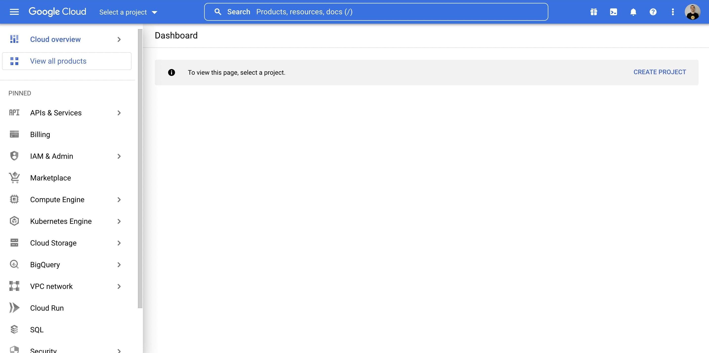
  - 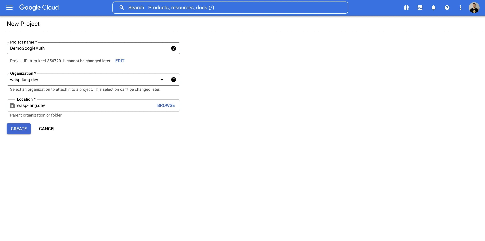
- Search for `OAuth` in the top bar, click on `OAuth consent screen`
  - 
  - Select what type of app you want, we will go External
    - 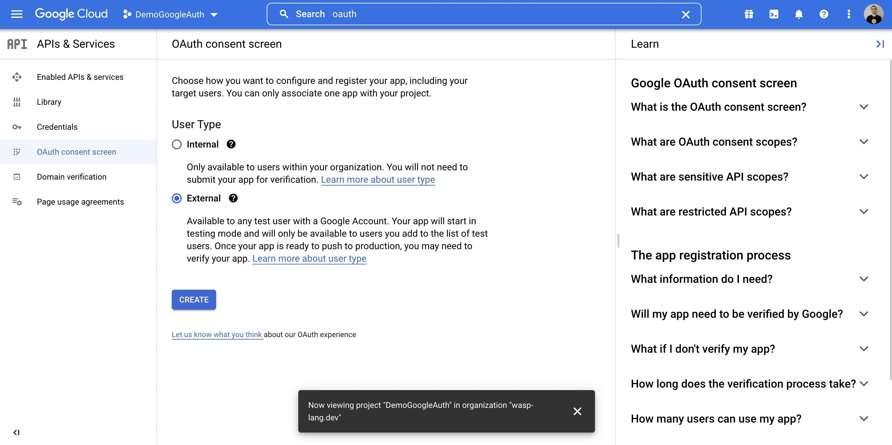
  - Fill out applicable information on Page 1
    - 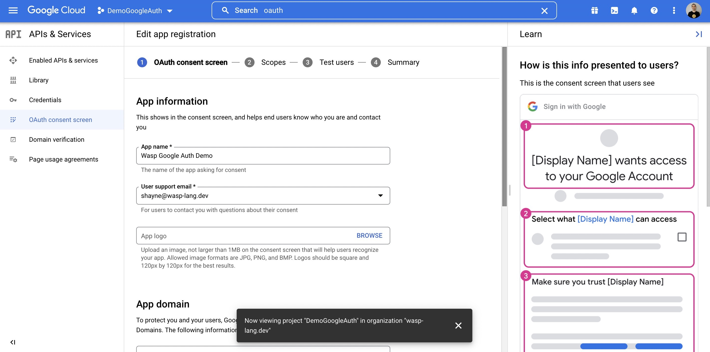
  - On Page 2, Scopes, search for `email`
    - Select the `userinfo.email` row
      - 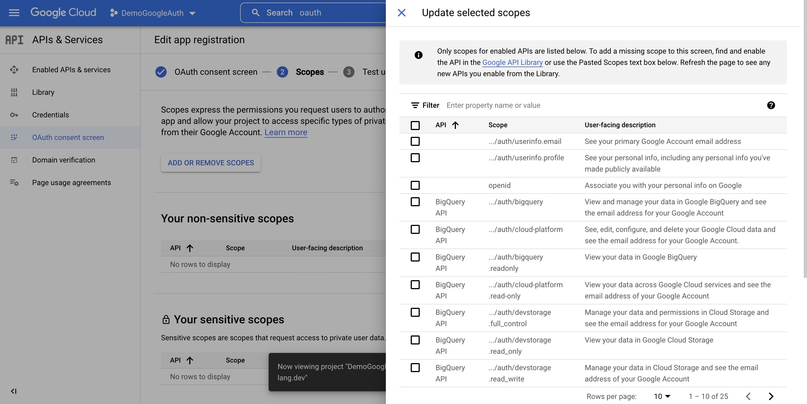
      - 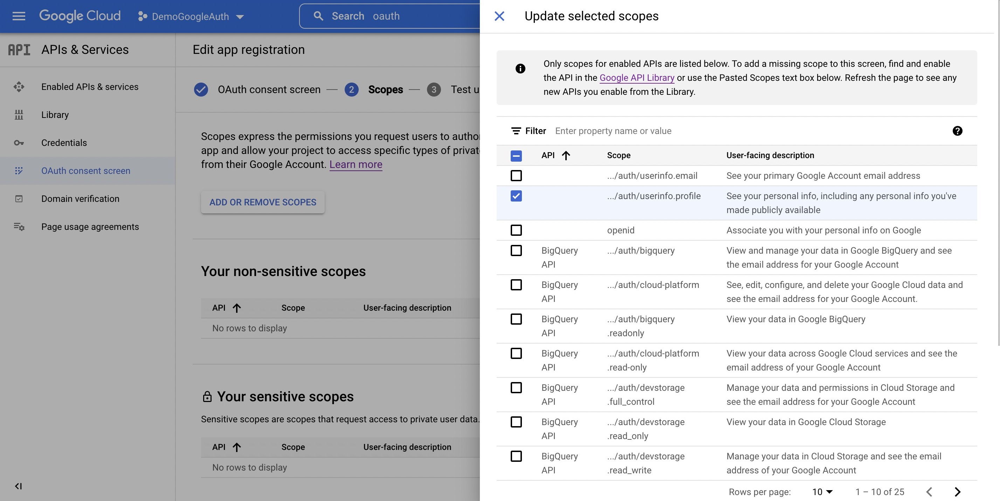
      - 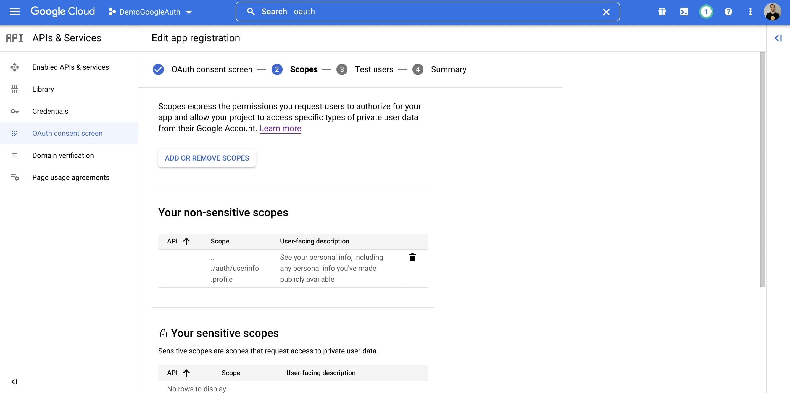
  - Add any test users you want on Page 3
    - 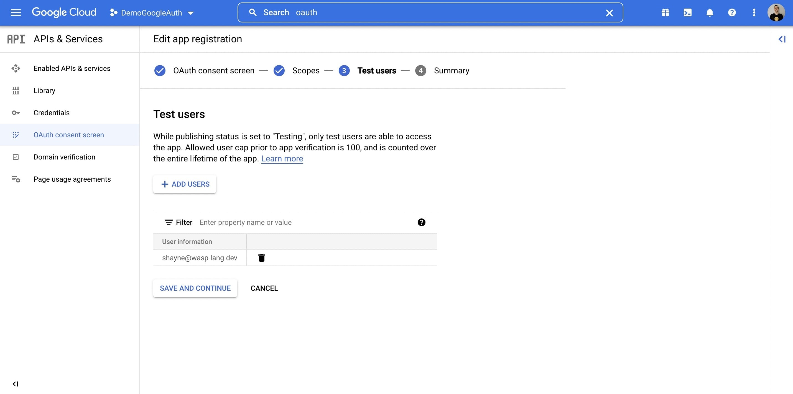
- Next, click `Credentials`
  - 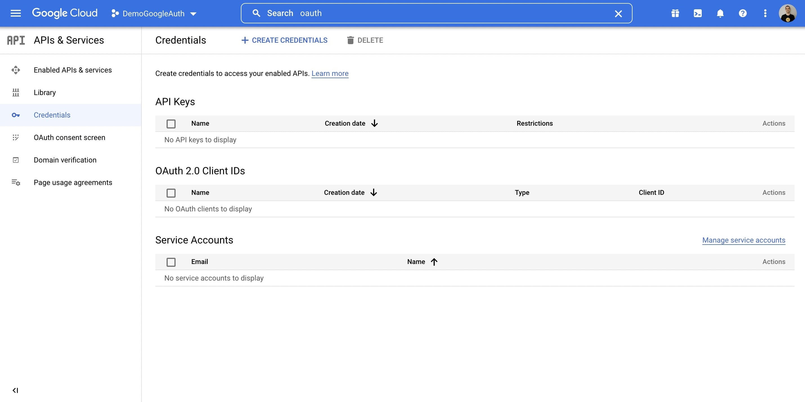
  - Select `+ Create Credentials`
  - Select `OAuth client ID`
    - 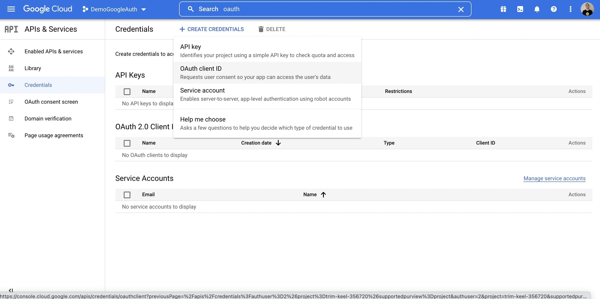
  - Complete the form
    - 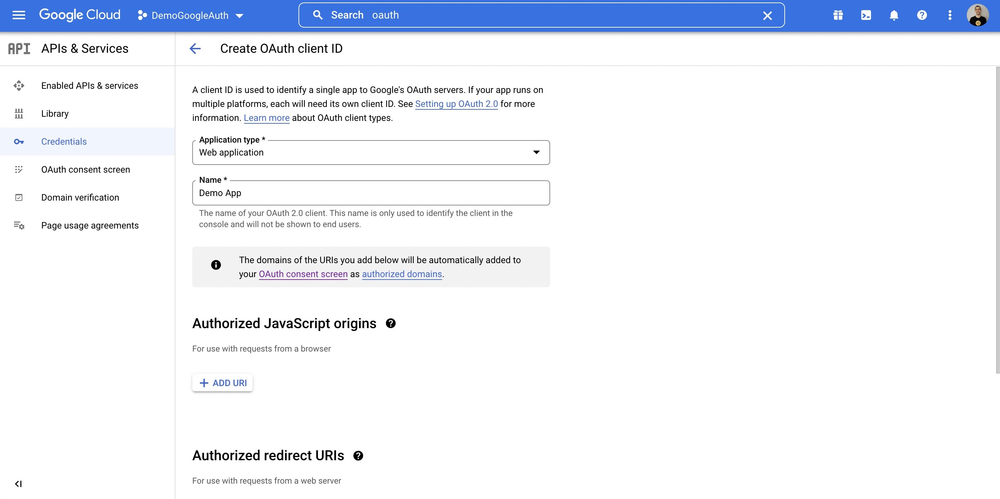
  - Under Authorized URIs, put in: `http://localhost:3000/auth/redirect/google`
    - 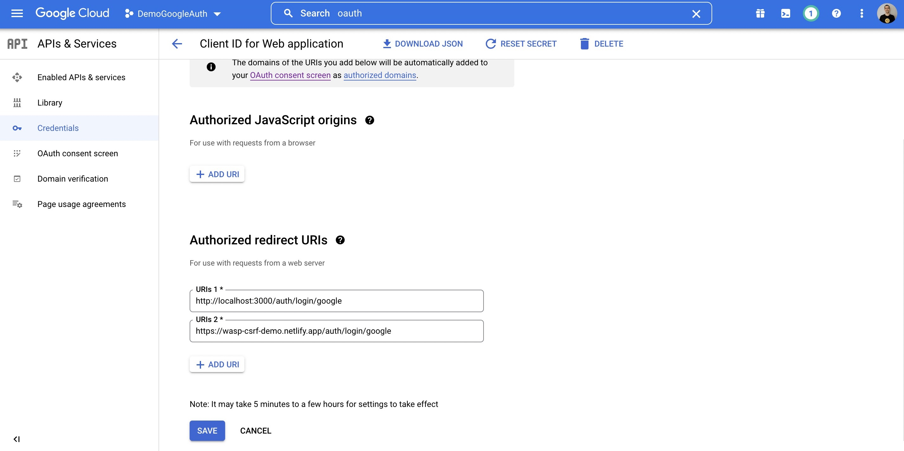
    - You can optionally put in any Heroku or other PaaS URL where your API server will be deployed
      - For example: `https://someotherhost.com/auth/redirect/google`
  - When you save, you can click the Edit icon and your credentials will be shown
    - 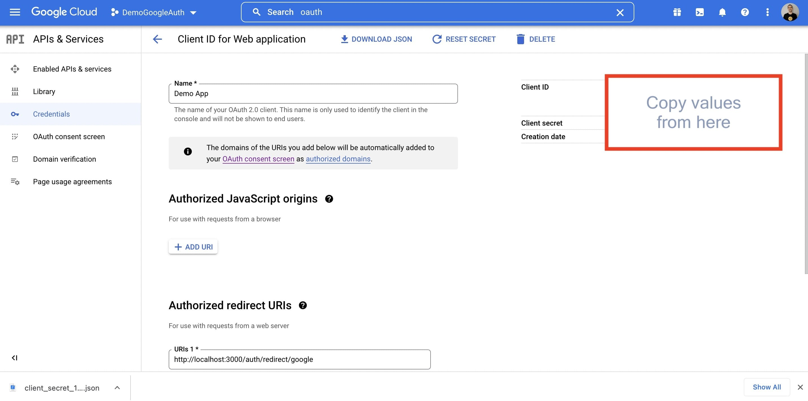
- Copy your Client ID and Client secret, and expose them as environment variables named `GOOGLE_CLIENT_ID` and `GOOGLE_CLIENT_SECRET` wherever your app is running
