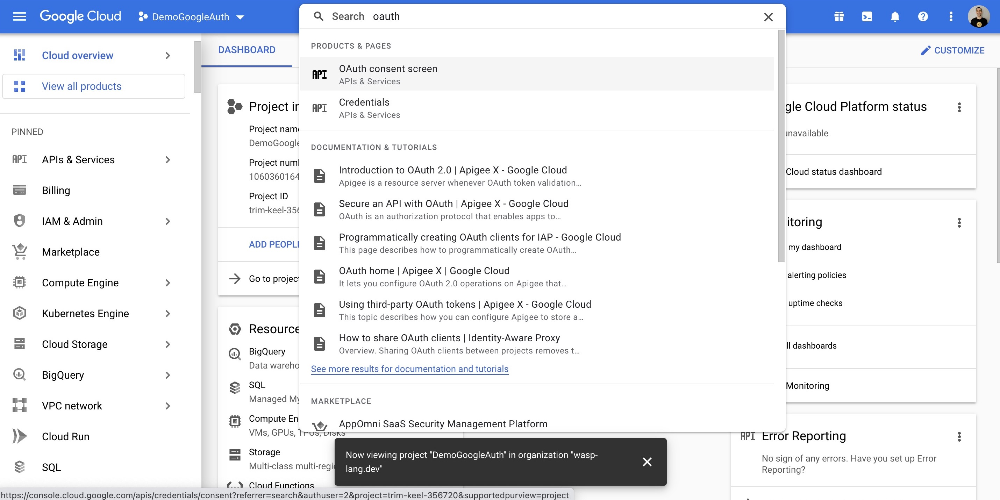
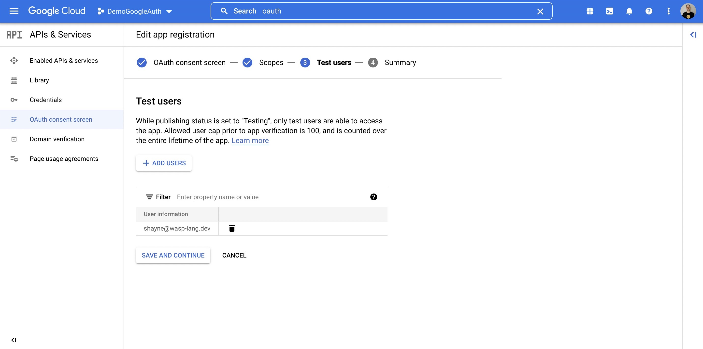

import useBaseUrl from '@docusaurus/useBaseUrl';

# Google Integrations

## Google Auth

To use Google as an authentication method (covered [here](/docs/language/features#google)), you'll first need to create a Google project and provide Wasp with your client key and secret. Here is how to do so:

1. Create a Google Cloud Platform account if you do not already have one: https://cloud.google.com/
2. Create and configure a new Google project here: https://console.cloud.google.com/home/dashboard

  

  

3. Search for `OAuth` in the top bar, click on `OAuth consent screen`

  

  - Select what type of app you want, we will go External

    

  - Fill out applicable information on Page 1

    

  - On Page 2, Scopes, you should select `userinfo.profile`. You can optionally search for other things, like `email`.

    

    

    

  - Add any test users you want on Page 3

    

4. Next, click `Credentials`

  

  - Select `+ Create Credentials`
  - Select `OAuth client ID`

    

  - Complete the form

    

  - Under Authorized redirect URIs, put in: `http://localhost:3000/auth/login/google`

    

    - Once you know on which URL(s) your API server will be deployed, also add those URL(s)
      - For example: `https://someotherhost.com/auth/login/google`
  - When you save, you can click the Edit icon and your credentials will be shown

    

5. Copy your Client ID and Client secret, and expose them as environment variables named `GOOGLE_CLIENT_ID` and `GOOGLE_CLIENT_SECRET` wherever your app is running
