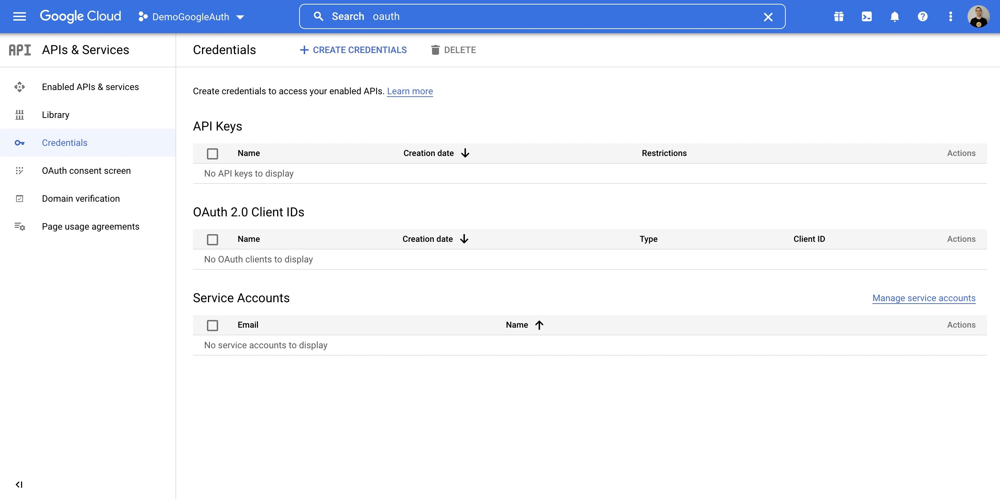

import useBaseUrl from '@docusaurus/useBaseUrl';

# Google

To implement Google Auth, you'll need to add the Auth object with the following configuration to your `main.wasp` file:
```c title="main.wasp"
app Example {
  wasp: {
    version: "^0.8.0"
  },

  title: "Example",

  auth: {
    userEntity: User,
    externalAuthEntity: SocialLogin,
    methods: {
      google: {}
    },
    onAuthFailedRedirectTo: "/login"
  },
}

//...

entity User {=psl
    id          Int     @id @default(autoincrement())
    // ...
    externalAuthAssociations  SocialLogin[]
psl=}

entity SocialLogin {=psl
  id          Int       @id @default(autoincrement())
  provider    String
  providerId  String
  user        User      @relation(fields: [userId], references: [id], onDelete: Cascade)
  userId      Int
  createdAt   DateTime  @default(now())
  @@unique([provider, providerId, userId])
psl=}
```

For more info on the specific fields, check out this [Auth](../language/features#social-login-providers-oauth-20) section of the docs.


You'll also need to add these environment variables to your `.env.server` file at the root of your project:

```bash title=".env.server"
GOOGLE_CLIENT_ID=your-google-client-id
GOOGLE_CLIENT_SECRET=your-google-client-secret
```
We will cover how to get these values in the next section.

## Google Auth

To use Google as an authentication method (covered [here](/docs/language/features#social-login-providers-oauth-20)), you'll first need to create a Google project and provide Wasp with your client key and secret. Here is how to do so:

1. Create a Google Cloud Platform account if you do not already have one: https://cloud.google.com/
2. Create and configure a new Google project here: https://console.cloud.google.com/home/dashboard

  

  

3. Search for `OAuth` in the top bar, click on `OAuth consent screen`

  

  - Select what type of app you want, we will go External

    

  - Fill out applicable information on Page 1

    

  - On Page 2, Scopes, you should select `userinfo.profile`. You can optionally search for other things, like `email`.

    

    

    

  - Add any test users you want on Page 3

    

4. Next, click `Credentials`

  

  - Select `+ Create Credentials`
  - Select `OAuth client ID`

    

  - Complete the form

    

  - Under Authorized redirect URIs, put in: `http://localhost:3000/auth/login/google`

    

    - Once you know on which URL(s) your API server will be deployed, also add those URL(s)
      - For example: `https://someotherhost.com/auth/login/google`
  - When you save, you can click the Edit icon and your credentials will be shown

    

5. Copy your Client ID and Client secret, and expose them as environment variables named `GOOGLE_CLIENT_ID` and `GOOGLE_CLIENT_SECRET` in your `.env.server` file.
6. Now when your user logs in with Google, you can access the logged in user on the client via the `useAuth()` hook, and on the server via the `context.user` object as described [here](/docs/language/features#accessing-the-currently-logged-in-user)!
