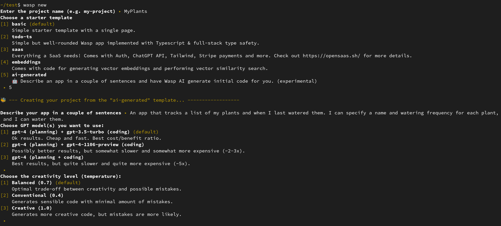
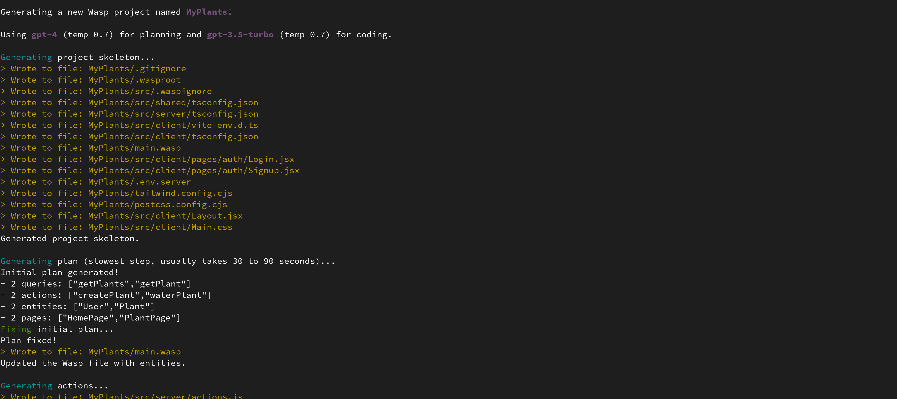

import useBaseUrl from '@docusaurus/useBaseUrl';

import ImgWithCaption from '@site/blog/components/ImgWithCaption'

Wasp comes with its own AI: Wasp AI, aka Mage (**M**agic web **A**pp **GE**nerator).

Wasp AI allows you to create a new Wasp app **from only a title and a short description** (using GPT in the background)!

There are two main ways to create a new Wasp app with Wasp AI:

1. Free, open-source online app [usemage.ai](https://usemage.ai).
2. Running `wasp new` on your machine and picking AI generation. For this you need to provide your own OpenAI API keys, but it allows for more flexibility (choosing GPT models).

They both use the same logic in the background, so both approaches are equally "smart", the difference is just in the UI / settings.

:::info
Wasp AI is an experimental feature. Apps that Wasp AI generates can have mistakes (proportional to their complexity), but even then they can often serve as a great starting point (once you fix the mistakes) or an interesting way to explore how to implement stuff in Wasp.
:::

## usemage.ai

<ImgWithCaption source="img/gpt-wasp/how-it-works.gif" caption="1. Describe your app 2. Pick the color 3. Generate your app 🚀" />

[Mage](https://usemage.ai) is an open-source app with which you can create new Wasp apps from just a short title and description.

It is completely free for you - it uses our OpenAI API keys and we take on the costs.

Once you provide an app title, app description, and choose some basic settings, your new Wasp app will be created for you in a matter of minutes and you will be able to download it to your machine and keep working on it!

If you want to know more, check this [blog post](/blog/2023/07/10/gpt-web-app-generator) for more details on how Mage works, or this [blog post](/blog/2023/07/17/how-we-built-gpt-web-app-generator) for a high-level overview of how we implemented it.

## Wasp CLI

You can create a new Wasp app using Wasp AI by running `wasp new` in your terminal and picking AI generation.

If you don't have them set yet, `wasp` will ask you to provide (via ENV vars) your OpenAI API keys (which it will use to query GPT).

Then, after providing a title and description for your Wasp app, the new app will be generated on your disk!

